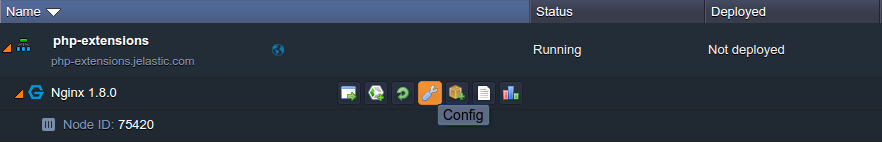
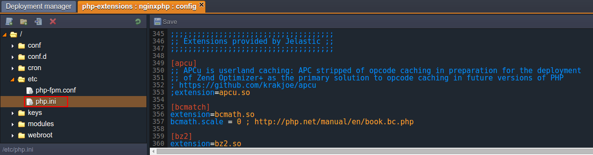
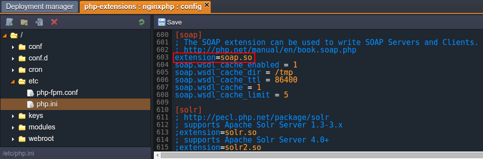
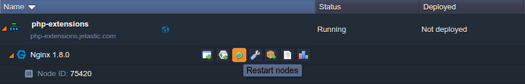
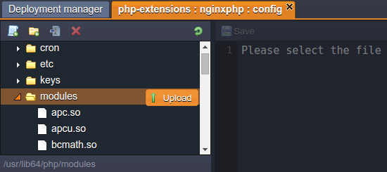
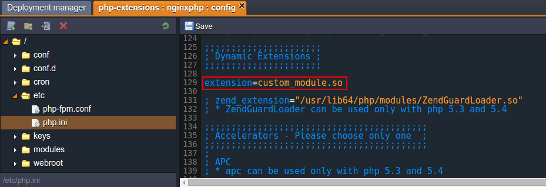

## PHP Extensions

At the platform, PHP application servers are delivered with a number of embedded modules, which allows you to **set different PHP extensions** in _httpd_ (Apache-PHP) and _PHP-FPM_ (NGINX-PHP) daemons. Among these extensions, the following commonly required ones are **_inbuilt_**, i.e. loaded and run with PHP by default:

    

        

            

                        <ul style={{
                listStyle: "none"
               }}>
                  <li>ctype</li>
                  <li>date</li>
                  <li>dom</li>
                  <li>ereg</li>
                  <li>filter</li>
                </ul>
            

            

               <ul style={{
                listStyle: "none"
               }}>
  <li>hash</li>
  <li>libxml</li>
  <li>mhash</li>
  <li>pcre</li>
  <li>Reflection</li>
</ul>
            

            

                   <ul style={{
                listStyle: "none"
               }}>
  <li>session</li>
  <li>SLPxml</li>
  <li>sockets</li>
</ul>
            

        
 
    
 

    

        

            

                        <ul style={{
                listStyle: "none"
               }}>
                 <li>apc.so</li>
  <li>apcu.so</li>
  <li>bcmath.so</li>
  <li>bz2.so</li>
  <li>calendar.so</li>
  <li>curl.so</li>
  <li>dba.so</li>
  <li>dom.so</li>
  <li>enchant.so</li>
  <li>event.so</li>
  <li>exif.so</li>
  <li>fileinfo.so</li>
  <li>ftp.so</li>
  <li>gd.so</li>
  <li>gearman.so</li>
  <li>geoip.so</li>
  <li>gettext.so</li>
  <li>gmp.so</li>
  <li>http.so</li>
  <li>iconv.so</li>
  <li>igbinary.so</li>
  <li>imagick.so</li>
  <li>imap.so</li>
</ul>
            

            

               <ul style={{
                listStyle: "none"
               }}>
<li>inotify.so</li>
  <li>intl.so</li>
  <li>json.so</li>
  <li>ldap.so</li>
  <li>mbstring.so</li>
  <li>mcrypt.so</li>
  <li>memcache.so</li>
  <li>memcached_2_1_0.so</li>
  <li>memcached_2_2_0.so</li>
  <li>mongo.so</li>
  <li>mongodb.so</li>
  <li>mysql.so</li>
  <li>mysqli.so</li>
  <li>mysqlnd_ms.so</li>
  <li>mysqlnd_qc.so</li>
  <li>mysqlnd.so</li>
  <li>ncurses.so</li>
  <li>oauth.so</li>
  <li>odbc.so</li>
  <li>opcache.so</li>
  <li>openssl.so</li>
  <li>pcntl.so</li>
  <li>pdo_dblib.so</li>
</ul>
            

            

                   <ul style={{
                listStyle: "none"
               }}>
 <li>pdo_firebird.so</li>
  <li>pdo_mysql.so</li>
  <li>pdo_oci.so</li>
  <li>pdo_odbc.so</li>
  <li>pdo_pgsql.so</li>
  <li>pdo_sqlite.so</li>
  <li>pdo.so</li>
  <li>pgsql.so</li>
  <li>phar.so</li>
  <li>posix.so</li>
  <li>propro.so</li>
  <li>pspell.so</li>
  <li>raphf.so</li>
  <li>rar.so</li>
  <li>readline.so</li>
  <li>recode.so</li>
  <li>redis.so</li>
  <li>shmop.so</li>
  <li>simplexml.so</li>
  <li>snmp.so</li>
  <li>soap.so</li>
  <li>solr.so</li>
  <li>solr2.so</li>
</ul>
            

            

                   <ul style={{
                listStyle: "none"
               }}>
<li>sphinx.so</li>
  <li>sqlite3.so</li>
  <li>svn.so</li>
  <li>sysvmsg.so</li>
  <li>sysvsem.so</li>
  <li>sysvshm.so</li>
  <li>tidy.so</li>
  <li>timezonedb.so</li>
  <li>tokenizer.so</li>
  <li>uuid.so</li>
  <li>wddx.so</li>
  <li>xcache.so</li>
  <li>xdebug.so</li>
  <li>xmlreader.so</li>
  <li>xmlrpc.so</li>
  <li>xmlwriter.so</li>
  <li>xsl.so</li>
  <li>yaml.so</li>
  <li>ZendGuardLoader.so</li>
  <li>zip.so</li>
  <li>zlib.so</li>
</ul>
            

        
 
    
 

The rest of provided extensions are **_dynamic_**, i.e. they are included to the appropriate servers' builds (being stored within the dedicated _modules_ server folder) and can be enabled upon the necessity:

Below, you can figure out how to:

- [activate an extension](https://cloudmydc.com/)
- [configure an extension](https://cloudmydc.com/)
- [add your custom extension](https://cloudmydc.com/)

## Activate Extension

In order to make a dynamic extension available for the used PHP module (i.e. engine), it should be enabled within the corresponding configuration file.

:::danger Note

The inbuilt extensions _<u>should not</u>_ be loaded manually, as they are constantly running at all PHP servers in the platform by default.

:::

Below, you can find out how this can be accomplished:

1.

Click the **Config** button for your app server.

2.

Within the opened configuration tab, move to the **etc >** **_php.ini_** file and scroll down to the **_Extensions provided by PaaS_** section. Here, each dynamic extension has its own sub-section, where it can be enabled and configured.

3.

Now, locate the required section (they are listed in the alphabetic order) and uncomment the **extension=** **_{module_name}.so_** directive inside (i.e. remove semicolons at the beginning of the corresponding line) to enable it:

Also, here you can adjust the extension by means of the stated configuration parameters (or specify your own ones).

4.

After all the necessary changes are made, do not forget to **Save** them and **Restart** the node to apply the new configuration.

## Configure Extension

All the necessary PHP modules' settings are to be handled via the **_php.ini_** file. Herewith, the majority of provided dynamic extensions are specified with a set of possible configuration parameters alongside.

As an example, let’s consider such for the dynamic _OPcache_ extension - [PHP accelerator](https://cloudmydc.com/), based on the opcode caching and optimization:

- **_opcache.enable=1_**
  enable/disable OPcache extension
- **_opcache.memory_consumption=64_**
  set the amount of memory to use
- **_opcache.interned_strings_buffer=8_**
  set the amount of memory to be used for storing internal strings (e.g. classnames)
- **_opcache.max_accelerated_files=4000_**
  the maximum number of files to be cached
- **_opcache.revalidate_freq=60_**
  the frequency of checking file timestamps for the shared memory storage allocation to be changed
- **_opcache.fast_shutdown=1_**
  enable/disable a fast shutdown sequence for accelerated code
- **_opcache.enable_cli=1_**
  enable/disable OPcache for the CLI version of PHP

## Add Custom Extension

In addition to all of the modules, available at the platform out-of-box, you have the possibility to integrate your own PHP extensions to a server if needed. For that, just follow the instruction below:

1. Compile the extension itself.

2. Navigate to the platform dashboard and click on the **Config** button for your PHP application server.

3. Now, using the opened manager, upload your custom extension to the **modules** folder.

4. Move to the **etc >** **_php.ini_** file, find the **_Dynamic Extensions_** section and add the next command directive:
   _extension_ **_={module_name}_**.so

:::tip Tip

You can define all the necessary settings for your extension at the same section, if needed.

:::

5. **Save** the changes and **Restart** the node.

That’s all! Now your custom extension is activated.
