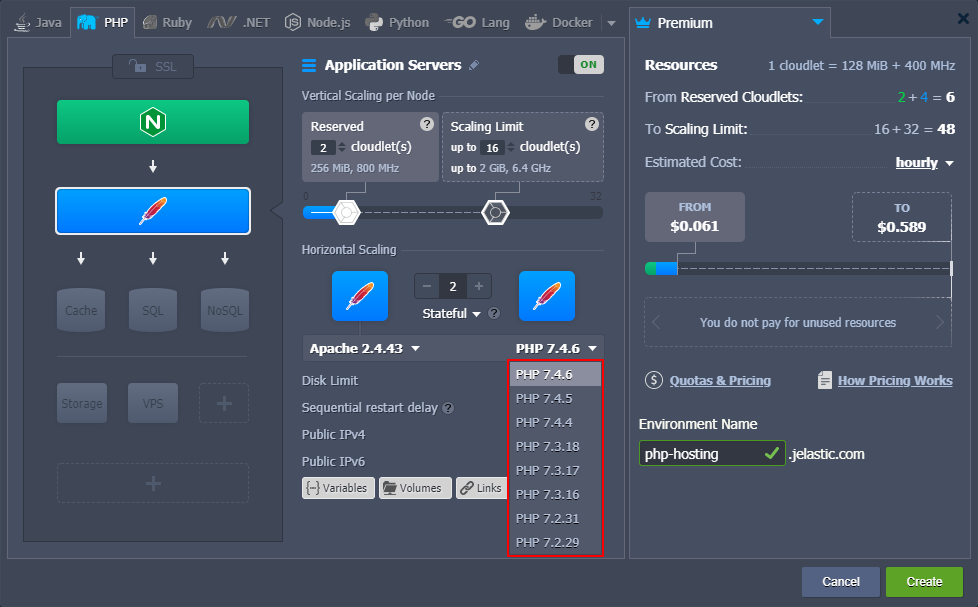
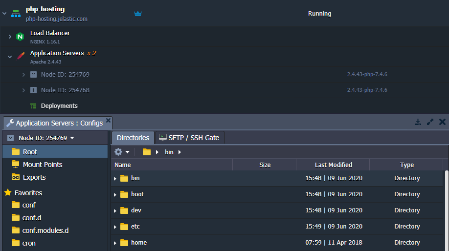
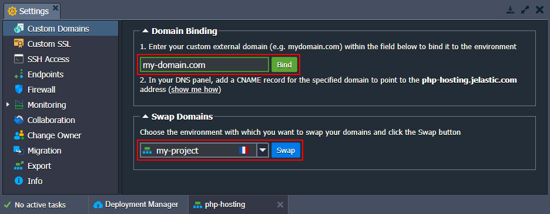
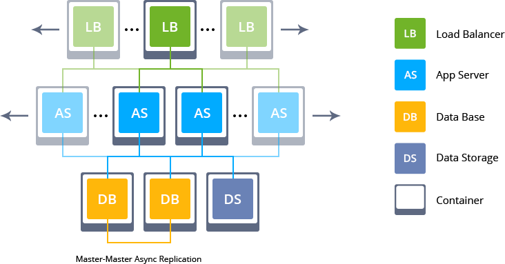
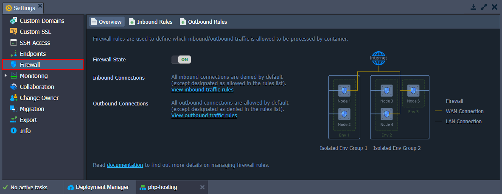

## PHP Developer’s Center

PHP is considered one of the easiest to use server-side scripting languages. Its usage for websites (top 10 million by Alexa rank) is steadily growing and currently reached [78.9%](https://cloudmydc.com/). The PHP engine’s popularity is also proven by the platform customers as almost every second server is run on top of PHP according to our internal statistics.

Let’s take a journey to PHP cloud hosting within the platform, its chief peculiarities, winning points, and rich possibilities provided for the efficient running of applications.

Use the table of content below to find required information within the guide quicker:

- [PHP Versions](https://cloudmydc.com/)
- [PHP Application Servers](https://cloudmydc.com/)
- [PHP Application Deployment](https://cloudmydc.com/)
- [Domains Management](https://cloudmydc.com/)
- [automatic vertical scaling](/docs/ApplicationSetting/Scaling%20And%20Clustering/Automatic%20Vertical%20Scaling)
- [Manual Horizontal Scaling](https://cloudmydc.com/)
- [Automatic Horizontal Scaling](https://cloudmydc.com/)
- [PHP Clustering](https://cloudmydc.com/)
- [Database Connection to PHP Application](https://cloudmydc.com/)
- [Modules and Accelerators](https://cloudmydc.com/)
- [PHP Security](https://cloudmydc.com/)

## PHP Versions

Keeping the pace with technology evolution, the platform supports the latest PHP engine versions (at the time of this writing):

- 8.0.30
- 8.1.22
- 8.2.8

:::tip Tip

The up-to-date list of the releases available on the platform is provided via the dedicated, regularly (weekly) updated [Software Stack Versions](https://cloudmydc.com/) document.

:::

You can choose the engine version you need while environment creation and easily switch between them afterward via intuitive [platform UI](https://cloudmydc.com/).

## PHP Application Servers

Two PHP application servers are provided by default and supported by the platform (e.g. version updates or security patches are added by PaaS team to the templates):

- [Apache](https://cloudmydc.com/)
- [NGINX](https://cloudmydc.com/)

To see in detail how these servers can be configured, and find out the list of editable config files for each of them, refer to the document [PHP App Server Configuration](https://cloudmydc.com/).

## PHP Application Deployment

[Zero downtime deployment](https://cloudmydc.com/) provides the ability to run any cloud-native or legacy application. In order to deliver your PHP projects to the created environment within the platform, you can choose one of the available [deployment options](https://cloudmydc.com/): via Archive/URL, GIT/SVN, Bitbucket project, etc.

Besides, you can configure an automatic periodic re-deployment from the repository (it is performed only if new code changes appear).

Also, all platform-certified PHP nodes are provided with the pre-installed [**Composer**](https://cloudmydc.com/) dependency manager to quickly install all the required packages for the deployed project and keep them up-to-date.

## Domains Management

For production purposes, you can bind an external domain name to your application instead of the default environment domain. Follow the appropriate [custom domains](https://cloudmydc.com/) instruction to learn how it can be done.

With the help of the [swapping domains](https://cloudmydc.com/) feature, end-users of your application won’t experience any downtime when you, for example, deploy a new application version. You can stage your new application version in a test environment and consequently swap URLs with a production environment just in a few clicks.

Using [multiple domains](https://cloudmydc.com/) on a single PHP server increases the application usability, efficiency, and scalability, simultaneously saving the costs on the necessity to set up separate instances.

## Automatic Vertical Scaling

Automatic vertical scaling is made possible by the platform ability to dynamically change the number of allocated resources (RAM and CPU) for a server according to its current demands, with no manual intervention required. This feature guarantees you [never overpay for unused resources](https://cloudmydc.com/) and saves your time due to eliminating the necessity of handling the load-related adjustments or architectural changes.

In order to set up automatic resource consumption by your PHP server, open the environment topology wizard and specify the upper scaling limit of [cloudlets](/docs/PlatformOverview/Cloudlet) (each equals to 128 MiB and 400 MHz) with the slider located at the top:

Your application will work within these limits reducing resource consumption when the load is down or increasing them when the load is up. Thus, you only pay for the resources that are actually consumed. For more information, please refer to the documentation about [automatic vertical scaling](/docs/ApplicationSetting/Scaling%20And%20Clustering/Automatic%20Vertical%20Scaling).

## Manual Horizontal Scaling

For adding extra PHP servers manually, just click **Change Environment Topology**. Then press the “+” button in the wizard and add the required number of instances.

The maximum number of the same-type servers within a single environment layer depends on a particular hosting provider settings (usually, this limit stands for 16 nodes and can be adjusted by sending a request to support).

Also, as you can see, when you add extra servers, [[load balancing]](https://cloudmydc.com/) is enabled automatically.

Please, find more details about manual [Horizontal Scaling](/docs/ApplicationSetting/Scaling%20And%20Clustering/Horizontal%20Scaling) in the documentation.

## Automatic Horizontal Scaling

Automatic horizontal scaling can be implemented through tunable triggers, which monitor the changes in the application load and increase or decrease the number of nodes due to them.

To configure a trigger for the automatic horizontal scaling open **Settings > Monitoring > Auto Horizontal Scaling** section and press **Add** button.

In this way, you can configure the triggers for specific stacks and resources (CPU, RAM, Network, Disk) within your environment separately. Just specify the conditions of scaling and apply changes.

Please, find more details about [automatic horizontal scaling](https://cloudmydc.com/) in the corresponding document.

## PHP Clustering

Implementing the [PHP sessions clustering](https://cloudmydc.com/) for your application can highly increase its availability and failover capabilities using the sticky sessions, run on several app server nodes. This mechanism is ensured by a Memcached node that should be added to your environment and used as storage for the processed sessions’ backups.

While scaling out PHP server with your deployed application, you get its exact copy with all the same configurations and files inside due to built-in [data synchronization](https://cloudmydc.com/).

Besides, the platform has pre-packaged auto-scalable [WordPress Cluster](https://cloudmydc.com/) and [Magento Cluster](https://cloudmydc.com/) available for one-click installation to ensure your service operability. Moreover, you can package any PHP application in this way to automate its clustered installation.

## Database Connection to PHP Application

The platform provides a set of scalable and fully manageable database servers that you can easily install and operate within the PHP environment. To establish the connection, adjust your application following the instruction based on the database you require:

- [MySQL/MariaDB Connection](https://cloudmydc.com/)
- [PostgreSQL Connection](https://cloudmydc.com/)
- [MongoDB Connection](https://cloudmydc.com/)

## Modules and Accelerators

While working with the platform, you can extend the functionality of the environment through setting different PHP extensions at the appropriate application servers. You can either select one of the default extensions and activate it, or upload your own custom one - both these operations are described in the [PHP Modules](https://cloudmydc.com/) instruction.

As a separate kind of PHP extension, [PHP accelerators](https://cloudmydc.com/) can be determined. They are used for enlarging your application efficiency through caching the already compiled parts of PHP code, which can be quickly executed upon a user’s request.

Apache PHP and NGINX servers include a particular [set of the inbuilt modules](https://cloudmydc.com/). In addition, there are a few separate tutorials on configuring the various modules:

- [Adding Custom Apache Modules](https://cloudmydc.com/)
- [Apache WebDav Module](https://cloudmydc.com/)
- [Apache Statistics Module](https://cloudmydc.com/)
- [NGINX WebDav Module](https://cloudmydc.com/)
- [New Relic Monitoring](https://cloudmydc.com/)

## PHP Security

[SSL / TLS](https://cloudmydc.com/) (Secure Sockets Layer / Transport Layer Security) is the industry standard security technology for establishing an encrypted connection between a web server and a browser. This technology is supported by the platform and ensures that all passed data remains private and confidential, i.e., it can’t be intercepted by a third party.

Besides the common protection methods, security of your application can be increased through [customizing the main PHP configuration file](https://cloudmydc.com/), named **_php.ini_**. You can edit a number of default settings it contains or adds your own in accordance with the needs of your application.

Additional configuration guidance is available for particular application servers:

- [Apache Security Configurations](https://cloudmydc.com/)
- [NGINX Security Configurations](https://cloudmydc.com/)

One more way to ensure the application protection is using a container [firewall feature](https://cloudmydc.com/). It lets you control nodes' availability both from inside and outside of the platform.

Explore limitless PHP possibilities with the platform.
