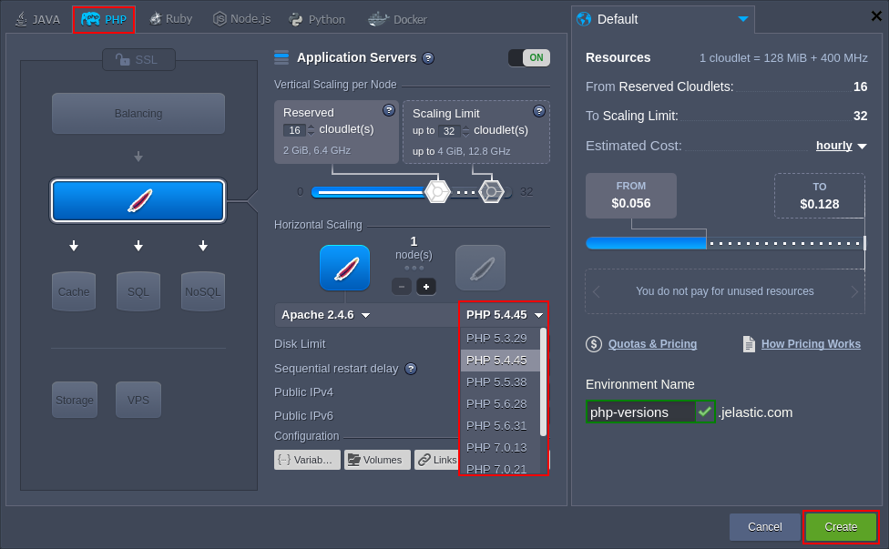
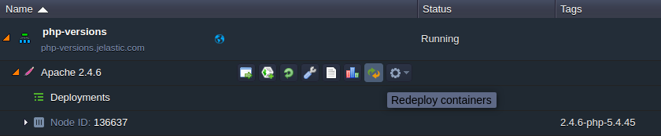
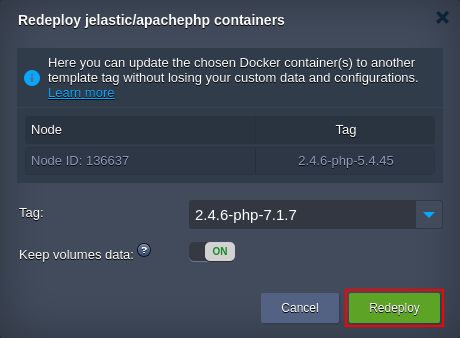

## PHP Versions

Within the confines of PHP hosting at the platform, the following PHP engine versions are supported:

- _PHP 8.0.30_
- _PHP 8.1.22_
- _PHP 8.2.8_

:::tip

The up-to-date list of the releases available on the platform is provided via the dedicated, regularly (weekly) updated [Software Stack Versions](https://cloudmydc.com/) document.

:::

You can choose the version you need while environment creation and easily [switch between them](https://cloudmydc.com/) afterwards via topology wizard. The workflow is the following:

1. Click the **New Environment** button at the top dashboard pane to open the _Environment Wizard_ frame.

2. Navigate to the **_PHP_** language tab and pick the preferred application server. Choose the desired engine version by means of the second drop-down list in the central pane.

Specify the resource limits, select the preferred [region](https://cloudmydc.com/), type your environment name (or leave the default one) and click the **Create** button.

:::tip Tip

For more information on PHP hosting specifics at the platform and the possibilities it provides, refer to the [PHP Developer’s Center](https://cloudmydc.com/) document.

:::

3. In order to change the version of PHP for the already existing environment, click the **Redeploy containers** icon next to the appropriate layer.

4. Select required engine version within the _Tag_ list of the opened frame.

Click **Redeploy** to confirm the changes.

:::danger Note

In case of switching the engine version to PHP 7 for legacy PHP containers, you may require to manually [re-define](https://cloudmydc.com/) the included PHP modules, as part of them was turned into dynamic (i.e. to be activated only upon the necessity) in confines of the [PaaS 4.3](https://cloudmydc.com/) release.

:::
