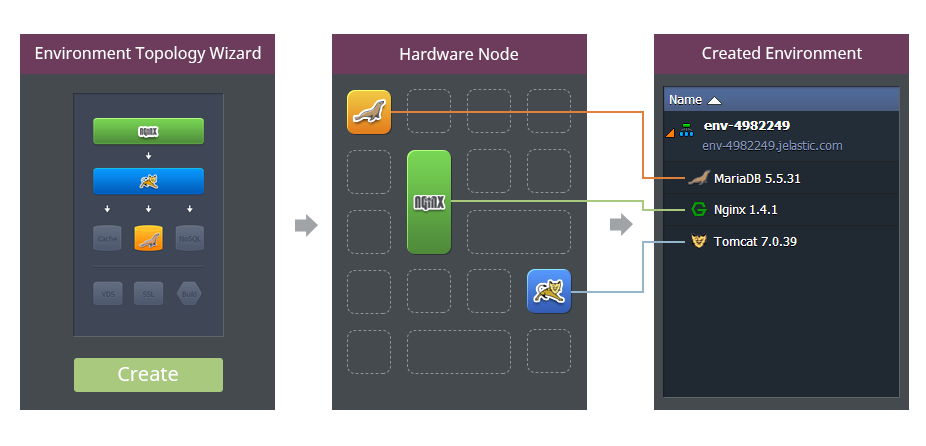

The platform can be installed on top of **bare metal** servers or third party **IaaS** solutions such as OpenStack, vSphere, AWS, Azure, Rackspace and others. The number of hardware nodes in the cluster depends on the expected cluster load and is usually determined during the onboarding process.

**Hardware Nodes** are physical servers or big virtual machines (they can be virtualized via KVM, ESXi, Hyper-V etc.). The platform slices big servers or virtual machines into small isolated virtual containers which will be used for user environments. This slicing is the basis for the platform’s industry-leading density and system resources utilization.

Each **environment** is a collection of isolated virtual containers that provides all the facilities necessary for a particular application. During environment creation the requested containers are taken from the pool of pre-created container templates. This helps to speed up provisioning and means that it literally takes a minute to get complex environments up and running. Each stack is located inside the isolated container, what removes the risk of potential influence of one stack to another.

