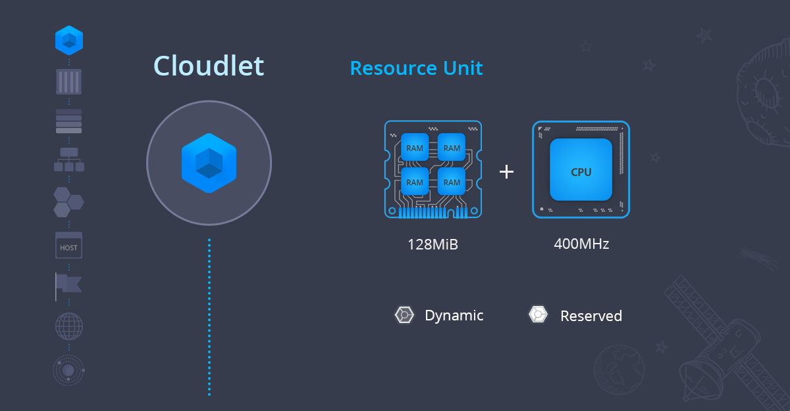

This document represents an overview of the platform fundamental concepts, a versatile solution for hosting inside Public, Private, Hybrid, or Multi-Cloud. The reference below is targeted at those who are new to PaaS and helps to understand the overall landscape of the platform.

Here, we offer a consistent outline of the underlying platform components with pointers to the corresponding documentation, namely:

- [Cloudlet](http://localhost:3000/docs/PlatformOverview/Basics%20&%20Terminology#cloudlet)
- [Container](http://localhost:3000/docs/PlatformOverview/Basics%20&%20Terminology#container)
- [Layer](http://localhost:3000/docs/PlatformOverview/Basics%20&%20Terminology#layer)
- [Environment](http://localhost:3000/docs/PlatformOverview/Basics%20&%20Terminology#environment)
- [Application](http://localhost:3000/docs/PlatformOverview/Basics%20&%20Terminology#application)
- [Host](http://localhost:3000/docs/PlatformOverview/Basics%20&%20Terminology#host)
- [Environment Region](http://localhost:3000/docs/PlatformOverview/Basics%20&%20Terminology#environment-region)
- [Platform Installation](http://localhost:3000/docs/PlatformOverview/Basics%20&%20Terminology#platform-installation)
- [Cloud Union](http://localhost:3000/docs/PlatformOverview/Basics%20&%20Terminology#cloud-union)

Being informed about the basic components and how they interrelate, you can proceed with more complex scenarios available within the platform.

## Cloudlet

[**Cloudlet**](http://localhost:3000/docs/PlatformOverview/Cloudlet) is the smallest platform infrastructure component. It is a special resource unit that equals to ***128 MiB*** of **RAM** and ***400 MHz*** of **CPU** power simultaneously. Such high granularity of resources allows the system to allocate the exactly required capacity for each instance in the environment. This ensures the truly fair [usage-based pricing](http://localhost:3000/docs/Account&Pricing/Pricing%20Model%20Overview), so that only the really consumed resources are being paid.

There are two types of cloudlet at the platform:

- **Reserved Cloudlets** are fixed amount of resources reserved in advance and charged irrespective of the actual usage. Reserved cloudlets are cheaper than dynamic and recommended to be used when the application load is permanent.
- **Dynamic Cloudlets** are added and removed automatically according to the amount of resources required by your application (assigned when load goes up and removed as soon as it drops down). Dynamic cloudlets are recommended to be used for applications with variable load or when it cannot be predicted in advance, ensuring the truly usage-based charging model. In such a way, so that you pay based on your actual resource usage within the scaling limit.

:::tip Note

When calculating cloudlet usage, the system considers only the larger of RAM or CPU usage per hour (not both combined). E.g. if during one hour your average CPU usage is 2400 MHz (6 cloudlets), and your peak RAM usage is 1024 MiB (8 cloudlets), you pay for 8 cloudlets - not the combined total (14 cloudlets).

:::

Both reserved and dynamic cloudlets functionality provides auto discounts for the usage volume - the more is used, the cheaper is the base price.

## Container

**Container** (node) is an isolated virtualized instance, provisioned for software stack handling (like application servers, databases, load balancers, etc.) and placed on a particular [host](http://localhost:3000/docs/PlatformOverview/Basics%20&%20Terminology#host). Each container can be automatically scaled, both [vertically](http://localhost:3000/docs/ApplicationSetting/Scaling%20And%20Clustering/Automatic%20Vertical%20Scaling) and [horizontally](http://localhost:3000/docs/ApplicationSetting/Scaling%20And%20Clustering/Automatic%20Horizontal%20Scaling), making hosting of applications truly flexible.

The platform provides [certified containers](http://localhost:3000/docs/QuickStart/Software%20Stack%20Versions) for Java, PHP, Ruby, Node.js, Python, Go, .NET and the ability to deploy custom [Docker](http://localhost:3000/docs/Container/Container%20Types) containers. Each container has its own private IP and unique DNS record, whilst [public IP](http://localhost:3000/docs/ApplicationSetting/External%20Access%20To%20Applications/Public%20IP) can be easily attached within UI [dashboard](http://localhost:3000/docs/QuickStart/Dashboard%20Guide) or via [API](http://localhost:3000/docs/Deployment%20Tools/API%20&%20CLI/API%20Overview).

## Layer

**Layer**, also referred to as a **Node group**, is a set of similar [containers](http://localhost:3000/docs/PlatformOverview/Basics%20&%20Terminology#container) in a single [environment](http://localhost:3000/docs/PlatformOverview/Basics%20&%20Terminology#environment). There is a set of predefined layers within the platform [topology wizard](http://localhost:3000/docs/EnvironmentManagement/Setting%20Up%20Environment) for certified containers, such as:

- load balancer (LB)
- compute (CP)
- database (DB)
- data storage (DS)
- сache
- VPS
- build node
- extra (custom layer; multiple ones can be added for [Docker-based](http://localhost:3000/docs/Container/Container%20Types) environments)

The layers are designed to perform different actions with the same type of containers at once. For example, the nodes can be simultaneously restarted or redeployed, as well as horizontally [scaled](http://localhost:3000/docs/ApplicationSetting/Scaling%20And%20Clustering/Horizontal%20Scaling):

- manually via [dashboard](http://localhost:3000/docs/QuickStart/Dashboard%20Guide), platform [API](http://localhost:3000/docs/Deployment%20Tools/API%20&%20CLI/API%20Overview#platform-api), [CLI](http://localhost:3000/docs/Deployment%20Tools/API%20&%20CLI/Platform%20CLI/Platform%20CLI%20Overview)
- automatically based on the [load triggers](http://localhost:3000/docs/ApplicationSetting/Scaling%20And%20Clustering/Automatic%20Horizontal%20Scaling)

Also, it is possible to check the common logs and stats, or make the required configurations via file manager for all containers in a layer.

In addition, the containers of one layer are distributed across different [hosts](http://localhost:3000/docs/PlatformOverview/Basics%20&%20Terminology#host) using anti-affinity rules, ensuring even more reliability and high-availability for hosted applications.

## Environment

**Environment** is a collection of isolated [containers](http://localhost:3000/docs/PlatformOverview/Basics%20&%20Terminology#container) for running particular application services. The platform provides built-in tools for convenient environment [management](http://localhost:3000/docs/EnvironmentManagement/Setting%20Up%20Environment) (i.e. configuration, monitoring, troubleshooting, etc.).

There is a number of actions that can be performed for the whole environment, such as stop, start, clone, migrate to another region, share with team members for [collaborative work](http://localhost:3000/docs/EnvironmentManagement/Share%20Environment), track resource consumption and so on.

Each environment has its own internal 3rd level domain name by default. A custom external domain can be easily bound via [CNAME or A record](http://localhost:3000/docs/ApplicationSetting/Domain%20Name%20Management/Custom%20Domain%20Name), and even further [swapped](http://localhost:3000/docs/ApplicationSetting/Domain%20Name%20Management/Swap%20Domains) with another environment for traffic redirection.

## Application

**Application** is a combination of environments for running one project. A simple application with one or two [stacks](http://localhost:3000/docs/QuickStart/Software%20Stack%20Versions) can be run inside a single environment.

:::tip Tip

Applications with more complex topology usually require more flexibility during deploy or update processes, so it is better to distribute different types of servers across several environments, to be able to maintain them independently.

:::

Application source code or built binaries can be deployed from:

- GIT/SVN repository, which allows to benefit on the [automatic updates](http://localhost:3000/docs/Deployment/Git%20&%20SVN%20Auto-Deploy/Auto-Deploy%20Overview)
- local archive (zip, war, ear, etc.) via [UI dashboard](http://localhost:3000/docs/QuickStart/Dashboard%20Guide) or [FTP](http://localhost:3000/docs/Deployment%20Tools/FTP-FTPS%20Support)
- custom [Docker](http://localhost:3000/docs/Container/Container%20Types) template

Also, a number of already prepackaged applications can be found within the platform [Marketplace](http://localhost:3000/docs/Deployment%20Tools/Cloud%20Scripting%20&%20JPS/Marketplace), to be set up in just a few clicks.

## Host

**Host** is a physical server or a big virtual machine that is virtualized via KVM, ESXi, Hyper-V, etc.

Hosts are sliced into small isolated [containers](http://localhost:3000/docs/PlatformOverview/Basics%20&%20Terminology#container) that are used to build [environments](http://localhost:3000/docs/PlatformOverview/Basics%20&%20Terminology#environment). Such partition provides the industry-leading multitenancy, as well as high density and smart resource utilization with the help of containers distribution according to the load across hosts.

## Environment Region

**[Environment region](http://localhost:3000/docs/EnvironmentManagement/Environment%20Regions/Choosing%20a%20Region)** is a set of [hosts](http://localhost:3000/docs/PlatformOverview/Basics%20&%20Terminology#host) orchestrated within a single isolated network.

Each environment region has its own capacity in a specific data centre, predefined pool of private and public IP addresses and corresponding resource pricing. Moreover, the initially chosen location can be effortlessly changed by [migrating](http://localhost:3000/docs/EnvironmentManagement/Environment%20Regions/Migration%20between%20Regions) the project between available regions.

## Platform Installation

The **Platform** is a group of [environment regions](http://localhost:3000/docs/PlatformOverview/Basics%20&%20Terminology#environment-region) (where each one can be physically located in a separate Data Center, representing an isolated Cloud) and cluster orchestrator to control and act like a single system. This provides versatile possibilities to develop, deploy, test, run, debug and maintain applications due to the multiple options while selecting hardware - different capacity, pricing, location, etc.

As a result, you get a multi-data center or even multi-cloud solution for running your applications within a single panel. Moreover, each Platform is maintained by a separate hosting service provider with its local support team.

## Cloud Union

The platform has a unique business model of distributing its cloud product globally through hosting providers that form our **Cloud Union**. There is a rich choice of the platform vendors regulated by local government and laws. In other words, our hosting partners speak your language and understand your specific needs.

Cloud Union already includes [100 data centres](https://cloudmydc.com/) available in 38 countries (more than offered by cloud giants). This partner community provides the freedom of choice, while hosting your application with no vendor lock-in and no compromise on data centre location, support level, performance or pricing.
