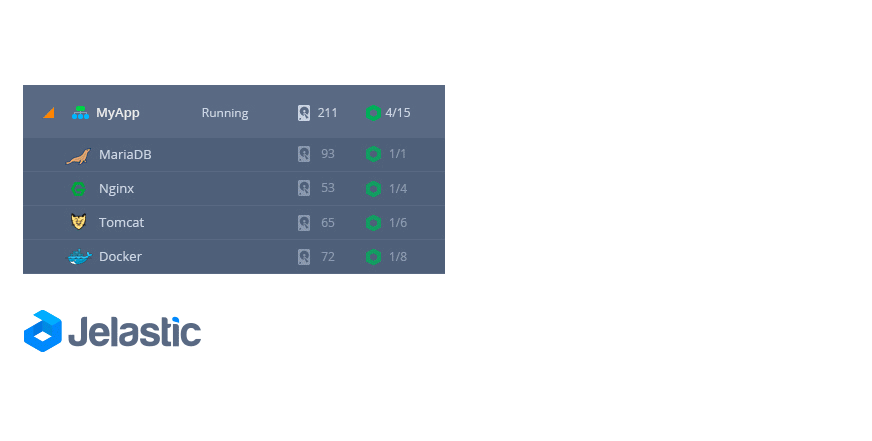
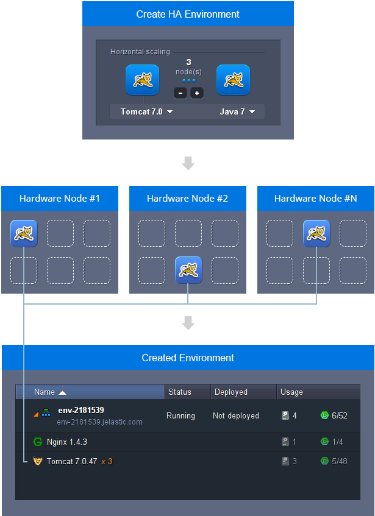

All of the instances in the environment (like databases, application servers, etc.) are isolated containers located on different hosts.

Three main reasons why the platform provides individual role-based servers are:

- [live migration](https://cloudmydc.com/)
- [high availability](https://cloudmydc.com/)
- [security](https://cloudmydc.com/)

## Isolated Containers Live Migration

In some cases, as your application starts requesting more and **_more resources_**, the physical server running your node might not be able to provide the required resources. In this case, the platform can perform a **_live migration_** of the node to another host within 30 seconds.

During that migration, the application keeps working being [scaled vertically](https://cloudmydc.com/). As an application scales within a server, other applications can be migrated to another server to make room. Live migration allows platform to deliver all the needed resources for applications without restarting containers and causing application downtime. In addition, it can be used during maintenance or other planned downtime to perform automated evacuation of containers from a physical server.

Also, you can add **more instances** to your environment using [horizontal scaling](https://cloudmydc.com/), not having to worry if there is **enough space** on the host. The platform chooses the host with an appropriate amount of free space and relocates your server, in order to offer high-quality performance to each of your nodes.

## High Availability for Applications

The platform provides the **highest availability** by distributing containers of one environment evenly on different physical servers (Hardware nodes). This is done with the help of anti-affinity groups configured to specify that certain containers should never run on the same physical server.

As a result, the platform eliminates any risk of application downtime if one of the physical servers has any issues with performance.

## Security of Isolated Containers

The platform uses the **virtualization** method to run multiple containers simultaneously on a single host. These containers are **fully isolated** with no risk of interfering with one another. If the security of any container at the hardware node is compromised, the rest of the containers are left unaffected.

:::danger Note

Since each instance within the platform represents an isolated container, it can’t be reached from another node with a simple localhost:port_number or 127.0.0.1:port_number reference - the corresponding container hostname or private/public IP address should be used instead (for example, this could be required to interconnect your application with a database instance).

:::
