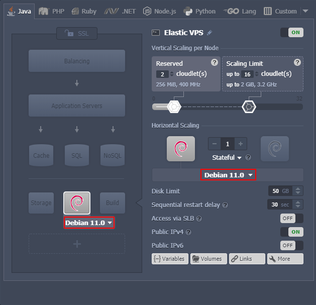
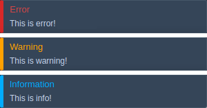

import obj from './ReleaseNotes6.1.3.json'

## Virtuozzo Application Platform 6.1.3

_This document is preliminary and subject to change._

In this document, you will find all of the new features, enhancements and visible changes included to the **Virtuozzo PaaS 6.1.3** release.

<hr/>
<div style={{
        display: 'flex',
        padding: '10px 0 10px 0',
    }}>
    <div style={{
        width: '20%',
        display: 'flex',
        flexDirection: 'column',
        alignItems: 'center',
        padding: '20px',
        justifyContent: 'flex-start',
    }}>


New

</div>
    <div style={{
        width:'100%',
    }}>
        <div style={{
            width:'100%',
            background: '#e4ffee',
            padding: '20px',
            margin: '10px 0',
        }}>
            <h3 style={{
                fontSize: '23px',
                fontWeight: '500',
        }}>Debian 11 OS Template Support</h3>
            <p>Implemented support for the Debian 11 OS template</p>
            <div style={{
            display: 'flex',
            flexDirection: 'row-reverse',
        }}>
                <a href="/">
                    Learn More >>
                </a>
            </div>
        </div>
    </div>

</div>

<hr/>

<div style={{
        display: 'flex',
        padding: '10px 0 10px 0',
    }}>
    <div style={{
        width: '20%',
        display: 'flex',
        flexDirection: 'column',
        alignItems: 'center',
        padding: '20px',
        justifyContent: 'flex-start',
    }}>


Changed

</div>
    <div>
        <div style={{
            background: '#def6ff',
            padding: '20px',
            margin: '10px 0',
        }}>
            <h3 style={{
                fontSize: '23px',
                fontWeight: '500',
        }}>Pop-Up Notifications for Interrupted OnBeforeInit Event</h3>
            <p>Added possibility to display dashboard notification for the interrupted onBeforeInit CS event</p>
            <div style={{
            display: 'flex',
            flexDirection: 'row-reverse',
        }}>
                <a href="/">
                    Learn More >>
                </a>
            </div>
        </div>
        <div style={{
            background: '#def6ff',
            padding: '20px',
            margin: '10px 0',
        }}>
            <h3 style={{
                fontSize: '23px',
                fontWeight: '500',
        }}>Software Stack Versions</h3>
            <p>Actualized list of supported OS templates and software stack versions</p>
            <div style={{
            display: 'flex',
            flexDirection: 'row-reverse',
        }}>
                <a href="/">
                    Learn More >>
                </a>
            </div>
        </div>
    </div>

</div>

<hr/>

<div style={{
        display: 'flex',
        padding: '10px 0 10px 0',
    }}>
    <div style={{
        width: '20%',
        display: 'flex',
        flexDirection: 'column',
        alignItems: 'center',
        padding: '20px',
        justifyContent: 'flex-start',
    }}>

.png>)

Fixed

</div>
    <div>
        <div style={{
            background: '#fef6e6',
            padding: '20px',
            margin: '10px 0',
        }}>
            <h3 style={{
                fontSize: '23px',
                fontWeight: '500',
        }}>Fixes Compatible with Prior Versions</h3>
            <p>Bug fixes implemented in the current release and integrated into the previous platform versions through the appropriate patches</p>
            <div style={{
            display: 'flex',
            flexDirection: 'row-reverse',
        }}>
                <a href="/">
                    Learn More >>
                </a>
            </div>
        </div>
        <div style={{
            background: '#fef6e6',
            padding: '20px',
            margin: '10px 0',
        }}>
            <h3 style={{
                fontSize: '23px',
                fontWeight: '500',
        }}>Bug Fixes</h3>
            <p>List of fixes applied to the platform starting from the current release</p>
            <div style={{
            display: 'flex',
            flexDirection: 'row-reverse',
        }}>
                <a href="/">
                    Learn More >>
                </a>
            </div>
        </div>
    </div>

</div>

## Debian 11 OS Template Support
The platform implements support for the **Debian 11** “bullseye” OS templates on all the PaaS installations (available for all platforms starting with the PaaS 6.0 release). It is an LTS (Long Term Support) version with an estimated support period of five years. The new release provides a massive update of the default packages list, kernel support for the exFAT filesystem, and many other improvements, optimizations, and security fixes. For detailed information, refer to the official [Debian 11 release notes](1).

Also, Debian 11 was added as an out-of-box [Elastic VPS](1) stack in the platform dashboard.

<div style={{
    display:'flex',
    justifyContent: 'center',
    margin: '0 0 1rem 0'
}}>



</div>

[More info](1)

<div style={{
        display: 'flex',
        flexDirection: 'row-reverse',
        padding: '10px 0',
    }}>
    <a href="/docs/PlatformOverview/Release%20Notes/Release%20Notes%208.3#virtuozzo-application-platform-83">
        Back to the top
    </a>
</div>

## Pop-Up Notifications for Interrupted OnBeforeInit Event
In the current PaaS 6.1.3 release, the ability to show dashboard notifications for interrupted ***onBeforeInit*** events was implemented. Such a possibility will help JPS package and CS scripts developers to implement better UI/UX for their solutions.

Add the following code to interrupt your ***onBeforeInit*** event with the dashboard notification:

```bash
return { type: "info|warning|error", message: "Your custom message." };
```

<div style={{
    display:'flex',
    justifyContent: 'center',
    margin: '0 0 1rem 0'
}}>



</div>

[More info](1)

<div style={{
        display: 'flex',
        flexDirection: 'row-reverse',
        padding: '10px 0',
    }}>
    <a href="/docs/PlatformOverview/Release%20Notes/Release%20Notes%208.3#virtuozzo-application-platform-83">
        Back to the top
    </a>
</div>

## Fixes Compatible with Prior Versions

Below, you can find the fixes that were implemented in the Virtuozzo Application Platform 8.3 release and also integrated into previous platform versions by means of the appropriate patches.

<div style={{
        width: '100%',
        margin: '0 0 5rem 0',
        borderRadius: '7px',
        overflow: 'hidden',
    }} >
    <div style={{
        width: '100%',
        padding: '20px',
        height: '70px',
        border: '1px solid var(--ifm-toc-border-color)',
        display: 'flex', 
        alignItems: 'center', 
        justifyContent: 'center',
        fontWeight: '400',
        fontSize: '25px',
        color: 'var(--table-color-primary)',
        background: 'var(--table-bg-primary-t3)'
    }}>
        Virtuozzo Application Platform 8.3
    </div>
    <div>
        <div style={{
            width: '100%',
            height: 'auto',
            border: '1px solid var(--ifm-toc-border-color)',
            display: 'grid', 
            fontWeight: '500',
            color: 'var(--table-color-primary)',
            background: 'var(--table-bg-primary-t2)', 
            gridTemplateColumns: '0.8fr 1fr 2fr',
            overflow: 'hidden',
        }}>
            <div style={{
                display: 'flex', 
                alignItems: 'center', 
                justifyContent: 'center',
                padding: '20px',
                wordBreak: 'break-all',
                borderRight: '1px solid var(--ifm-toc-border-color)',
            }}>
                #
            </div>
            <div style={{
                display: 'flex', 
                alignItems: 'center', 
                justifyContent: 'center',
                padding: '20px',
                borderRight: '1px solid var(--ifm-toc-border-color)',
                wordBreak: 'break-all'
            }}>
               Compatible from
            </div>
            <div style={{
                display: 'flex', 
                alignItems: 'center', 
                justifyContent: 'center',
                padding: '20px',
                borderRight: '1px solid var(--ifm-toc-border-color)',
                wordBreak: 'break-all'
            }}>
               Description
            </div> 
        </div>
        {obj.data1.map((item, idx) => {
            return <div style={{
            width: '100%',
            height: 'auto',
            border: '1px solid var(--ifm-toc-border-color)',
            display: 'grid', 
            gridTemplateColumns: '0.8fr 1fr 2fr',
            fontWeight: '400',
        }}>
            <div style={{
                padding: '20px',
                borderRight: '1px solid var(--ifm-toc-border-color)',
                background: 'var(--table-bg-primary-t1)',
                display: 'flex', 
                alignItems: 'center', 
                justifyContent: 'flex-start',
                wordBreak: 'break-all',
                padding: '20px',
            }}>
                <a href="/">
                    {item.JE}
                </a>
            </div>
            <div style={{
                display: 'flex', 
                alignItems: 'center', 
                justifyContent: 'center',
                padding: '20px',
                wordBreak: 'break-all'
            }}>
                    {item.CompatibleFrom}
            </div>
            <div style={{
                wordBreak: 'break-all',
                 padding: '20px',
            }}>
                {item.Desc}
            </div>
        </div>
        })}
    </div>
</div>

<div style={{
        display: 'flex',
        flexDirection: 'row-reverse',
        padding: '10px 0',
    }}>
    <a href="/docs/PlatformOverview/Release%20Notes/Release%20Notes%208.3#virtuozzo-application-platform-83">
        Back to the top
    </a>
</div>

## Software Stack Versions
The software stack provisioning process is independent of the platform release, which allows new software solutions to be delivered as soon as they are ready. However, due to the necessity to adapt and test new stack versions, there is a small delay between software release by its respective upstream maintainer and integration into Virtuozzo Application Platform.

The most accurate and up-to-date list of the certified [software stack versions](1) can be found on the dedicated documentation page.


[More info](1)

<div style={{
        display: 'flex',
        flexDirection: 'row-reverse',
        padding: '10px 0',
    }}>
    <a href="/docs/PlatformOverview/Release%20Notes/Release%20Notes%208.3#virtuozzo-application-platform-83">
        Back to the top
    </a>
</div>

## Bug Fixes
In the table below, you can see the list of bug fixes applied to the platform starting from Virtuozzo Application Platform 8.3 release:


<div style={{
        width: '100%',
        margin: '0 0 5rem 0',
        borderRadius: '7px',
        overflow: 'hidden',
    }} >
    <div style={{
        width: '100%',
        padding: '20px',
        height: '70px',
        border: '1px solid var(--ifm-toc-border-color)',
        display: 'flex', 
        alignItems: 'center', 
        justifyContent: 'center',
        fontWeight: '400',
        fontSize: '25px',
        color: 'var(--table-color-primary)',
        background: 'var(--table-bg-primary-t3)'
    }}>
        Virtuozzo Application Platform 8.3
    </div>
    <div>
        <div style={{
            width: '100%',
            height: 'auto',
            border: '1px solid var(--ifm-toc-border-color)',
            display: 'grid', 
            fontWeight: '500',
            color: 'var(--table-color-primary)',
            background: 'var(--table-bg-primary-t2)', 
            gridTemplateColumns: '0.8fr 1fr 2fr',
            overflow: 'hidden',
        }}>
            <div style={{
                display: 'flex', 
                alignItems: 'center', 
                justifyContent: 'center',
                padding: '20px',
                wordBreak: 'break-all',
                borderRight: '1px solid var(--ifm-toc-border-color)',
            }}>
                #
            </div>
            <div style={{
                display: 'flex', 
                alignItems: 'center', 
                justifyContent: 'center',
                padding: '20px',
                borderRight: '1px solid var(--ifm-toc-border-color)',
                wordBreak: 'break-all'
            }}>
               Affected Versions
            </div>
            <div style={{
                display: 'flex', 
                alignItems: 'center', 
                justifyContent: 'center',
                padding: '20px',
                borderRight: '1px solid var(--ifm-toc-border-color)',
                wordBreak: 'break-all'
            }}>
               Description
            </div> 
        </div>
        {obj.data2.map((item, idx) => {
            return <div style={{
            width: '100%',
            height: 'auto',
            border: '1px solid var(--ifm-toc-border-color)',
            display: 'grid', 
            gridTemplateColumns: '0.8fr 1fr 2fr',
            fontWeight: '400',
        }}>
            <div style={{
                padding: '20px',
                borderRight: '1px solid var(--ifm-toc-border-color)',
                background: 'var(--table-bg-primary-t1)',
                display: 'flex', 
                alignItems: 'center', 
                justifyContent: 'flex-start',
                wordBreak: 'break-all',
                padding: '20px',
            }}>
                <a href="/">
                {item.JE}
                </a>
            </div>
            <div style={{
                display: 'flex', 
                alignItems: 'center', 
                justifyContent: 'center',
                padding: '20px',
                wordBreak: 'break-all'
            }}>
                {item.AffectedVersions}
            </div>
            <div style={{
                wordBreak: 'break-all',
                 padding: '20px',
            }}>
                {item.Desc}
            </div>
        </div>
        })}
    </div>
</div>
