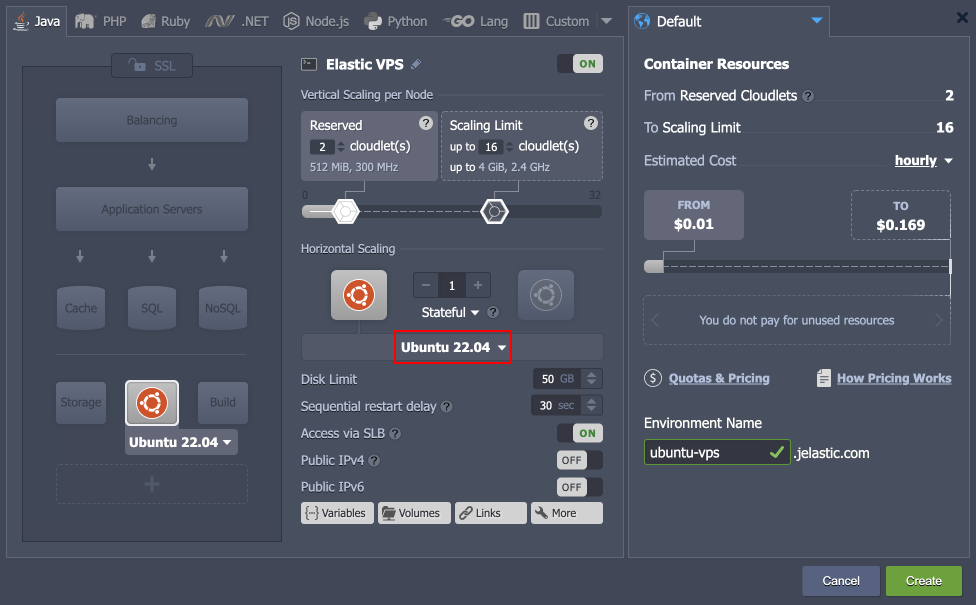

import obj from './ReleaseNotes7.3.json'

## CloudMyDc Application Platform 7.3

_This document is preliminary and subject to change._

In this document, you will find all of the new features, enhancements and visible changes included to the **CloudMyDc PaaS 7.3** release.

    

New

    

        

            <h3 style={{
                fontSize: '23px',
                fontWeight: '500',
        }}>Dashboard Performance Optimization</h3>
            
Significantly improved the performance of the user dashboard when working on accounts with a lot of environments

            

                <a href=" /docs/PlatformOverview/Release%20Notes/Release%20Notes%207.3#dashboard-performance-optimization">
                    Learn More >>
                </a>
            

        

        

            <h3 style={{
                fontSize: '23px',
                fontWeight: '500',
        }}>Ubuntu 22 Support</h3>
            
Added Ubuntu 22.04 OS template support and integrated the Ubuntu 22.04 VPS stack

            

                <a href=" /docs/PlatformOverview/Release%20Notes/Release%20Notes%207.3#ubuntu-22-support">
                    Learn More >>
                </a>
            

        

        

            <h3 style={{
                fontSize: '23px',
                fontWeight: '500',
        }}>API to Move Public IPs</h3>
            
Implemented a new MoveExtIP API method that can move external IP addresses between containers and can operate with multiple IPs

            

                <a href=" /docs/PlatformOverview/Release%20Notes/Release%20Notes%207.3#api-to-move-public-ips">
                    Learn More >>
                </a>
            

        

    

    

Changed

    

        

            <h3 style={{
                fontSize: '23px',
                fontWeight: '500',
        }}>Platform Optimizations</h3>
            
Improved the performance, security, and usability of the platform

            

                <a href=" /docs/PlatformOverview/Release%20Notes/Release%20Notes%207.3#platform-optimizations">
                    Learn More >>
                </a>
            

        

        

            <h3 style={{
                fontSize: '23px',
                fontWeight: '500',
        }}>Show Logs Button in Dashboard Notifications</h3>
            
Improved options denomination for the environment selection combo-boxes in the dashboard to provide better clarity

            

                <a href=" /docs/PlatformOverview/Release%20Notes/Release%20Notes%207.3#show-logs-button-in-dashboard-notifications">
                    Learn More >>
                </a>
            

        

        

            <h3 style={{
                fontSize: '23px',
                fontWeight: '500',
        }}>API Changes</h3>
            
Listed all the changes to the public platform API in the current release

            

                <a href=" /docs/PlatformOverview/Release%20Notes/Release%20Notes%207.3#api-changes">
                    Learn More >>
                </a>
            

        

        

            <h3 style={{
                fontSize: '23px',
                fontWeight: '500',
        }}>Software Stack Versions</h3>
            
Actualized list of supported OS templates and software stack versions

            

                <a href=" /docs/PlatformOverview/Release%20Notes/Release%20Notes%207.3#software-stack-versions">
                    Learn More >>
                </a>
            

        

    

    

.png>)

Fixed

    

        

            <h3 style={{
                fontSize: '23px',
                fontWeight: '500',
        }}>Fixes Compatible with Prior Versions</h3>
            
Bug fixes implemented in the current release and integrated into the previous platform versions through the appropriate patches

            

                <a href=" /docs/PlatformOverview/Release%20Notes/Release%20Notes%207.3#fixes-compatible-with-prior-versions">
                    Learn More >>
                </a>
            

        

        

            <h3 style={{
                fontSize: '23px',
                fontWeight: '500',
        }}>Bug Fixes</h3>
            
List of fixes applied to the platform starting from the current release

            

                <a href=" /docs/PlatformOverview/Release%20Notes/Release%20Notes%207.3#bug-fixes">
                    Learn More >>
                </a>
            

        

    

## Dashboard Performance Optimization

One of the major benefits the platform is renowned for is a versatile and robust user interface ([dashboard](/docs/QuickStart/Dashboard%20Guide)). It provides users with all the necessary tools to track and manage all hosted resources. However, when working with a large number of environments on the account (over 100), the drop in the dashboard’s performance can be noted. In order to resolve the issue and improve customers' experience, several internal optimizations were applied in the 7.3 platform release to boost the operation speed when working with a lot of environments.

Among the applied changes, the most notable are:

- significantly improved the dashboard initialization time
- optimized operability in the Firefox browser
- optimized floating menu, search, and environment list components

    <a href="/docs/PlatformOverview/Release%20Notes/Release%20Notes%208.3#CloudMyDc-application-platform-83">
        Back to the top
    </a>

## Platform Optimizations

Below you can find a number of optimizations implemented in the current 7.3 release to boost performance and enhance the user experience when working with the platform:

- Optimized SSL certificate requests to prevent a vast number of queries to the platform database. It results in a faster response of the hosted services in case of multiple simultaneous requests.
- Improved the security of some platform cookies with the additional “_HttpOnly_” and “_Secure_” flags.
- Changed the error code for the “_limit_conn_” problem from **_503_** to **_429_**. The new code better corresponds to the generally accepted rule of code interpreting (i.e. _4xx_ - client error; _5xx_ - server error).

    <a href="/docs/PlatformOverview/Release%20Notes/Release%20Notes%208.3#CloudMyDc-application-platform-83">
        Back to the top
    </a>

## Ubuntu 22 Support

The platform introduces support of the latest Long Term Support release for one of the world’s most popular Linux distributions - **_Ubuntu 22.04_** LTS (Jammy Jellyfish). The update integrates the base [operating system template]( /docs/Container/Container%20Image%20Requirements) (for custom Docker containers) and adds the Ubuntu 22.04 VPS stack. Moreover, the distribution support is automatically available for all platform versions since the 6.0.2 release via the appropriate patches.

[More info]( /docs/Container/Container%20Image%20Requirements)

    <a href="/docs/PlatformOverview/Release%20Notes/Release%20Notes%208.3#CloudMyDc-application-platform-83">
        Back to the top
    </a>

## Show Logs Button in Dashboard Notifications

In the current 7.3 platform release, the ability to display the **Show Logs** button within the _‘warning’_ and _‘error’_ [dashboard notification](https://docs.cloudscripting.com/creating-manifest/handling-custom-responses/) was implemented. Previously, such functionality was available for the _‘info’_ notifications only. The implementation allows custom package developers to handle errors more naturally. Namely, the log file may contain additional information on the occurred issue and even some suggested resolution steps.

    <a href="/docs/PlatformOverview/Release%20Notes/Release%20Notes%208.3#CloudMyDc-application-platform-83">
        Back to the top
    </a>

## API to Move Public IPs

The new **_MoveExtIP_** API method allows moving external IP addresses from the source node to the target node. It complements the existing [SwapExtIps]( /docs/Deployment%20Tools/API%20&%20CLI/Platform%20CLI/Swap%20Public%20IPs) API, making the management of existing public IPs more flexible. Additionally, the new method supports nodes with multiple IPs and can manage them in a single API call.

The following parameters should be specified for the **_MoveExtIP_** method:

- **envName** - source environment name
- **session** - user session or personal access token
- **sourceNodeId** - source node ID (from the source environment)
- **targetNodeId** - target node ID
- **ips** - a comma- or semicolon-separated list of IP addresses that should be transferred (use “\*” to move all the source node external IP addresses)

:::tip Tip

The UI implementation of moving public IPs will be provided in future releases.

:::

[More info](https://cloudmydc.com/)

    <a href="/docs/PlatformOverview/Release%20Notes/Release%20Notes%208.3#CloudMyDc-application-platform-83">
        Back to the top
    </a>

## API Changes

Below, you can find a list of all changes to the public API in the 7.3 platform version (compared to the preceding [7.1]( /docs/PlatformOverview/Release%20Notes/Release%20Notes%207.1#api-changes) ones):

- Implemented a new **_MoveExtIP_** API method (the **binder** service) that can [move external IP addresses]( /docs/PlatformOverview/Release%20Notes/Release%20Notes%207.3#api-to-move-public-ips) between containers and can operate with multiple IPs
- Added a new **_GetBasicEnvsInfo_** API method (the **control** service) to improve the [dashboard loading speed]( /docs/PlatformOverview/Release%20Notes/Release%20Notes%207.3#platform-optimizations)

[More info](https://cloudmydc.com/)

    <a href="/docs/PlatformOverview/Release%20Notes/Release%20Notes%208.3#CloudMyDc-application-platform-83">
        Back to the top
    </a>

## Fixes Compatible with Prior Versions

Below, you can find the fixes that were implemented in the CloudMyDc Application Platform 7.3 release and also integrated into previous platform versions by means of the appropriate patches.

    

        CloudMyDc Application Platform 7.3
    

    

        

            

                #
            

            

               Compatible from
            

            

               Description
            
 
        

        {obj.data1.map((item, idx) => {
            return 

            

                {item.JE}
            

            

                    {item.CompatibleFrom}
            

            

                {item.Desc}
            

        

        })}
    

    <a href="/docs/PlatformOverview/Release%20Notes/Release%20Notes%208.3#CloudMyDc-application-platform-83">
        Back to the top
    </a>

## Software Stack Versions

The software stack provisioning process is independent of the platform release, which allows new software solutions to be delivered as soon as they are ready. However, due to the necessity to adapt and test new stack versions, there is a small delay between software release by its respective upstream maintainer and integration into CloudMyDc Application Platform.

The most accurate and up-to-date list of the certified [software stack versions]( /docs/QuickStart/Software%20Stack%20Versions) can be found on the dedicated documentation page.

[More info]( /docs/QuickStart/Software%20Stack%20Versions)

    <a href="/docs/PlatformOverview/Release%20Notes/Release%20Notes%208.3#CloudMyDc-application-platform-83">
        Back to the top
    </a>

## Bug Fixes

In the table below, you can see the list of bug fixes applied to the platform starting from CloudMyDc Application Platform 7.3 release:

    

        CloudMyDc Application Platform 7.3
    

    

        

            

                #
            

            

               Affected Versions
            

            

               Description
            
 
        

        {obj.data2.map((item, idx) => {
            return 

            

                {item.JE}
            

            

                {item.AffectedVersions}
            

            

                {item.Desc}
            

        

        })}
    

