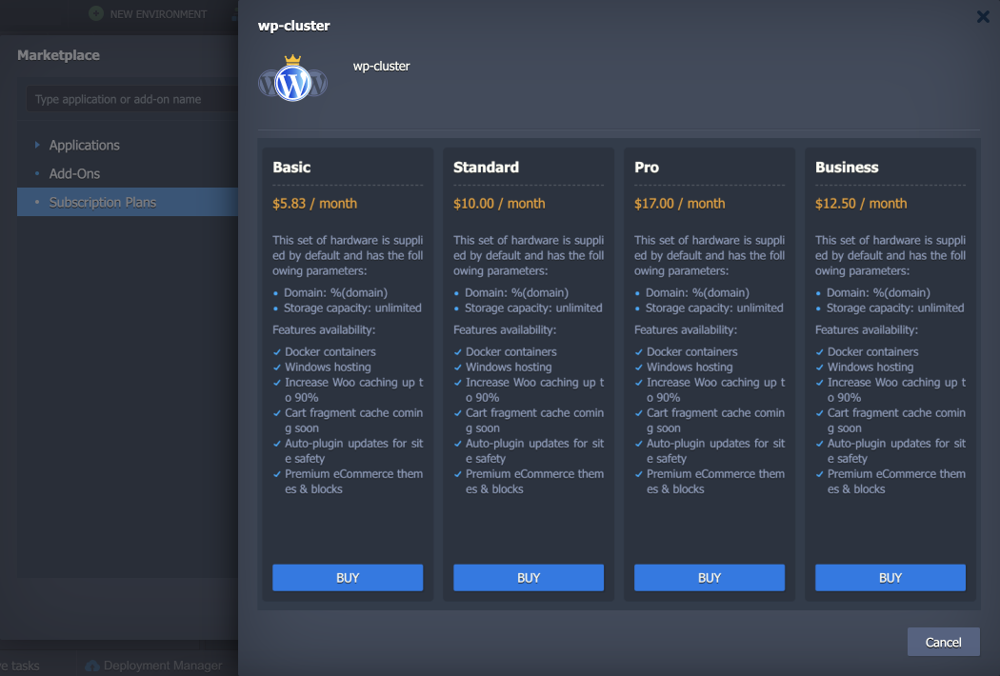
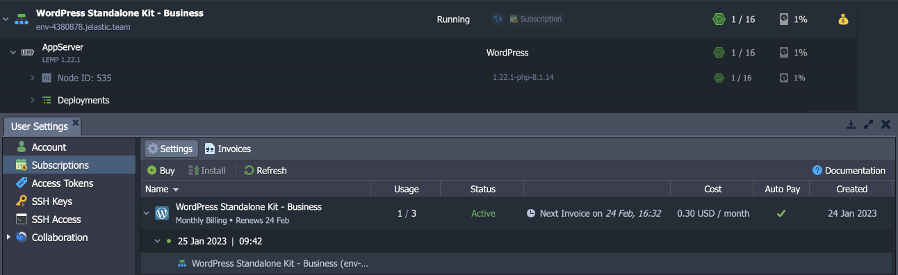

import obj from './ReleaseNotes8.2.json'

## CloudMyDc Application Platform 8.2.2

_This document is preliminary and subject to change._

In this document, you will find all of the new features, enhancements and visible changes included to the **CloudMyDc PaaS 8.2.2** release.

    

New

    

        

            <h3 style={{
                fontSize: '23px',
                fontWeight: '500',
        }}>Subscription Based Solutions</h3>
            
Implemented a native support of the subscription-based solutions with a fixed pricing

            

                <a href="/docs/PlatformOverview/Release%20Notes/Release%20Notes%208.2#subscription-based-solutions">
                    Learn More >>
                </a>
            

        

    

    

Changed

    

        

            <h3 style={{
                fontSize: '23px',
                fontWeight: '500',
        }}>Refilling with 3DS Cards</h3>
            
Provided a notification that additional steps are required to complete an invoice if the selected payment method uses 3DS

            

                <a href="/docs/PlatformOverview/Release%20Notes/Release%20Notes%208.2#refilling-with-3ds-cards">
                    Learn More >>
                </a>
            

        

        

            <h3 style={{
                fontSize: '23px',
                fontWeight: '500',
        }}>API Changes</h3>
            
Listed all the changes to the public platform API in the current release

            

                <a href="/docs/PlatformOverview/Release%20Notes/Release%20Notes%208.2#api-changes">
                    Learn More >>
                </a>
            

        

        

            <h3 style={{
                fontSize: '23px',
                fontWeight: '500',
        }}>Software Stack Versions</h3>
            
Actualized list of supported OS templates and software stack versions

            

                <a href="/docs/PlatformOverview/Release%20Notes/Release%20Notes%208.2#software-stack-versions">
                    Learn More >>
                </a>
            

        

    

    

.png>)

Fixed

    

        

            <h3 style={{
                fontSize: '23px',
                fontWeight: '500',
        }}>Fixes Compatible with Prior Versions</h3>
            
Bug fixes implemented in the current release and integrated into the previous platform versions through the appropriate patches

            

                <a href="/docs/PlatformOverview/Release%20Notes/Release%20Notes%208.2#fixes-compatible-with-prior-versions">
                    Learn More >>
                </a>
            

        

        

            <h3 style={{
                fontSize: '23px',
                fontWeight: '500',
        }}>Bug Fixes</h3>
            
List of fixes applied to the platform starting from the current release

            

                <a href="/docs/PlatformOverview/Release%20Notes/Release%20Notes%208.2#bug-fixes">
                    Learn More >>
                </a>
            

        

    

## Subscription Based Solutions

The 8.2.2 version of the platform implements a native ability to offer products based on the subscription model. The flow is standard to the modern subscription services implementations – a one-time fee to get a designated product for a specified period. The solution gives you a fix-priced alternative to the default [usage-based model](/docs/Account&Pricing/Pricing%20Model%20Overview).

:::danger

Note: This feature availability depends on the particular hosting provider’s settings.

:::

All the available subscriptions are available at the Marketplace under a new **_Subscription Plans_** section. Upon selecting, you’ll see several plans to choose from (e.g. offering a different quantity of resources, additional features, etc.). Click the **Buy** button for the preferred option to see the purchase dialog. You can pay monthly or annually, enable auto pay with your default payment method, and set the required number of product instances in your subscription.

All the **Subscriptions** are added to the dedicated section in the account settings. Here, you can see all the relevant information on the subscriptions (including invoices), install/remove instances, and terminate the subscription.

Due to the concept of subscriptions, some actions are restricted for the installed instances (e.g. topology adjustment or environment cloning). Read more about subscriptions in the dedicated **[Subscription-Based Product](/docs/Account&Pricing/Subscription-Based%20Products)** document.

[More info](/docs/Account&Pricing/Subscription-Based%20Products)

    <a href="/docs/PlatformOverview/Release%20Notes/Release%20Notes%208.3#CloudMyDc-application-platform-83">
        Back to the top
    </a>

## Refilling with 3DS Cards

**3D Secure (3DS)** protocol adds an extra layer of payment authentication for additional fraud protection during an online transaction. If used, the cardholder is asked to provide proof of identity by entering a unique password, an SMS code, or a temporary PIN. 3DS can be mandatory in some regions (e.g. Europe due to the _Strong Customer Authentication regulation_) and optional in others (but still can be used to reduce fraud).

When refilling the account balance using the saved payment method with the 3DS, the platform will provide an explicit notification that the invoice was created, but the transaction should be completed through additional external authentication.

    <a href="/docs/PlatformOverview/Release%20Notes/Release%20Notes%208.3#CloudMyDc-application-platform-83">
        Back to the top
    </a>

## API Changes

Below, you can find a list of all changes to the public API in the 8.2.2 platform version (compared to the preceding [8.0.2](/docs/PlatformOverview/Release%20Notes/Release%20Notes%208.0.2#api-changes) ones):

Added a new **[Billing > Subscriptions](https://docs.jelastic.com/api/#!/api/billing.Subscription)** service with API methods to support the [subscriptions](/docs/PlatformOverview/Release%20Notes/Release%20Notes%208.2#subscription-based-solutions) feature

[More info](https://cloudmydc.com/)

    <a href="/docs/PlatformOverview/Release%20Notes/Release%20Notes%208.3#CloudMyDc-application-platform-83">
        Back to the top
    </a>

## Fixes Compatible with Prior Versions

Below, you can find the fixes that were implemented in the CloudMyDc Application Platform 8.0.2 release and also integrated into previous platform versions by means of the appropriate patches.

    

        CloudMyDc Application Platform 8.2.2
    

    

        

            

                #
            

            

               Compatible from
            

            

               Description
            
 
        

        {obj.data1.map((item, idx) => {
            return 

            

                {item.JE}
            

            

                    {item.CompatibleFrom}
            

            

                {item.Desc}
            

        

        })}
    

    <a href="/docs/PlatformOverview/Release%20Notes/Release%20Notes%208.3#CloudMyDc-application-platform-83">
        Back to the top
    </a>

## Software Stack Versions

The software stack provisioning process is independent of the platform release, which allows new software solutions to be delivered as soon as they are ready. However, due to the necessity to adapt and test new stack versions, there is a small delay between software release by its respective upstream maintainer and integration into CloudMyDc Application Platform.

The most accurate and up-to-date list of the certified [software stack versions](/docs/QuickStart/Software%20Stack%20Versions) can be found on the dedicated documentation page.

[More info](/docs/QuickStart/Software%20Stack%20Versions)

    <a href="/docs/PlatformOverview/Release%20Notes/Release%20Notes%208.3#CloudMyDc-application-platform-83">
        Back to the top
    </a>

## Bug Fixes

In the table below, you can see the list of bug fixes applied to the platform starting from CloudMyDc Application Platform 8.2.2 release:

    

        CloudMyDc Application Platform 8.2.2
    

    

        

            

                #
            

            

               Affected Versions
            

            

               Description
            
 
        

        {obj.data2.map((item, idx) => {
            return 

            

                {item.JE}
            

            

                {item.AffectedVersions}
            

            

                {item.Desc}
            

        

        })}
    

