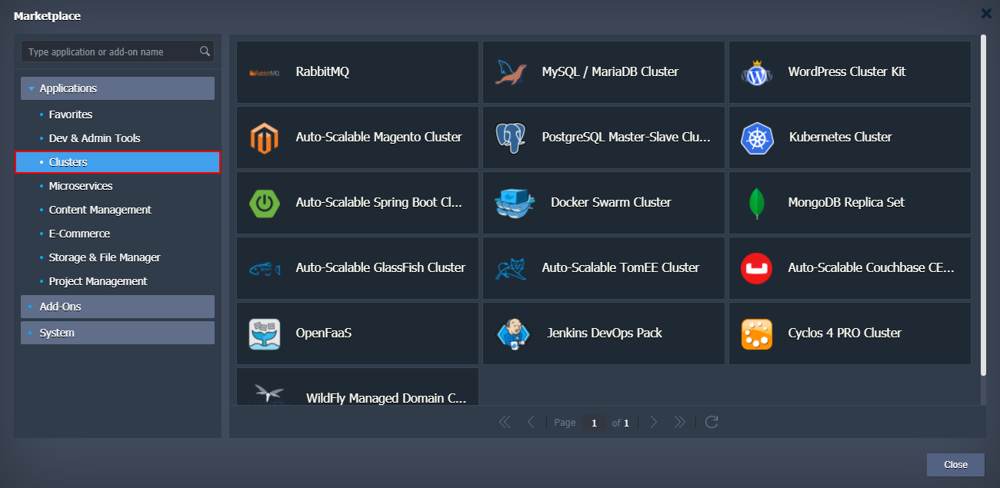
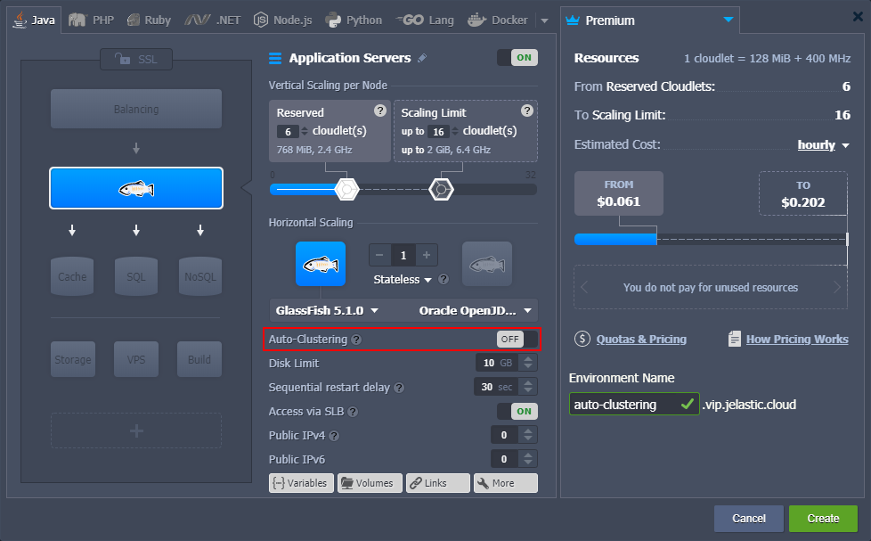
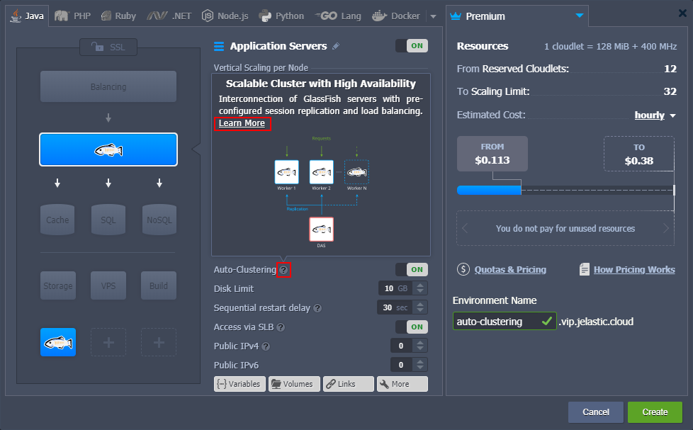
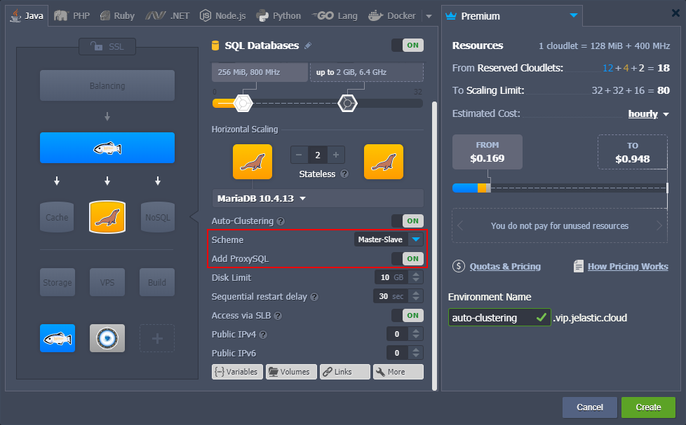

In the modern world, the importance of data availability cannot be underestimated. Herewith, you want to maintain immediate access to any required information at a moment’s notice. Thus, for any production solution of any meaningful size, it is highly recommended to configure a **cluster**. Software clustering is the technique of using at least two instances for a service. Such redundancy not only provides reliability (the system can withstand a failure of at least one instance) but also helps to handle high load.

Based on the experience, the configuration of a cluster can be a challenging process that requires quite a lot of time investment. In order to help you out, the platform automates some of the most popular clusterization solutions and can perform them for you on-demand directly from [topology wizard](https://cloudmydc.com/). Such automation immensely simplifies and speeds up the creation of a reliable production-ready cluster for your project.

## Enabling Auto-Clustering

Currently, the following templates support the Auto-Clustering feature via the topology wizard:

- **application servers** - [Tomcat/TomEE](https://cloudmydc.com/), [GlassFish](https://cloudmydc.com/), [Payara](https://cloudmydc.com/), [Jenkins](https://cloudmydc.com/), [WildFly](https://cloudmydc.com/)
- **SQL databases** - [MySQL](https://cloudmydc.com/), [MariaDB](https://cloudmydc.com/), [Percona](https://cloudmydc.com/), [PostgreSQL](https://cloudmydc.com/)
- **NoSQL database** - [Couchbase](https://cloudmydc.com/), [MongoDB](https://cloudmydc.com/), [Redis](https://cloudmydc.com/), [OpenSearch](https://cloudmydc.com/)
- **storage server** - [Shared Storage Container](https://cloudmydc.com/)

:::tip Tip

In addition to the **Auto-Clustering** option in topology wizard, a number of prepackaged clusterization solutions can be found under the **Clusters** category of the platform [Marketplace](https://cloudmydc.com/).

:::

1. Select one of the listed stacks in the topology wizard. The appropriate **Auto-Clustering** switcher will be available in the central part of the frame.

2. You can hover over the **hint** icon for additional information on this particular stack auto-clustering implementation. Within the description, you can find the **Learn More** link to documentation with a more extensive overview.

3. Also, after enabling Auto-Clustering, some additional configs can appear for further customization of the cluster. For example, **MariaDB auto-cluster** allows to choose replication Scheme and add dedicated ProxySQL load balancer exclusively for this database cluster:

## Additional Materials on Auto-Clustering

The platform provides extensive documentation, multiple blog posts, and dedicated GitHub pages on the Auto-Clustering topic:

- [Auto-Clustering of Instances via Topology Wizard](https://cloudmydc.com/) - lists stacks that support the feature, explains basic management via wizard and Cloud Scripting
- [MariaDB/MySQL Auto-Сlustering with Load Balancing and Replication](https://cloudmydc.com/) - automatic clustering and replication for MariaDB and MySQL databases for high availability and performance
- [PostgreSQL Auto-Clustering with Asynchronous Master-Slave Replication](https://cloudmydc.com/) - get multiple copies of essential data within automatic master-slave replication for PostgreSQL database
- [MongoDB Replica Set Auto-Сlustering for High Availability and Performance](https://cloudmydc.com/) - automatic clustering and replication for MongoDB databases for redundancy, automated failover, and high-availability
- [Out-of-Box GlassFish & Payara Clustering](https://cloudmydc.com/): Running Java EE Highly-Available Applications in the Cloud - shows how to set up a highly-available cluster with GlassFish and Payara Micro for running Java EE applications
- [Jenkins Cluster Hosting for Continuous Integration and Delivery (CI/CD)](https://cloudmydc.com/) - automate continuous integration and delivery of your Java applications using pre-configured master-slave Jenkins cluster
- [WildFly Managed Domain in Containers](https://cloudmydc.com/): Automatic Micro Clustering and Scaling - explains how to extend your WildFly from a standalone server to cluster in managed domain mode for running cloud-native microservices
- [Shared Storage Container Auto-Clustering](https://cloudmydc.com/) - configures a reliable storage cluster with AutoFS, NFSv4, and GlusterFS support
- [Solutions Collection on GitHub](https://cloudmydc.com/) - stores the platform automation solutions, including Auto-Clustering (e.g. [db-clustering](https://cloudmydc.com/), [wildfly](https://cloudmydc.com/), [glassfish](https://cloudmydc.com/), and other repositories)
