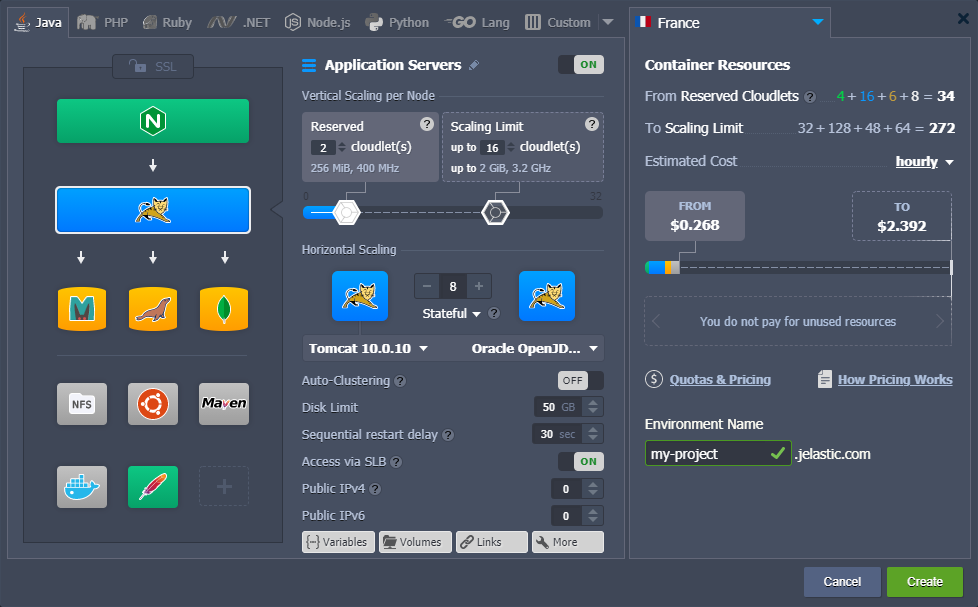
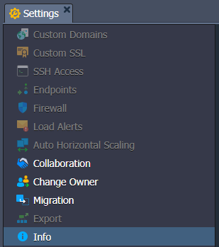
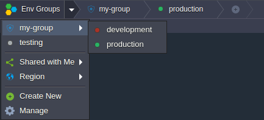
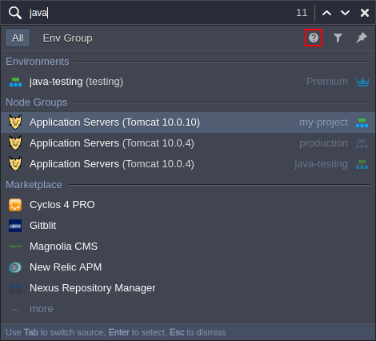
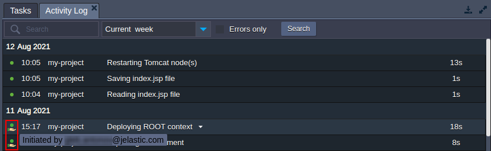
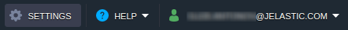
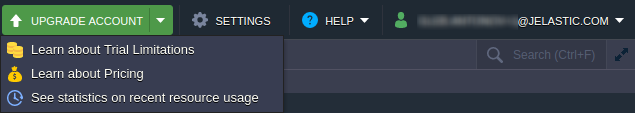
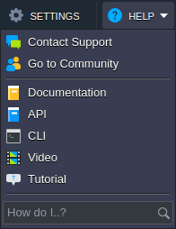

The following guide will provide you with the necessary information on the platform dashboard usage and will help you to get acquainted with the offered possibilities.

To start with, you can check out the quick overview video below to get insights on the main functionality available through the platform intuitive UI:

For better acquaintance, we recommend creating a free account (if you don’t have one yet) on any of the installations available at [Cloud Union](https://cloudmydc.com/) and following the guide steps.

:::tip Tip

A short, interactive tutorial is available directly within the dashboard through the **Help >** [Tutorial](https://cloudmydc.com/) option in the top-right corner.

:::

Let’s start our detailed exploration of the platform dashboard:

- [Creating and Managing Environments](/docs/QuickStart/Dashboard%20Guide#creating-and-managing-environments)
- [Function Icons for Environments](/docs/QuickStart/Dashboard%20Guide#function-icons-for-environments)
- [Environment Settings](/docs/QuickStart/Dashboard%20Guide#environment-settings)
- [Function Icons for Each Instance](/docs/QuickStart/Dashboard%20Guide#function-icons-for-each-instance)
- [Import](/docs/QuickStart/Dashboard%20Guide#import)
- [Marketplace](/docs/QuickStart/Dashboard%20Guide#marketplace)
- [Environment Groups](/docs/QuickStart/Dashboard%20Guide#environment-groups)
- [Dashboard Search](/docs/QuickStart/Dashboard%20Guide#dashboard-search)
- [Deployment Manager](/docs/QuickStart/Dashboard%20Guide#deployment-manager)
- [Tasks Panel](/docs/QuickStart/Dashboard%20Guide#tasks-panel)
- [User Settings](/docs/QuickStart/Dashboard%20Guide#user-settings)
- [Upgrade Trial Account & Balance](/docs/QuickStart/Dashboard%20Guide#upgrade-trial-account--balance)
- [Help and Account Options](/docs/QuickStart/Dashboard%20Guide#help-and-account-options)

## Creating and Managing Environments

1. Click **New Environment** in the upper left corner of the dashboard.

<!--  -->

2. The **Topology Wizard** will be opened, where you can fully customize your environment settings.

The full possibilities of this window are described in the [Setting Up Environment](/docs/EnvironmentManagement/Setting%20Up%20Environment) article.

After finishing configurations, type your Environment Name, and click the **Create** button.

3. All of your environments will be listed in the central panel of the dashboard.

You can find the following information in the columns:

- **Name** - includes the name (or [alias](/docs/EnvironmentManagement/Environment%20Aliases) if specified) of the environment and its domain. Using the arrow icon before the environment’s name, you can expand the list of nodes it includes.
- **Status** - shows the current state of your environments (Running, Sleeping, Stopped, Creating, Launching, Stopping, Cloning, Redeploying, Exporting, Installing, Migrating, Deleting).
- **Tags** - displays [Environment Groups](/docs/QuickStart/Dashboard%20Guide#environment-groups) and [region](/docs/EnvironmentManagement/Environment%20Regions/Choosing%20a%20Region) of this environment, versions (tags) of the containers, and the name of the deployed project.
- **Usage** - shows the current load (i.e. cloudlets and disk space usage). You can also find the **Billing History**  button here, which leads to a separate tab with [your spending statistics](/docs/Account&Pricing/Resource%20Charging/Monitoring%20Consumed%20Resources) on the current environment.

## Function Icons for Environments

Hover over a running environment to see multiple icons for its management: Set Alias, Region, Open in Browser, Settings, Change Environment Topology, Clone Environment, Start/Stop, Delete Environment, Add/Edit Env Groups.

1. Use the **Set Alias**  icon to provide an [alternative environment name](/docs/Account&Pricing/Resource%20Charging/Monitoring%20Consumed%20Resources) (domain will remain unchanged).

2. Click the **Open in Browser**  icon to open the environment in a new browser tab.

:::tip Note

This option could be absent if your environment does not include application server and load balancer layers.

:::

3. Click on **Settings**  environment settings icon to open a separate tab with numerous [configuration panels](/docs/QuickStart/Dashboard%20Guide#environment-settings), check the detailed description in the linked section.

4. To **Change Environment Topology**, select the needed  option. Perform the required changes in the appeared Topology Wizard dialog and click **Apply** to submit them.

5. To **Clone Environment**, click on the appropriate  button. In the opened frame, specify a name for the new environment and click **Clone**.

More info:

- [Clone Environment](/docs/EnvironmentManagement/Cloning%20Environment)
- [Application Lifecycle Management](/docs/ApplicationSetting/Application%20Lifecycle%20Management)

6. To change the status of the environment, use the Start  and Stop  buttons.

:::tip Note

When the environment is stopped, only the **Settings, Clone Environment, Start**, and **Delete Environment** buttons are available for it.

Also, the [Settings](/docs/EnvironmentManagement/Cloning%20Environment) tab for such an environment will contain only four active options: Collaboration, Change Owner, Migration, and Info.

:::

7. To **Delete Environment**, click on the following  icon and confirm the action by entering your password.

8. Hover over the **Tags** column to manage the [groups of this environment](/docs/QuickStart/Dashboard%20Guide#environment-groups) with the **Add/Edit Env Group** buttons (  or  respectively).

For the platforms with multiple [regions](/docs/EnvironmentManagement/Environment%20Regions/Choosing%20a%20Region), each environment has a region-dedicated icon in the **Tags** column. It allows you to visually separate instances hosted on the different hardware servers and, upon clicking, shows only environments in the appropriate region.

## Environment Settings

There are twelve options within the environment **Settings** tab: _Custom Domains, Custom SSL, SSH Access, Endpoints, Firewall, Load Alerts, Auto Horizontal Scaling, Collaboration, Change Owner, Migration, Export, and Info_.

1. Select **Custom Domains** to access the following suboptions: _Domain Binding and Swap Domains_.

More info:

- [Custom Domain Name](/docs/ApplicationSetting/Domain%20Name%20Management/Custom%20Domain%20Name)
- [Swap Domains](/docs/ApplicationSetting/Domain%20Name%20Management/Swap%20Domains)
- [Application Lifecycle Management](/docs/ApplicationSetting/Application%20Lifecycle%20Management)

2. Choose the **Custom SSL** option and upload the necessary files to apply your custom SSL certificate.

:::tip Note

This feature can be configured only for the certified application servers and load balancers with [public IP](https://) attached.

:::

More info:

- [Self-Signed Custom SSL](/docs/ApplicationSetting/SSL/Self-Signed%20Custom%20SSL)
- [Custom SSL](/docs/ApplicationSetting/SSL/Custom%20SSL)

3. In the **SSH Access** section, you can see the Public Keys, SSH Connection, and **SFTP / Direct SSH Access** tabs. The first one allows managing your [public SSH keys](/docs/Deployment%20Tools/SSH/Add%20SSH%20Key). The second one shows how to access your environment (either via SSH Gate or Web SSH). The third provides details on the connection over the SFTP/FISH protocols.

More info:

- [SSH Gate](/docs/Deployment%20Tools/SSH/SSH%20Overview)
- [Add SSH Key](/docs/Deployment%20Tools/SSH/Add%20SSH%20Key)
- [SSH Access via Web Browser](/docs/Deployment%20Tools/SSH/SSH%20Access/Web%20SSH)
- [SSH Access via Local Client](/docs/Deployment%20Tools/SSH/SSH%20Access/SSH%20Gate)
- [SSH Protocols](/docs/Deployment%20Tools/SSH/SSH%20Protocols)

4. Within the **Endpoints** section, you can manage the mapping of your containers' TCP/UDP ports for ensuring their collaboration with external resources via a direct connection.

More info: [Endpoints](/docs/ApplicationSetting/External%20Access%20To%20Applications/Endpoints)

5. The **Firewall** section allows setting **Inbound** and **Outbound Rules** to manage access to your containers. These rules allow you to explicitly define which connections should be accepted and which ones - blocked.

More info: [Container Firewall](/docs/ApplicationSetting/External%20Access%20To%20Applications/Container%20Firewall)

6. Use **Load Alerts** to set new triggers (or adjust the default ones) to receive the appropriate email notifications in case the specified resource’s usage exceeds the stated limits.

The **History** tab lists all the triggered alerts in the environment with the details.

More info: [Load Alerts](/docs/ApplicationSetting/Built-in%20Monitoring/Load%20Alerts)

7. With the **Auto Horizontal Scaling** option, you can configure triggers to control the number of containers within a layer (except the Maven build node). Scaling conditioning can be defined based on the CPU, Memory, Network, Disk I/O, and Disk IOPS consumption.

Switch to the History tab to view a list of all scaling operations performed by the platform due to the configured triggers.

More info: [Automatic Horizontal Scaling](/docs/ApplicationSetting/Scaling%20And%20Clustering/Automatic%20Horizontal%20Scaling)

8. In the **Collaboration** section, you can view and manage the list of accounts that have access to the current environment.

If you need to grant access to another user, click **Add** and fill in the Email field. To give the Change Topology / SSH Access permissions, tick the appropriate option. Click **Save** to apply changes.

More info: [Account Collaboration](/docs/Account&Pricing/Accounts%20Collaboration/Collaboration%20Overview)

9. Click **Change Owner** to transfer environment to another user account within the confines of a single platform.

More info: [Environment Transferring](/docs/EnvironmentManagement/Environment%20Transferring)

10. Choose **Migration** to move your environment to another set of hardware ([region](/docs/EnvironmentManagement/Environment%20Regions/Choosing%20a%20Region)).

:::danger Note

Availability of this option, as well as access to each particular environment region, depends on your hosting provider’s settings.

:::

More info: [Environment Migration between Regions](/docs/EnvironmentManagement/Environment%20Regions/Migration%20between%20Regions)

11. Select **Export** to pack all your environment’s settings and data into a single downloadable file. Subsequently, it can be restored at another hosting provider’s platform, creating an identical environment copy.

:::danger Note

Availability of this option, as well as access to each particular environment region, depends on your hosting provider’s settings.

:::

More info:

- [Environment Export](/docs/EnvironmentManagement/Environment%20Export%20and%20Import/Environment%20Export)
- [Environment Import](/docs/EnvironmentManagement/Environment%20Export%20and%20Import/Environment%20Import)

12. Switch to the **Info** section to see additional information on the environment _Domain_, its _Owner_ and Creator (can differ due to the [account collaboration](/docs/Account&Pricing/Accounts%20Collaboration/Collaboration%20Overview) feature), [Region](/docs/EnvironmentManagement/Environment%20Regions/Choosing%20a%20Region), and _Creation Date_.

That’s all of the environment settings.

## Function Icons for Each Instance

Click on the environment in the dashboard to see the list of its [layers](/docs/PlatformOverview/Basics%20&%20Terminology#layer) (load balancers, application servers, databases, etc.). You can further expand these node groups to view and manage separate containers, deployed contexts, attached IP addresses.

Hover over a particular layer or container to see the pop-up icons with different functions.

Use these options to perform the following actions:

- Click the **Set Alias** button to configure an [alternative name](/docs/EnvironmentManagement/Environment%20Aliases) for your layer/node (for example, to define primary and secondary servers in a DB cluster).
- Use **Open in Browser** to access a node of the layer in a new browser tab (can be hidden for some stacks, e.g. Shared Storage or Maven build node).
- Select the **Restart Node(s)** option to restart the appropriate service inside a particular container or all containers of the layer.
- Select the **Config** option to open [configuration file manager](/docs/ApplicationSetting/Configuration%20File%20Manager) that can adjust nodes by [mounting data](/docs/Data%20Storage%20Container/Data%20Sharing/Mount%20Points), creating/uploading new files, and modifying/removing existing ones.
- Choose the **Log** option to view the log files for the nodes of the layer. A list of [log files](/docs/ApplicationSetting/Built-in%20Monitoring/Log%20Files) varies based on the selected instance.
- Click the **Statistics** button to [track the data](/docs/ApplicationSetting/Built-in%20Monitoring/Statistics) on CPU, RAM, Network, Disk space, and IOPS consumption for a separate node or a set of nodes in real-time.
- Select the **Web SSH** option to connect to your [container over SSH](/docs/Deployment%20Tools/SSH/SSH%20Access/Web%20SSH) protocol directly in the browser.
- Use the **Redeploy Container(s)** option to [update nodes](/docs/Container/Container%20Redeploy) to the preferred tag (version).
- Some nodes can have additional options, such as **Add-Ons** (for installing pluggable modules) or **Remote Desktop** (for [managing Windows-based nodes](/docs/Windows&.NET/Windows%20RD%20Access)).
- The **Additionally** list allows you to configure [container settings](/docs/Container/Container%20Configuration/Configuration%20Tools) (_Variables, Links, Volumes, CMD / Entry Point_), view SFTP / Direct SSH Access details, and access Scaling Nodes functionality. Also, depending on the node, it can contain other options (_e.g. Reset Password or Admin Panel Login_).

## Import

- Next to the **New Environment** option, you can find the **Import** button. It processes the uploaded **_.json_**, **_.jps_**, **_.cs_**, **_.yml_**, or **_.yaml_** file to create a new or modify existing environment according to the provided settings.

:::tip Tip

In particular, this feature can be used to create a copy of the environment from another PaaS installation (by [exporting](/docs/EnvironmentManagement/Environment%20Export%20and%20Import/Environment%20Export) it on one platform and [importing](/docs/EnvironmentManagement/Environment%20Export%20and%20Import/Environment%20Import) on the other).

:::

Within the opened **Import** frame, you’ll see the following three tabs (and _[Examples](https://github.com/jelastic-jps)_ link to the JPS Collection with numerous ready-to-go solutions):

- **Local File** - select the locally stored file (via the _Browse_ button), which should be uploaded and executed on the platform
- **URL** - provide a direct link to the required manifest file
- **JPS** - the built-in JSON/YAML editor can be used to insert and edit your code before the deployment (or even write your package from scratch)

For the detailed overview, check the appropriate [Environment Import](/docs/EnvironmentManagement/Environment%20Export%20and%20Import/Environment%20Import) document.

## Marketplace

Upon clicking on the last **Marketplace** option at the top of the dashboard, you’ll access a separate window with a list of the pre-packaged solutions for automatic installation.

These packages are divided into two groups: **Applications** to create new environments and **Add-Ons** to adjust existing ones. You can search for the required solution using the appropriate field at the top-left corner or a categorized list at the left-hand menu.

Once you’ve located the desired package, click **Install** for it, and follow the steps in the appeared installation frame.

Check the appropriate [Marketplace](/docs/Deployment%20Tools/Cloud%20Scripting%20&%20JPS/Marketplace) article for a detailed overview.

## Environment Groups

The platform provides a possibility to create [Environment Groups](/docs/EnvironmentManagement/Environment%20Groups/Overview), which help to categorize your environments. For example, the administration of multiple projects becomes much simpler when each one is organized into a dedicated environment group. If needed, you can apply further division by creating subgroups, e.g. _development/testing/production_, _servers/databases/storages_, etc.

:::tip Tip

Usually, environments on the same account are accessible from each other via the platform’s internal network. However, if necessary, you can enable network isolation for a group to ensure that environments inside are inaccessible for the environments outside (internal network only).

:::

More info:

- [Group Creation](/docs/EnvironmentManagement/Environment%20Groups/Group%20Creation)
- [Navigation Across Groups](/docs/EnvironmentManagement/Environment%20Groups/Navigation%20Across%20Groups)
- [Group Management](/docs/EnvironmentManagement/Environment%20Groups/Group%20Management)

## Dashboard Search

The platform provides a built-in search within the dashboard. The core functionality is straightforward - access the Search form at the top-right corner (or use the **Ctrl+F/Cmd+F** shortcut), type a search term(s), and hit **Enter**. For example, you can locate a container by its IP/ID; search for the particular deployed project/environment; find and deploy applications from [platform Marketplace](/docs/Deployment%20Tools/Cloud%20Scripting%20&%20JPS/Marketplace).

The implemented search engine can be personalized to match your specific needs and provide the most accurate results for your requests. Among the main options:

- special characters for search expression (e.g. “**-**” prefix to exclude a term or “**\***” wildcard)
- search source (either whole account or the current [environment group](/docs/EnvironmentManagement/Environment%20Groups/Overview))
- categories filter to search among the selected entities (e.g. exclude the Marketplace packages or look for IPs only)

Additional details can be found in the help hint for the search form (circled in the image above).

## Deployment Manager

**Deployment Manager** is located at the bottom of the dashboard. It stores applications to automate their subsequent deployment into your environments. There are two subsections within the tab:

- _[Archive](/docs/Deployment/Deployment%20Manager#application-archives)_ - stores the application package itself, **Upload** it from your local machine (Local File) or via any external link (URL)
- _[Git / SVN](/docs/Deployment/Deployment%20Manager#git--svn-projects)_ - saves the access credentials to your projects at the remote Git / SVN repositories; click the **Add Repo** button and specify the required details

Once your package is added to the Deployment Manager, it can be [automatically deployed](/docs/Deployment/Deployment%20Guide) to the required environment by following the linked guide.

:::tip Notes

- the VCS deployment type for Java application servers is performed with the help of the [Maven build node](/docs/Java/Build%20Node/Java%20VCS%20Deployment%20with%20Maven)
- the [.NET deployment process](/docs/Windows&.NET/DOT%20NET%20Core) for the Windows-based IIS application server is different from the standardized flow

:::

## Tasks Panel

The **Tasks** panel is placed at the bottom of the dashboard and contains live and historical data on the tasks that the platform is doing or has already done.

The following data is provided for each record:

- **Status** - shows a state of the operation: spinner (in progress), green (success) or red (error) dot

:::tip Tips

If a [collaborator](/docs/Account&Pricing/Accounts%20Collaboration/Collaboration%20Overview) works on the account, the icon for the appropriate actions is automatically customized to simplify tasks analysis. Hover over such a custom icon to view the email address of the corresponding account.

:::

- **Time** - shows a starting time of the respective operation with the latest records displayed at the top of a tab (additionally, all tasks are grouped by days)
- **Environment** - displays the name of the environment where the action was performed (or dash “-” if there is no target environment)
- **Task** - provides an operation or error description

:::tip Tips

You can expand a task to view action **parameters** and server **response** (after completion). The content of these sections can be easily copied with the appropriate button that appears upon hovering over.

Recent errors can be reported directly to the Support Team using the dedicated icon next to the failed operation.

:::

- **Duration** - shows an execution time for a task (displayed after completion)

If you need to view a complete list of actions performed on the account (i.e. not just the recent ones), switch to the **_Active Log_** tab (the magnifying glass icon). Here, you are provided with advanced search and filter options to quickly locate the required tasks:

- **search** is performed by the parameters and server response (i.e. the data upon expanding an operation) <u>not the action description</u>

- you can set the **date range** as last 1/6/24 hour(s), current/previous week, current month, or provide your custom period

- tick **Errors only** to hide all the successfully executed operations

Using the **Tasks** panel, you can always track the activity on your account, as well as troubleshoot issues.

## User Settings

Click the **Settings** button at the top-right corner of the dashboard to access **_User Settings_** configurations.

Here, you can find the following sections: _Account, Access Tokens, SSH Keys / SSH Access, and Collaboration_.

1. The **Account** section allows managing [two-factor authentication](/docs/Account&Pricing/Two-Factor%20Authentication) for your account, as well as changing the password.

2. Within the **_Access Tokens_** tab, you can configure [personal access tokens](/docs/Account&Pricing/Personal%20Access%20Tokens) for your account.

3. The **SSH Keys** and **SSH Access** points open a section with four sub-tabs:

- **Public Keys** - stores [public keys](/docs/Deployment%20Tools/SSH/Add%20SSH%20Key) added to the platform (required for remote access via local SSH client)
- **Private Keys** - lists [private keys](/docs/Deployment/SSH%20Access%20to%20GIT%20Repository) added to the platform (required for access to your private Git repository over SSH)
- **SSH Connection** - shows the required steps to connect to your account via [SSH Gate](/docs/Deployment%20Tools/SSH/SSH%20Access/SSH%20Gate) and allows accessing particular nodes directly in the browser using [Web SSH](/docs/Deployment%20Tools/SSH/SSH%20Access/Web%20SSH).
- **SFTP / Direct SSH Access** - displays connection data for [SFTP/FISH protocols](/docs/Deployment%20Tools/SSH/SSH%20Protocols).

4. The **Collaboration** section consists of two options - **Shared by Me** and **Shared with Me**. The first one allows sharing your environments with other users on the platform, while the second one lists collaborations you are a part of.

For a detailed overview of the [Account Collaboration](/docs/Account&Pricing/Accounts%20Collaboration/Collaboration%20Overview) feature, refer to the linked guide.

## Upgrade Trial Account & Balance

Depending on the [account type](/docs/Account&Pricing/Account%20Types) (trial or billing), either the **Upgrade Account** or **Balance** section is displayed at the top of the dashboard panel.

1. The default type for the accounts is trial, which provides a free-of-charge hosting period (limited by time or bonus money). However, it is usually limited by the number of provided resources, allowed environments/nodes, etc.

Expand the **Upgrade Account** drop-down menu to see the following options:

- Use the **Upgrade Account** button to get a fully functional [account with no limitations](/docs/Account&Pricing/Account%20Types#billing).
- The **Learn about Trial Limitations** option opens the appropriate [Account Limits](/docs/Account&Pricing/Quotas%20System) tab within the _Quotas & Pricing frame_.
- Click on **Learn about Pricing** to be redirected to the documentation page with information about the [pricing model](/docs/Account&Pricing/Pricing%20Model%20Overview).
- Select the **See statistics on recent resource usage** option to open the account’s [billing history](/docs/Account&Pricing/Resource%20Charging/Monitoring%20Consumed%20Resources#billing-history).

2. Billing accounts are spared from any limitations but are charged according to the hosting provider’s pricing.

Click the **Balance** button to expand a list of the following options:

- **Balance** shows the current balance of the account (both Cash and Bonus). By clicking on the section, you can open the Refill Balance tab.
- **Refresh Balance** option updates balance data to the most actual value.
- Click on **Refill Balance** to [submit the payment](/docs/Account&Pricing/Upgrade%20&%20Refill%20Account).
- **Configure auto-refill** to enable [automatic refill](/docs/Account&Pricing/Upgrade%20&%20Refill%20Account) of the account balance (based on the following conditions: _Weekly, Monthly or when Balance less than specified sum_).
- **Payment Methods** option gives an opportunity to choose the default payment method for the account or add a new one.
- Click on the **Quotas & Pricing** item to see the [information frame](/docs/Account&Pricing/Resource%20Charging/Pricing%20FAQ#how-much-do-resources-cost) with a set of tabs about platform _Regions_ (if multiple ones are available)_, Pricing, and Account Limits_.
- **Billing History** shows [account spends](/docs/Account&Pricing/Resource%20Charging/Monitoring%20Consumed%20Resources#billing-history) for the specified period.
- Click on the **View Invoices** option to go to the external billing system panel with the account invoices, orders, payments, etc.

## Help and Account Options

The last two sections of the dashboard are **Help** and **Account** (email address).

1. The **Help** drop-down menu provides access to multiple useful links:

- **Contact Support** redirects to the platform customers support page (based on the hosting provider settings, it can be available for billing users only)
- **Go to Community** is a link to the PaaS online community at [Stackoverflow](https://stackoverflow.com/nocaptcha?s=722a305e-abdf-4aa5-aaa3-570a78a9e6a4).
- **Documentation** navigates to the [Platform Devs Documentation](https://docs.cloudmydc.com).
- **API** opens the [Platform API Documentation](https://docs.cloudmydc.com).
- **CLI** redirects to the [Platform Command-Line Interface Overview](/docs/Deployment%20Tools/API%20&%20CLI/Platform%20CLI/Platform%20CLI%20Overview).
- **Video** points to the [Platform YouTube Channel](https://www.youtube.com/user/JelasticCloud).
- **Tutorial** starts a short, [interactive guide](/docs/QuickStart/Welcome%20Tutorial), which explains the basics of working with the platform
- **How do I..?** shows a list of documents relevant to your request

2. Within the **Account** (email address) drop-down list, the following options are available:

- **Settings** redirects you to the [User Settings](/docs/QuickStart/Dashboard%20Guide#user-settings) section
- **Change Password** opens the same-named dialog box, where you need to fill in the required fields (_Current Password, New Password, and Confirm Password_)
- **Language** allows changing the localization of the dashboard interface (if available)
- **Sign out** to log out of the current account.

Now, you know all the basic dashboard possibilities and hopefully won’t have any problems working with it. If you still have additional questions, please get in touch with the Support Team of your hosting provider or refer to our technical experts at [Stackoverflow](https://stackoverflow.com/questions/tagged/jelastic).
