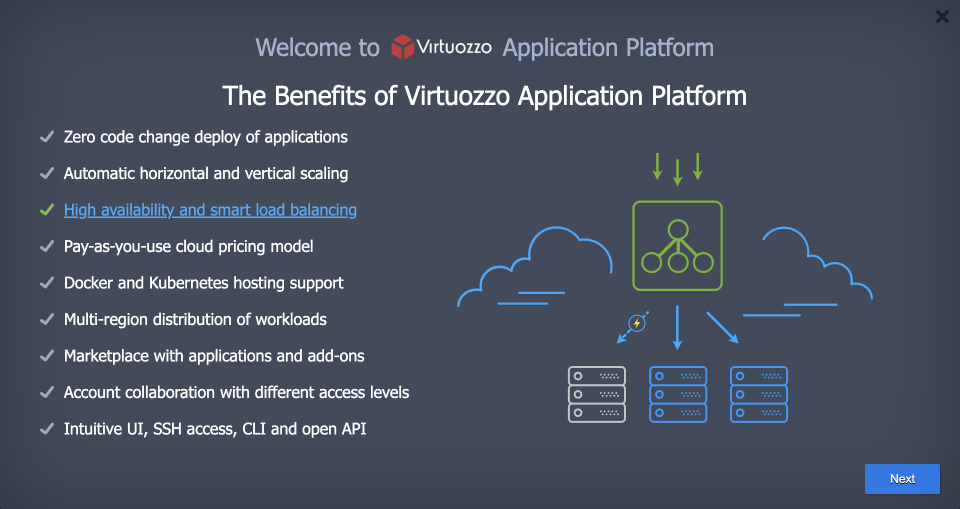
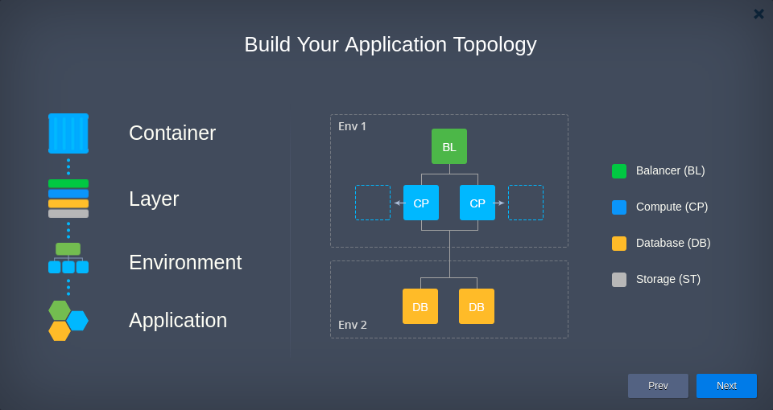
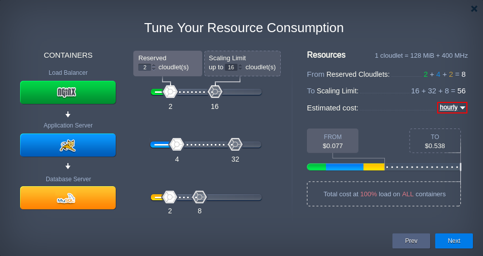
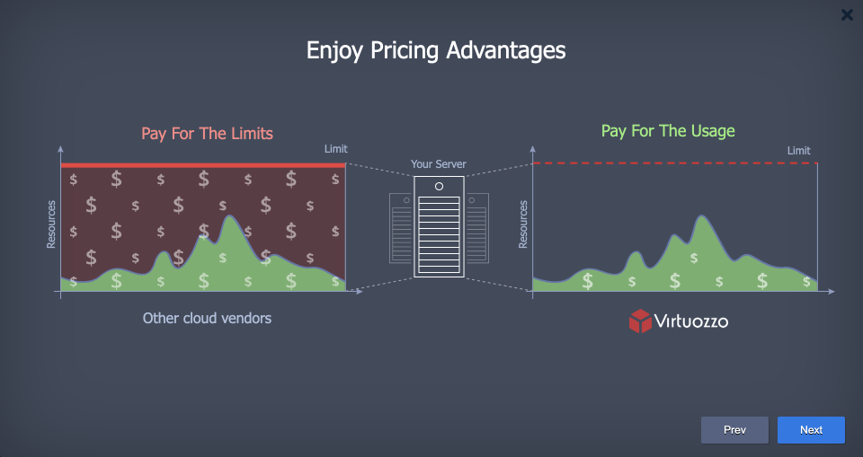
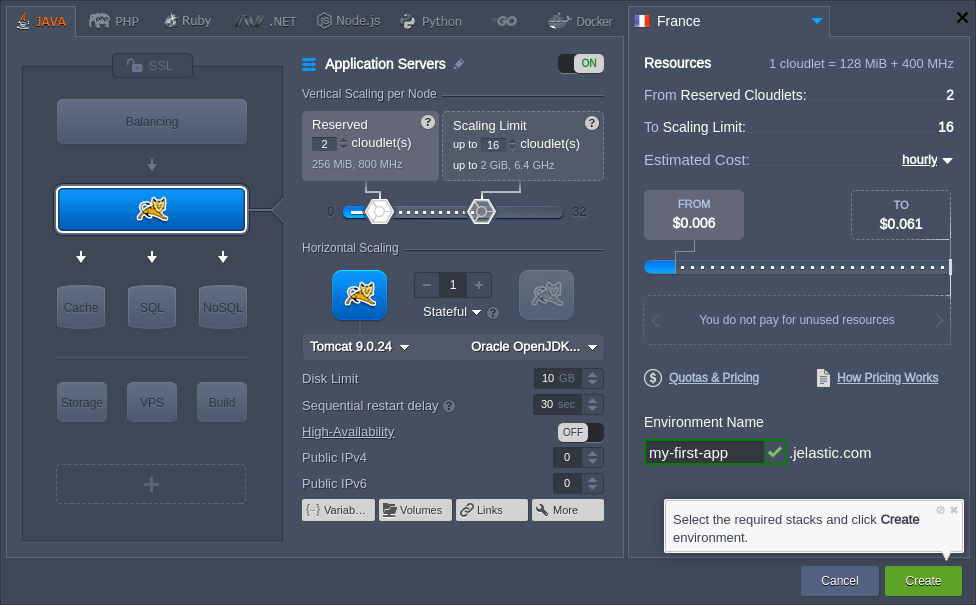
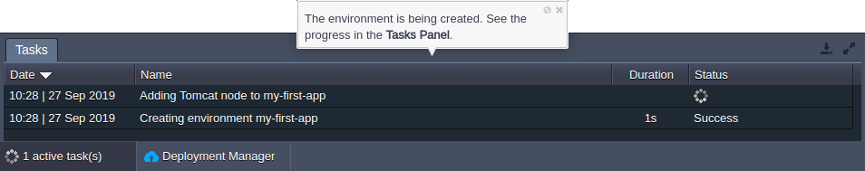
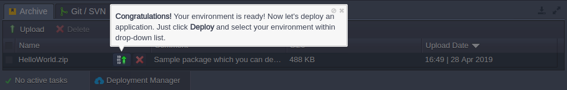
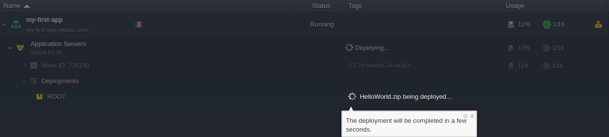
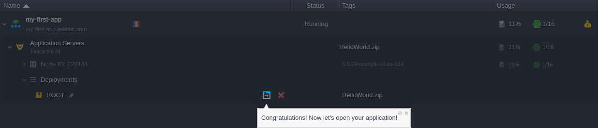

On the very first login into the dashboard, the platform automatically starts a quick introduction guide. The tutorial includes information on the main functionality and features available for you and helps to deploy your first application. The whole process requires just a few minutes to complete and is an excellent basis to start working with the platform.

If needed, this tutorial can be manually run via the **Help > Tutorial** menu at any time:

    

Let’s walk through all of the tutorial steps.

1. Guide starts with an introductory presentation. The first frame is named **The Benefits of PaaS**, which provides a list of the central features of the platform.

Hover over a particular point within the list to view an explanatory illustration. Click it to open the dedicated documentation page for even more details.

Hovering over any point reveals the corresponding illustration, while clicking on it redirects to the dedicated documentation page.

2. The second **Build Your Application Topology** slide shows how to build your application topology using the platform components. Refer to the [Concept & Terminology](h) document for additional details.

3. The next **Tune Your Resource Consumption** frame demonstrates how to provide resources for the instances and how the estimated price is automatically calculated.

The platform automatically provides Estimated cost for the currently configured topology based on the hourly, daily, and monthly basis (use the drop-down menu circled in the image above).

:::tip Notes

The maximal usage pricing is almost unreachable in practice (100% load on all nodes at all times), see the next step for more details.

:::

4. The last **Enjoy Pricing Advantages** slide helps to explain the efficiency of the platform [usage-based pricing](1) comparing to other cloud vendors' models.

5. Next, the presentation is closed and the topology wizard is automatically opened.

:::tip Tip

You can hide the current hint or completely abandon the tutorial with the appropriate icons (cross and crossed out circle respectively).

    <img src="data:image/png;base64,iVBORw0KGgoAAAANSUhEUgAAASwAAAA+CAYAAACRFCZRAAAac0lEQVR4nO2dd5iMV/v4P1O297XsLkuU6FbvXXi9pOiR6C1EtCVIRJSIECF6jyB6EHy1INrL6gSJEkTZbLHWltnd2d0pdub8/lg7ZsuM0YLfdT7XtRfPnHLfpzz33M95zrlHMf7rmaJn1/aEFAlGIpFIXkWiY2JZvX4bihs3b4tCAf7cuHEDg8HwsvWSSCSSHLi4uFCmTBnuJySh0Ol04tKlS4SEhODn5/eydZNIJJIcaDQaoqOjCQ0NRQ1gMBiksZJIJHZxdXN7KXKDgVvh4QAoX4oGEolE8hSoX7YCEonk9UKv0/1rsnJ7ddJgSSSS54IQAiEECoUCwPLv80QaLIlE8kwIIdBqtSQmJmIwGHBycsLf3x8fHx+USturTsnJyej1eoKCggCIj4/H2dkZHx8fm2WkwZJIJE+NEILExERiYmJwc3PD09OT9PR0IiIiCAoKIjAwMF+jlZyczK1btwDw9vZGoVAQGRkJQKlSpfD19c1XnjRYEonkqdHr9cTGxuLr60tISAhCCKKjo9Hr9cTFxeHh4YG3t3eectl7PoUQREREoFAoLI+T9vaDSoMlkUieCiEEaWlpAAQFBWE2m4mKiiItLY3ChQsTHx+PRqPBy8srz3pWYGAgXl5eREREkJGRAYC7uzvFixfH3d3dpky5rUEikTw1JpMJlUqF2WwmJiYGrVZL0aJF8fPzQ6FQYDKZbJZVqVSoVCrLtVKptLvmBdJgSSSSp0ShUODp6UlmZqbFUypWrBg+Pj7odDoePHiAl5dXvmXj4+O5evUqWq0Wd3d33N3dSUtL4+rVq8TFxdmUKQ2WRCJ5atzc3PD19UWv1+Pi4oKTkxMJCQlERkbi7u6Or69vvtsbsr0ypVJJiRIlKFGiBEqlEiEETk5ONuXJNSyJRPLUqFQqgoODUalUJCcnExERgRACb29vgoODbRoff39/lEolmZmZuD3cHFqsWDGUSiX+/v425UmDJZH8S2iSUzh99iJxcfG4u7tRtnRJKoeWfyGyjEYjTk5OL2TzZm6cnJwoXLgwwcGPQlQpFIrHys69dSEgIOCxshx+JIxPSGTKdwv4oPtg2n8wgA97DGH2/OVk6PSPLXsvLp7mrbvaXYB7HEmaZI4eO2Mzfceu/Zb/9+4/kpOnzz+1rH+b72YuZsWqTc+lriEjJnDg0LEnKnP12t/c+PvOM8l9nm14VoxGI81bd+V+fKLDZaznqKPztUuvYfx+4ZJD9R88fJzufYYzY9ZSVq/bypJl6xjx2WRGjZlCWnqGw3o6wvW/b9O6bW8i/ol+rvXaQ6FQWBbNlUrlCzOUDntYU75byJsl32DNijm4ubmSkJDEpKlzWbR0NaOGD3BMmFqNEOKpFD1/8Qpnzl6kSaM6eepISEhi3cbttH2vpSUtu9OeVt6/yeCBvVCr1SiVSsxm8zPX96Rt37Pvf5QrW4oypUs8k9zsSfs82vA8UKuf/AFCrVZTsGABNq1biIuLC5mZmXbzO9LXN2//w3czF+Pj4824MUOpUb0yGRk61m3Yxtbte1m2fAOtWjbh2ImzVKtSkb+u36RBvZqULFGMC39c4fqNW4CCBvVqUjQkOEe9Fy9ewWA0UqFcaapVrUhkVAyr124BYNuOfbRs0YhKFcryT2QMv5+/RFp6BpVDy1G1coUn7ptsXlbUBngCg3UnIpKeXTvg6uqCyWTCz8+Hr8YNzzFJ9x04ys+bdpKZ+QAvL09Gj/iYEsWL5qnLXr7zFy+zaOkakpNTCQwMYMjAXhiMRhYuWUVmpomwUZOYM2OCpS693sCQERPQaJLp3X8kU7/+DIDomHsMChvHvXvxFA0JZtwXwwgo4EdmZiY//rSR4yfPkZlpolyZknwa1h8vT488en43czHeXp78fuEy1atVYtCAHnZ137Pvf6zZsBUntZpaNapw8/Y/tPpPE1q1bEKnrp8wbsxQy0RZuHQ1JpOZYYN6s3DJKgoGFKBvr8506TWMtu+2YNuO3xg0oDtNGtW1K3Pvb0dYs34rTs5O1KpR2eaNo9GkMH3WEqJjYjGbBcXfCGHk8P78diCcA4eOc+rMBaKi7jKwf3c2/rKL3XsOYTQa8fX1Ydjg3lQoV9rm+JQv92YOWampaQwb9RUd2vyXd99uzqKlazh15gIKpQJPD3eGftKbCuVL59Ex5u49Zs9fTmzsfTJNJhrVr8XggT1RKBRMn7UETw8PklNSSUpKJiFJw4ih/agSWh6T2cySH9Zy9PgZfLy9ePft5jbnsdFoZMGS1Zw4+TsqtYomDeswsH+3HHni4xPp1juM33atQaVS8cu2X9mybQ8mk5lyZUsxYmg//PxyHh+5dv0W4yZ9z+QJI/P0x45d+zGZzIwY2o+G9WthNptxdlIzeGBPChUKoFrVity5E8XPm3fy8+aduLg4ExDgz8HDx/l58068vT158CCT1eu2MGn8CGrVqML+g+FM+34xbm6uKJVK0tMz6NmtI1Uql+fqtb+zxurCZUIrlkOrTWfi5Fmo1WrcXF1ZtfYXevfoRI+uHWz20yuLTqcT4eHhQqfT2f2bOn2BaNOpn1izfqu4fOWaSE9Pz5F+5uwF8d93u4ubtyKE0WgU+w+GizYd+wqtVivuRESK+k3bC71ebzffvbj7okXrLuLkqd+F0WgUO3cfEG069hVpaWli0dLVYsLXM4XRaBRGozGH7GMnzog2nfpZ0j7oPkgMGT5eJCYmCZ1OJz4Z9qVYvGyN0Ol0YtmK9aLfwNFCo0kWRqNRfD97qfhi/Hf5tnnKd/NFxw8/FpFRMcJoNIqz5y7a1D0qKkY0at5JnL946WHaUdHwrY5i956DQq/Xi3fa9xanz14Qer1e6HQ68f2cpWL6rCXCYDCIr76ZJRYtXS0MBoPo3O0TMfLzySI1NVUYjUa7/RUZFS0at3hf/PHnFWE0GsXBw8dyyLRuy/xFK8XEybOEwWAQRqNRLP/pZ7Fj136h0+nEgMFjxNbte4TRaBTnzv8hWrzdVcTcjRVGo1H8sHyd6N4nTOh0Orvjk90GrVYr+g/6XPywfJ0wGo3i2PEzolPXgUKbliaMRqM4En5KzJq3LN/+HjJivJgz/0dhMBhE3P148XbbXuLAoXDLWLTv3F8kJCQKg8Eg1m7YJj4e8oXQ6/Viz77Dot37H4mEhERhNBrFnAXLRf2m7UXM3Xt5ZMxftFIMHTFBaNPSRHJyiujeJ0xs3Lwjxxy1/n/4sdOiTce+IjIqRuj1evHNtHmW+dKuc39x4tQ5cfvOP6JNp37i2IkzeeamTqcTfQaMEg2adRDpGRl5xkWn0wm9Xi9+3XtI1G/aXoz+YoowGo3i2vWbokGzDmLE6ElCr9eLxCSN6PDhANGl5xCh1+tF9z5honXbniJVqxXp6Rmic7dB4p12vYXBYBCLlq4W9Zu2F9dv3BI6vV606dRPtOnYV9yPTxB6vV6MGTdNNGreUURFxzz2vn9V/rJtlMMeVtjgPlQJLU/48bP8vGkHDzIf0LBeLfr06kxAAT/2HThK/Xo1KFa0MCaTiYb1a7JwySquXP2bwMBHi2n28iUmaShYsAA1qodiNpt5q2k9atYIxcnJyeI5CCHsPnJkrzu0atkET08PzGYz5cuWIi4uAaVSyb79R+jetQMeHu6YTCbat21F7/6fYjKZUalyLukpFApCK5UjKLAgJpOJvfuP2NQ9ITGJwoUDqVSh7MO0Wvj72T7EaQuFQkHjhnVwccnyZO31V0JiEoWDAylfrjQmk4n6dWtQoED+gRgDAvwJP36GU2cuEFqpLF0/aGtZZ8juW7PZTIVypdmwej4+3l6YTCZqVq/M+o07UKlU/H7+ks3xyS4/+dv5lC1dkt493sdsNuPr602yJoX9B8OpU6sqtWtWoU6tqigUijzj+M3EUajUWRsJvb08KVO6BNEx9ywLuLVqVMH7oV7FigZz/37WmJ6/cJm6tatZ0t57uzmbftmVbz+EHz9Dv94f4uzkhFmlYvaMCbi6uJCYpMk3/9HjZ6hfr6ZlDgwZ2MvyOh4gJUXL3AUrGDSgO7VrVs13bmYtgKtRP3yVnxtrr7hxw6wlj0uXryGEwNXNlQ2bdiCEwMfbm+s3bpGSqmXJ/Cn8cekah4+cJCNDh5OTGk1ySp7H06iouyQkJFH6zRLs3nMIIQRKpQKTyczVv27SuGHtfNv9quKwwVIqlbzVtD7NmzVAoVBwJyKKH1f+zNgJ0/lh4bekpWVw/uJlPugxxNJheoMBTXIKQUEFLfXYy5eSqsXLyxPgYccq8fXxfqo1EU9PD0v9KquJok3LYNmKDaxau8WS7urqiiY5hYB8bnYfb09LPnu6p2rT8PHOuUnOzy//A5yPw/sJZHp7e+bSN/+Nem3f/Q/OTk5s/GUnk6bMoUb1UIYM7EWhggVy5DMYjKxet4VLl6+hVCoxGIwIkdV3ySmpdsdn5+4DGB88oF+vDyyhRkqVfIOvJ4xkx+4DLP5hLcWKFubjfl0JrVQuj46XLl9j05bdpKWno1QqiY6OpYrVWoubu2uONUrTQ7mp2jTeKFbEkmarDwBSUtPw8no0Nzw93C3tyY/U1Jx1u7g4A1jaPHfhCjIfZBIUVAiz2ZxvPYGBAdyJiCIyKibPj73cvBVBkSJBlmtXV+esL+WH9Zw+c4Fzv/9pSffwcCc1NY2FS1Zx4NBxnJ2d8fb2JDVVC+QN6ZI9dhH/RLF+Y1yOetLTM16bdd5sHDJYCYkaLl2+RrMm9SwT8Y1iRejRtQOfDPsSk8lEwQB/WjZvRNiQvnnK34191FH28h08fByNJsVyLYQg4p/oHAuNz0rBAH96de9Ek0Z18qTl+1bIagLY033fgaOkpaXn+EyT/KgtKqUSYX40MTLSdbi6uearo8JRmfuP5JGZpEm2WefbrZrxTuu3SE/PYPb85Sz9cR3jvxiWI9/qdVu4fTuSOd9PxN3NjUtXrvHpZ5MB8PfztTs+1auF0rtHJ4aMmEBopbKUKV0SgGpVK1K9WiUyM01s27GXSVPm8suGxTnkpqdnMHbiDL75ahR1a1dDoVAwcsw3+bYlN56e7jnetNnqAwA/Xx+Sk1Nz5LX3NtDP1ztH/gydnsREjaXNfXp2xsXZmclT57FkwVSLAbSmft0anDp9gSU/rmPC2DCcH3qkkVExjPpiKiFFgujYrnWOMoWDCgEwsH932r3XEoDbdyIt3uyBQ8dpUL8mkyeMRKlU0n/QGP6+mfdNb2ChgigUCurXq8mkcSOArPs5ISGJ0s/4kuVl4NC2BiHMzJy7jM1bd6PTZ21j0GhS2Lp9LxXKl8bFxYXGjepw5NhpYu/dx2QyER0Ty4SvZ6JNS8/p8trJV6N6KBpNMsdOnAXgSPhpRo+dikKhQK1Wo9Wm5aufk1qNXq/nwQP7b3QAGjeszfadv6HT6TGZTBw/eY75i39yaMuFPd1DK5YlKvouf127CcCBQ8dy3NwFCxYgMioGgJRULeccfB1uT2alhzKz3iJlGfyUFG2+9cycu4zde7MeCdzd3SgcHIgQWZ6Kk1qNVptl+BKTNBQpEoSbqyvatHS2bd+HyWTG+OCB3fEBKBoSTPE3Qvioz4d8M20+GRk6ft13mNnzl5OZmYlKpaRkiWIIIXKcIcvuE5PJROk3SyCE4PSZC9y8FYHOgW0zVULLc/L0eVJT0xBC8H87f7OZt1HDWmzftR+dXo9Or2f8pJkcO3HOTv7ahJ84Q8zde5jNZpb/9DMrVm20pBcNCaZVyyaUL/cms+f9mG8drf7ThKqVK3Dy1Hn6DfyMWfN+ZNr3ixkUNh6j0cjAj7rlOUNXtUoFCgcXYvlPG1m9bgtr1m8lbNQkxk6cjrOzGoVCQWzsfXbs2s/4STMtxmrLtj24uroAsHX7Xs5fvEyLtxoSfuwM8xatZPOW3Yz+YgpDP53AvXv3XyvvChz0sAoGFGDmtC9Zs34bGzfvwmA04urqQv26Nfh6wqcIIQitWJa+PTszZtw0HmRm4uzkRJcP2uLp4W5xVwG7+cxmM1MmjWbOgpXMmL2UggEF+Hr8pzg7O1O7ZhW27dhLpy6fsGHNfFRWA/xmqeIEFPCnwwcDmDJptN22fPD+e6Rn6Oj3SdbbRF8fb4YO6u3Q63h7uru7uTL4455MnDwLFAoa1K2RY5tAn57vs2DxKo6En8bf35eG9Ws6NFkckTl+0kwUSgX169SgUsWy+dbbsV1r5i5Ywdr121AqlYQUCeLTsP4ANGlUh8XL1vHX9Zt0+7Ad305fSM+PPsXP14dP+nfnTkQUHw38jJU/fG9zfKxp804LLly8zJwFKwgb3Ic//vyLbn2Go1ap8PBw58sxQ/LoVzg4kI7tWzNw6Fh8fbyoU7saH3/UjXkLVz7Ww27WpB6Xrlyn94CReLi70aVzW5uPOt0/bMdi7To+7DEUFxdnGtavSfu2rYiLi8+37upVK9GreyeGj5qEyWymzJslGDXi4zwGZviQvnw8ZCy79xzindZv5UhTqVR8+83nbN6ymwOHj/PbgaN4enpQq0ZlenbvxJsl38izd06tVvPdlC9YtHQNm7f+itlsJrRiWYYO6kNgoYIM+rgHGzbtYNEPa6lauTyfjRzIoqWrWb9pOzOnfcmefYfZt/8IwUGFCBvcB3d3N8KPnyUlRUuJ4iF8O/lzihQOeqa9kS8DhU6nE+fOnaNmzZoOFci9KSz3Inj2NodsrJ/r1Wq1ZV+LvXy506w7NfubOb+Otk7LXreyXvPIlpNfO2wNXO5yT6L7J8O+pEPbVjRv1sAS6yf7vJQ11ou4ZrM5j+5PIjNbjq31FGvPxnrsrHXL1sG6b6z71tb45NfH1u2z7m9b+lnny15+yP4yyf48t87W8q3zWKc9Tk52ndZz1NZ8tc6fe6zyGztrcvdd7jFQqVSYTKYc5W3pmlun7L6CnGOWrY+jY/Aqkm2jnnhn3eO8ECGEzUlivQnPXj57afa+EazTcufLrbejC/m23uo8je720qzl5JfnaevNjaN15M5nfW1Lnr0+fpb+zpaV++bKrUfusvb6xJY+1nPUkflqr5/y43HjmN9GVVu65lfXk9wDryMyWoNEInltkIefXyALZn+dY0uFRCJ5NqTBesG8bouaEsmrjHwklEgkrw3SYEkkktcGabAkEslrgzRYEonkteGlGaznEYX0ZXL46ElSU/M/KiSRSF4ML81gWUd1fB1ZsWoTaenpj88okUieGw5va7h67W8WLV1j8Sr69upM08Z1Aejaexgd27Xmjz//IkmTjEKhYOLYMO78E8W0GYvZtH6R5ezfth37OHzkJGM/G2yJ6rj/0DGOHD2Fk7MTiYkaFs6ZTNz9BOYtWkl0dCwKpZKqlSsw8KNuuLq62I0+ue/AUQ4eOk7x4iHcvh1J7L37DB/al/DjZ4mJuYcmOYXxY4dR4o2idqOPZtdTqmQxbkdEERt7n3bvtaRDu1ZMmjKHu3fj+PzLafTt3Zlmjeu9gKGRSCS5ccjDSk1NY/xXM+nU/m3W/TSX6VPHMnv+j0REZgW5d1Kr+fPyNb4aP4JFc7/Bz9eHXXsPUb1aKEqVkkuXr1nqOnzkJC1bNLKceVKr1Tg7OfHn5Wu893YLFs+bgkqlYur0hRQLKcyaFXNYvvg7IqPusmHzDkuZYyfOEja4D7Omj+e9t1uwcvVmFAoFTmo1f1z6i3dbN2fW9PE0a1KPiZNn06VzW2bPmEDNGpX5v+1Zp/l/3ryTy1eus2zhNDatXUhAAX9mz1tuadPFP6/QpHFdZkwdy8Qvw1i6fD1G4wPGjRkKwIxvx9KiWcN/5ZdJJBKJgwbrzLmLuLg607xZA8xmM0GBAdStXZ0jR08DWYcwmzaqa4moWLRoYeLiEnBSq2nauC7/O3oKhULB/fhE/r4ZwVtNG+Q52Ovj7UXd2tUQQpCQmMTlK9f5sHMbIOtA6TutmnHy1HnLAc7s6JNmszlH9EmFQkFIkSBKFC+K2WymSOEg3ihWhJAiQVnXwYHEJyRaoo++906LHNFHj504g8mUddA2KLAQFcuXsbQpMzMzR4wrIM9BVYlE8uJw6JEwVZtGUlJyjqiXDx48wMPD3eIpubu7PTqxbhWqpUWzBoydMIOwIX05En6KunWq4eXpkSPkDID3wyiRQghLwDQ/Xx9LPd7enpYQsGA7+iSAm1VgPIVSYfmhxqzrR3ntRR8F8PB4VE5ldSpeIpG8HByMh+VPSJFgVv7wfZ60x93AZcuUwsvLgz///IvDR07RvUu7fMtYP1X5+2eFFtYkp1jC3aakaPF/ypDDtrAXfdSx8HoSieTfxKFHwmpVK5GYpOH02YuYTCbS0tOZPmsJf1276dDB3ubNGrDz1wPExcVTr071xxo5H28vQiuV45etvwJZP+W189eDNGpQyxF1HeZpo49mxyFKS8sKyxt3P+GJf7xUIpE8OQ55WJ4e7nzz1WiWLFvL3AXL4eEvuzj6w5vNmzWkR9/htG/zX9RqtUN7r8aOHsT8xavo3X8kALVrVqVL5zbPNfKBveij9lAqlTRrUo+wUV/Rp8f7BAUVZOHS1fyneSP5yCiRvECeOOKorYiVj4vwCVlv98xmc57PMjMz80SPzMZWtMXc9VuXz11XftfWPzNlK/pofjpZR6HMLmddz+u6EVYieZV56oijjkYCzc8Tyi+aYvZnjkaxtPW5dfncdeV3be0JPUlER+s2PEmES4lE8uzIs4QSieS1QRosiUTy2iANlkQieW2QBksikbw2SIMlkUheG6TBkkgkrw1KABcXFzQazcvWRSKRSPKg0WgscfMUN27eFoUC/Llx4wYGg+ElqyaRSP5/wJGN6OfOnXOoLhcXF8qUKcP9hCTUa9Zvo2fX9oSGhj6rjhKJRAI82pn+tOm5iY6JZc36bcjIcxKJ5LkTHh4uQoKDCSpSJE/avZgYomNjadSokbQ/Eonk1SA8PFzodLo8f+Hh4U8dIUC+JZRIJC+MezExdq8lEonklSG3l/Us3hVID0sikbxgsr0q6V1JJJJXnmwv61m9K5AelkQi+ReQ3pVEInlteB7eFcD/A1ghLGVknFZWAAAAAElFTkSuQmCC"/>

:::

If needed, you can [set up your new environment](1) using all of the parameters available via topology wizard. However, you don’t need any specific configurations for this tutorial, so we recommend to follow the hint and click **Create** straightaway.

6. Wait a minute for your environment to be created. Meanwhile, you can track the process state in the [Tasks](1) panel.

7. Once the operation is completed, tutorial automatically navigates you to the [deployment manager](1) section. Here, a button to deploy the default Hello World application will be highlighted. Click it to proceed.

8. Within the opened [deploy frame](1), select your just created Environment in the appropriate drop-down menu and click the **Deploy** button.

    

9. Wait a moment for the application to be deployed.

10. Great! Your first application is ready to work, click the highlighted **Open in Browser** button to view it in a separate browser tab.

