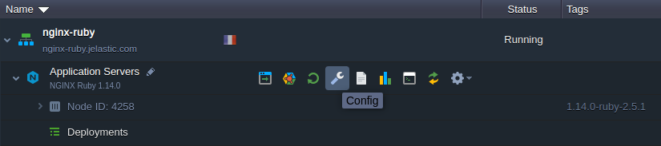
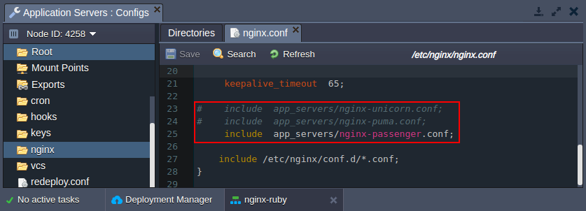
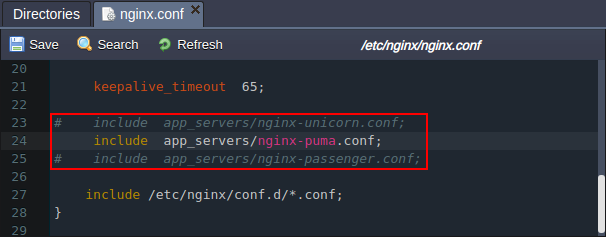
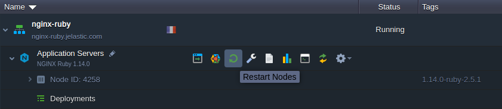
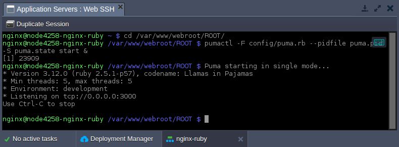

## Ruby Application Server Configuration

The platform provides Ruby application servers based on the two software stacks:

- **Apache Ruby**
- **NGINX Ruby**

Herewith, both ones are configured to utilize the **Passenger** application server by default, which is integrated via the appropriate custom module. Moreover, if needed, the _NGINX Ruby_ stack can be easily configured to work with the different inbuilt servers:

- [**_Passenger_**](https://cloudmydc.com/) - one of the most feature rich application servers for Ruby, which are invaluable for the modern web apps and microservice APIs
- [**_Puma_**](https://cloudmydc.com/) - a Ruby web server oriented on speed and parallelism due to fast and accurate HTTP 1.1 protocol parsing
- [**_Unicorn_**](https://cloudmydc.com/) - an HTTP server, which takes advantage of the Unix/Unix-like kernels features for serving fast clients on low-latency, high-bandwidth connections

Let’s see how it can be switched on the NGINX Ruby server.

# NGINX Application Server Modules

The **Passenger** module is used for all newly created Ruby environments by default. Follow the next steps to change to the different one:

1. Click the **Config** button next to your _NGINX Ruby_ application server.

<div style={{
    display:'flex',
    justifyContent: 'center',
    margin: '0 0 1rem 0'
}}>



</div>

2. Within the opened [configuration file manager](https://cloudmydc.com/) panel, navigate to the **/etc/nginx/** **_nginx.conf_** file. Find the **_include app_servers_** strings:

- _include app_servers/nginx-unicorn.conf_
- _include app_servers/nginx-puma.conf_
- _include app_servers/nginx-passenger.conf_

<div style={{
    display:'flex',
    justifyContent: 'center',
    margin: '0 0 1rem 0'
}}>



</div>

3. Uncomment the string with the required module and comment the previously active one.

:::danger Note

Only _<u>one</u>_ string for the application server module should be active, otherwise you’ll get the compatibility errors.

:::

<div style={{
    display:'flex',
    justifyContent: 'center',
    margin: '0 0 1rem 0'
}}>



</div>

For example, we’ll switch to **_Puma_**.

4. **Save** the changes and **Restart Nodes** of the NGINX application server to apply them.

<div style={{
    display:'flex',
    justifyContent: 'center',
    margin: '0 0 1rem 0'
}}>



</div>

5. Access your node via SSH (e.g. using [Web SHH](https://cloudmydc.com/)) and run the selected module with the appropriate command executed from the project directory:

```bash
cd /var/www/webroot/ROOT/
pumactl -F config/puma.rb --pidfile puma.pid -S puma.state start &
```

:::tip Note

For the **_Unicorn_** application server run the **_unicorn_rails -c config/unicorn.rb -D &_** command instead.

:::

<div style={{
    display:'flex',
    justifyContent: 'center',
    margin: '0 0 1rem 0'
}}>



</div>

:::danger Note

If you would like to switch to the different module, it could be done in the same way, but you need to stop the currently running application server:

- _for Puma_: **_pumactl -F config/puma.rb –pidfile puma.pid -S puma.state stop_**
- _for Unicorn_: **_ps aux | grep ‘unicorn’ | awk ‘{print $2}’ | xargs kill -QUIT_**

:::

That’s all! Now you can work with the chosen Ruby NGINX module.
