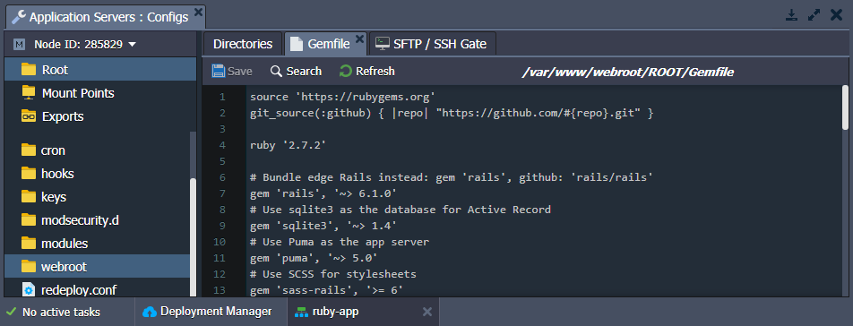

## Ruby Dependency Management

All Ruby-based application servers (_Apache_ and _NGINX_) are provided with the [**Bundler**](https://cloudmydc.com/) dependency manager by default. It automatically tracks and installs dependencies required by your application. You only need to specify the list of required gems in [**_Gemfile_**](https://cloudmydc.com/), which will resolve all dependencies.

Bundler performs dependency resolving in the following cases:

- [deploying applications](https://cloudmydc.com/)
- [switching between Ruby versions](https://cloudmydc.com/)
- [changing deployment type](https://cloudmydc.com/)

After any of the actions mentioned above, Bundler searches [RubyGems.org](https://cloudmydc.com/) (Ruby community’s gem hosting service) for dependencies listed in the config file and, if needed, installs them. By default, Ruby application servers are provided only with gems required for the example application’s work.

**_Gemfile_** supports a non-strict version declaration (e.g. greater than specified version, _“jquery-rails”, “~> 2.0.2”_). In such a case, the Bundler will download and install the latest version of the corresponding gem on each dependency resolving action.

Also, if your application uses any special (non-public) dependencies, you need to specify their repository URL in Gemfile. In such a way, Bundler will be able to download and install these gems.

:::danger Note

When [SSH Gateway](/docs/Container/Container%20Redeploy) a Ruby environment, ensure that a new engine version is correctly covered in the Gemfile. Otherwise, you’ll get a discrepancy error after the process.

We recommend using a non-strict Ruby version declaration in your **_Gemfile_**, for example **_ruby “~> 2.6.0”_**. Such a flexible form prevents you from interrupting your deployment or CI process while being able to upgrade your Ruby version.

:::
