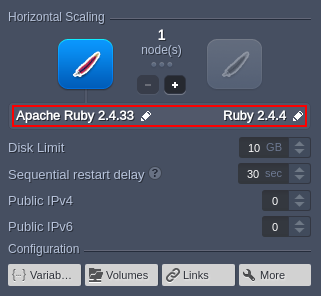

## Ruby Versions

The platform supports all of the latest major releases of the Ruby engine and provides the regular updates of the appropriate stacks, keeping them up-to-date. Currently, the following Ruby versions are available:

- _3.0.6_
- _3.1.4_
- _3.2.2_

:::tip

The up-to-date list of the releases available on the platform is provided via the dedicated, regularly (weekly) updated [Software Stack Versions](https://cloudmydc.com/) document.

:::

You can choose the required one during [environment creation](https://cloudmydc.com/) and quickly [switch between](https://cloudmydc.com/) them afterward.

## Create Ruby Environment

1. Click the **New Environment** button at the top of the dashboard.

2. Within the opened topology wizard, switch to the **_Ruby_** tab and select the desired application server (_Apache_ or _NGINX_). Next, choose the engine version with the appropriate drop-down list in the central part of the frame.

Configure any other desired customization (e.g. cloudlets limit, [public IP](/docs/ApplicationSetting/External%20Access%20To%20Applications/Public%20IP), [region](/docs/EnvironmentManagement/Environment%20Regions/Choosing%20a%20Region), etc.) and click **Create**.

## Change Ruby Version

For the already existing environments, you can change the Ruby version by [redeploying container(s)](https://cloudmydc.com/):

1. There are two options to access container update dialog:

- via the topology wizard (use the **Change Environment Topology** button next to the appropriate environment) by clicking on the stack/tag version in the central dialog part

- with the appropriate **Rededeploy container(s)** button next to the required node/layer

2. In the opened window, adjust the following settings:

- **_Tag_** - allows choosing the needed Ruby version
- **_Keep volumes data_** - saves data in [Volumes](/docs/Container/Container%20Configuration/Volumes)
- **_Simultaneous_** or **_Sequential deployment with delay_** (for [scaled servers](https://cloudmydc.com/) only) - defines whether all containers within a layer should be redeployed at once or one-by-one, to avoid downtime

3. Click **Redeploy** and confirm via the appeared pop-up frame.

In a minute, the Ruby version of your node(s) will be updated.
