## Windows Server VM

The platform integrates support of the virtual machines (VMs), which allows offering Windows Server hosting. In this guide, we’ll show how to create a Windows VM server and the VMs hosting specifics compared to the regular containers used on the platform.

:::danger Note

The availability and version of the Window VMs (e.g., _Windows Server 2019_ or _2022_) on the platform depends on the particular service hosting provider settings.

:::

## Creating Windows VM

1. Click the **New Environment** button at the top of the dashboard to open the topology wizard. Expand the VPS section to locate the Windows server (the VM label helps separate the option from containers).

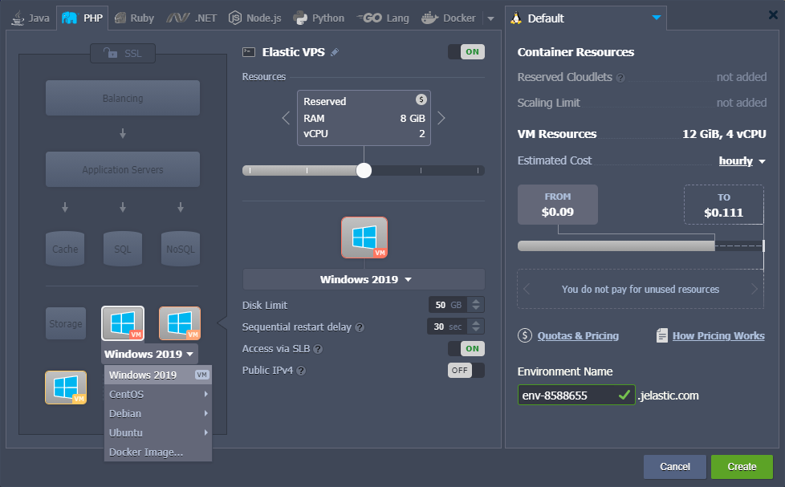

2. Only fixed resources are available for virtual machines, so when a VM is selected, the wizard’s central part is adjusted. Here, you can choose from several predefined plans using the slider. Hover over the price icon to view all the available tariffs for the VM.

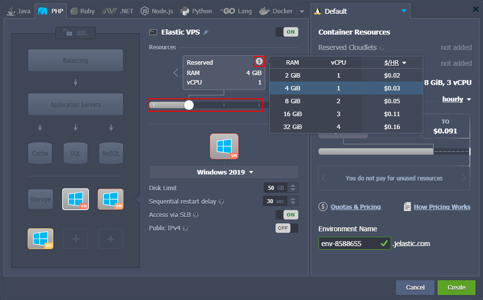

Also, note that the _[Horizontal Scaling](/docs/ApplicationSetting/Scaling%20And%20Clustering/Horizontal%20Scaling)_ and IPv6 options are not available for virtual machines.

3. If VM is added to the topology, an additional **_VM Resources_** line appears in the right part of the wizard (just below the cloudlets information for containers).

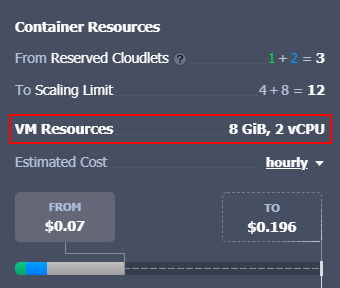

The cost of the VM Resources is always fixed regardless of the actual consumption of the VMs. Click **Create** to proceed with environment creation.

## Managing Windows VM

1. VMs are highlighted with a dedicated **_VM_** label and custom icon in the **Usage** column (as the cloudlets-shaped one is not suitable).

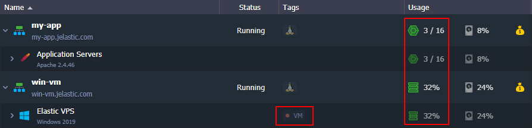

:::tip Tip

You can hover over the **Usage** column for a comprehensive overview of the current consumption or refer to the node **[Statistics](https://cloudmydc.com/)** for detailed analysis.

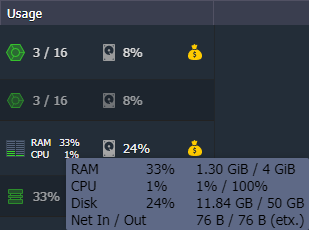

:::

2. Some [node’s function icons](https://cloudmydc.com/) for VM are a bit different compared to containers. The following options are available:

- **Add-Ons** - installs available pluggable modules (e.g. _Env Start/Stop Scheduler_)
- **Restart Node(s)** - restarts a VM
- **Statistics** - shows real-time and historical VM’s resource consumption
- **Remote Desktop** - connects via RDP using the web client and resets RDP password
- **Additionally** - lists additional options, like node’s info

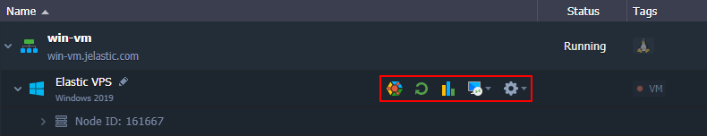

:::danger Note

The **[clone](https://cloudmydc.com/)** and **[migration](https://cloudmydc.com/)** options are automatically disabled for environments with VMs.

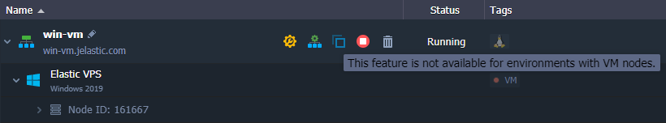

:::

Let’s overview these options in detail.

3. **Statistics** are collected in the same way as for containers. However, CPU is measured in % for VM (instead of MHz).

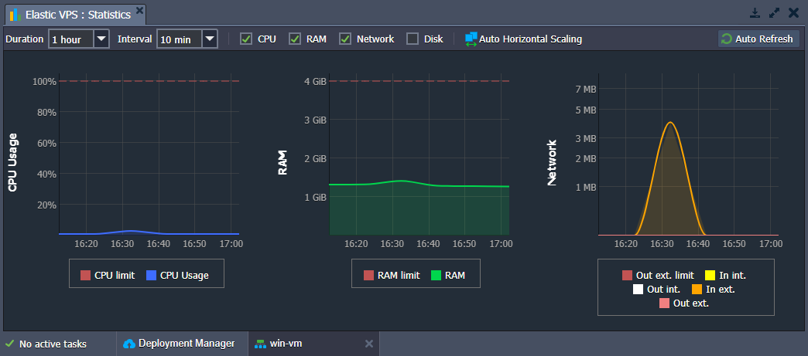

4. All the actual configurations and application management are performed via RDP. Use the appropriate \*\*\*\* menu to:

- **_Open in BRemote Desktoprowser_** - connects to the Windows Server over the RDP using the Guacamole web client, which allows managing server directly in a browser
- **Reset RDP Password** - resets and resends password of the Windows Administrator user
- **Info** - displays a short instruction on the remote desktop connection via local RDP client
- **RDP link** - shows a link for connection via local RDP client

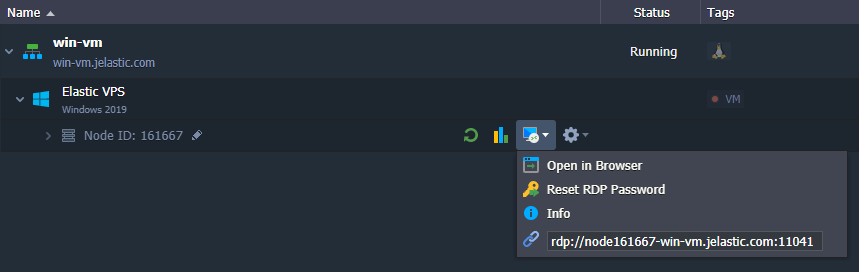

5. In addition to the built-in web client, you can connect using any preferred local RDP application. Connect to VM based on its entry point:

- If created <u>without external IP</u>, an [endpoint](https://cloudmydc.com/) is created automatically and can be used for RDP connectionWindows VM endpoint for RDP

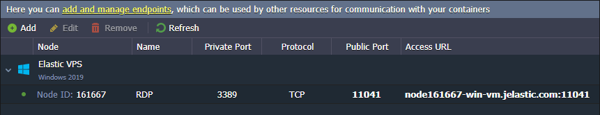

- If a <u>public IP is attached</u>, you can use it directly as VM’s host

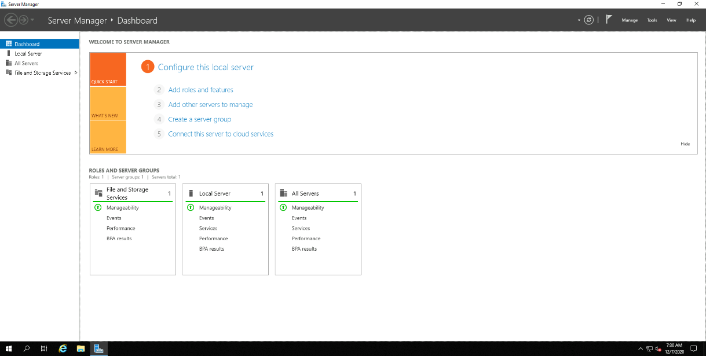

Use administrator credentials from email to authenticate and start managing your Windows Server.

6. The vCPU and Memory for VM are billed as one tariff, while Disk, Network, and Options are billed separately, just as for containers.

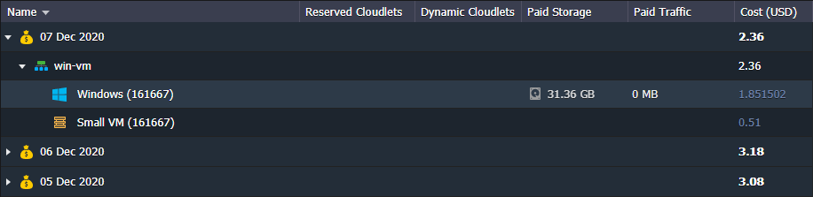

That’s all you need to manage Windows VM in the platform. Refer to the official [Microsoft documentation](https://cloudmydc.com/) for information on the server management itself.
