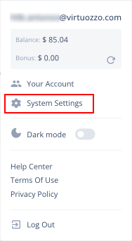
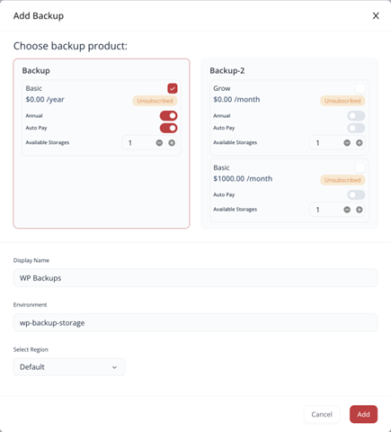
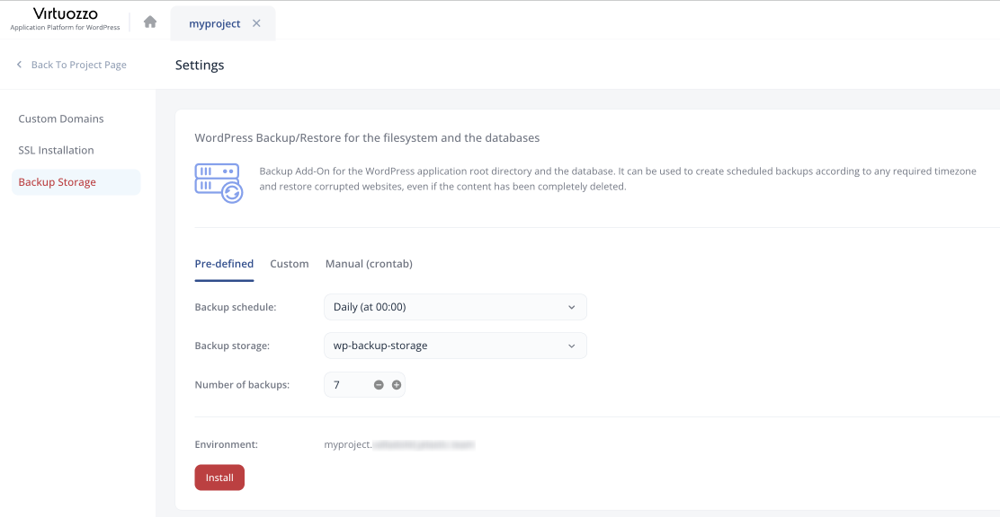
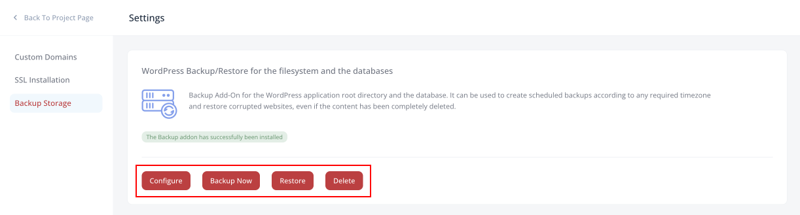

## WordPress Backups

CloudMyDc Application Platform for WordPress provides a fully automated backup solution (based on the **[Restic](https://restic.readthedocs.io/en/stable/010_introduction.html)** software) for all the supported topologies. The platform lets you set up the process based on your needs via a clear and intuitive user interface.

:::tip Tip

Refer to the linked section if you are interested in the [backup process flow and specifics](/docs/Wordpress%20as%20a%20Service/WordPress%20Backups#backup-process-specifics).

:::

The order of operation is the following:

- install preferred backup storage (via the account settings)
- set up the backup settings for the required WordPress instance (via the dedicated project settings)
- manage backup and restore processes via dedicated UI

Let’s go through the required steps in detail:

1. Log in to your CloudMyDc Application Platform for WordPress account and go to the System Settings in the top-right corner.

2. Switch to the **Backup Storage** section and click the **Add Backup** button to create new storage. Within the opened dialog, provide the following data:

- select the preferred backup storage option (tick the checkbox next to the name)
- if needed, enable annual and auto pay options
- set the number of storage nodes
- Provide the _display name_ and _domain_
- choose the required region (if available)

Click **Add** when ready. Your new storage product will be created in a few minutes.

3. Next, select the project you want to back up and click **Settings** (gear icon) in the top-right corner.

4. Go to the **Backup Storage** section and configure the backups schedule using the pre-defined, custom, or crontab tabs. Then, select the backup storage added earlier and set a number of the latest backups to keep.

Click **Install** to apply.

5. That’s all. In a minute, you’ll see successfully configured backups. Use the buttons at the bottom to:

- **Configure** – adjust the schedule, storage node, and quantity of backups to store
- **Backup Now** – create an immediate backup
- **Restore** – restore from backup (choose the project and required backup in the pop-up)
- **Delete** – remove the backup solution for the project

## Backup Process Specifics

Below, you can find information on the backup and restoration processes flow and specifics:

- the backup storage node is mounted to the WordPress instances only during the backup and restore processes (and unmounted afterward)
- during the backup operation, the **_Restic_** creates a snapshot that includes data from the **/var/www/webroot/ROOT** folder and the full database dump (made with the mysqldump utility)
- backups on the storage node have timestamps to make them easier to manage during restoration; also, snapshots are automatically rotated based on the backup number configured by the user - only the specified number of the latest backups is kept
- during the backup operation, the following directories are connected:
  - on the backup storage node - all the backups are stored under the **/data** folder (every environment has its own subdirectory - **/data/${env.name}**)
  - on the compute node (application server) layer - the **/opt/backup/** directory is used for backups
- during the restoration operation, the following directories are connected:
  - on the backup storage node - the **/data/${env.name}** directory with backups of the appropriate environment
  - on the compute node (application server) layer - the **/tmp/restore** directory is used to store initially restored data
- once data from the snapshot is restored to the application server, the corresponding environment is temporarily stopped to perform database restoration and **webroot** folder substitution
