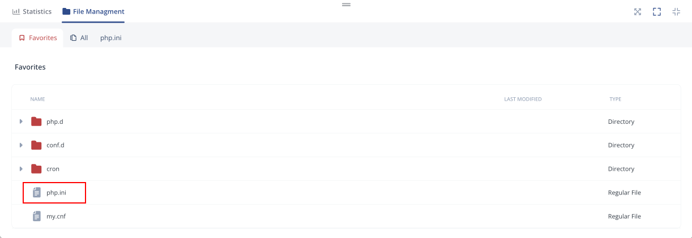

## WordPress PHP Optimization
PHP-based application servers have multiple functions that allow you to fine-tune a project and achieve maximum performance and security. We recommend configuring several standard PHP functions to protect your server from harm. Of course, these are just basic tools that can complement the overall protection of your system. So, let’s see how to perform some initial configurations to increase the security of your PHP environments.

The main PHP configuration file, named ***php.ini***, contains a number of default settings, which you can customize or even add new ones depending on your needs. The file is located in the **etc** directory of your PHP application server. It can be accessed and edited via the [embedded file manager](1) directly in the dashboard. You can find it among the main configuration files in the Favorites tab.

<div style={{
    display:'flex',
    justifyContent: 'center',
    margin: '0 0 1rem 0'
}}>



</div>

:::danger Note

All directives and values in this guide are just recommendations. Before making any changes, refer to the official [PHP documentation](1) for additional information and ensure that the new value will benefit your particular project.

:::

Follow the instructions below to analyze your configurations and apply the necessary changes.

1. Add the following string to disable the ***insecure functions***:

```bash
disable_functions = phpinfo, system, mail, exec
```

Additional security can be obtained by disabling the following functions:

```bash
disable_functions = exec,passthru,shell_exec,system,proc_open,popen,curl_exec,curl_multi_exec,parse_ini_file,show_source
```

<div style={{
    display:'flex',
    justifyContent: 'center',
    margin: '0 0 1rem 0'
}}>


</div>

2. Amount of the ***allowed resources*** (if acceptable for your application):

- **max_execution_time = 30** - maximum script execution time (in seconds)
- **max_input_time = 60** - maximum time for request data parsing by each script
- **upload_max_filesize = 2M** - maximum size of uploaded file
- **memory_limit = 8M** - maximum script memory amount (the default value is 128M, but it is acceptable to set the lower one if it doesn’t decrease your application performance)
- **post_max_size = 8M** - maximum POST data size acceptable for PHP

3. You can ***restrict functions*** unnecessary for your application:

- **file_uploads = Off** - disallow HTTP file uploads
- **display_errors = Off** - disallow displaying the PHP error messages for the end-users
- **safe_mode_allowed_env_vars = PHP_** - limit the external access to your PHP environment
- **expose_php = Off** - restrict the sending back of PHP information
- **register_globals = Off** - turn off the globals registration for input data
- **allow_url_fopen = Off** - restrict remote files opening

4. If needed, ***enable functions*** that give additional information about the security state:

- **cgi.force_redirect = 0** - ensure appropriateness of PHP redirecting
- **log_errors = On** - enable all possible errors logging
5. Switch on the available ***safe modes***:

- **safe_mode = On** - enable safe mode
- **sql.safe_mode = On** - enable SQL safe mode

Once again, while specifying the above-mentioned settings, you should consider the requirements of your application. To apply the changes you’ve made, **Save** the file and **Restart** your PHP application server.

## PHP Extensions
The ***php.ini*** file contains a list of PHP extensions. Some of these modules are enabled for the server by default, while others can be activated manually when necessary. See the list of [PHP extensions](1) available by default at the linked doc.

If you wish to have an extension loaded automatically, use the following syntax:

```bash
extension={moduleName}
```

For example, *“extension=mysqli”*.

:::tip Tip

You can provide custom extensions by uploading them into the default **modules** directory (**/usr/local/lsws/lsphp/lib64/php/modules**) and activating as usual or by specifying an absolute path to the library file:

```bash
extension=/path/to/extension/mysqli.so
```
:::

Also, you can configure extensions by adjusting the predefined directives in the corresponding sections of the ***php.ini*** file (or by adding your own ones). In order to apply the changes, you need to **Save** the file and **Restart** your PHP application server node(s).

