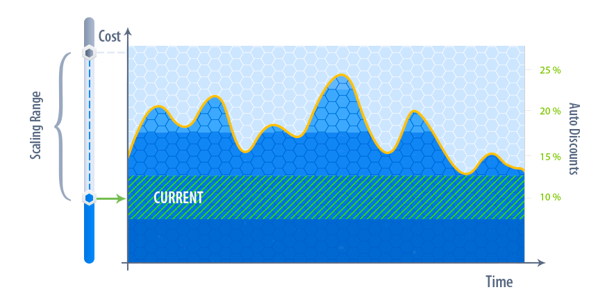
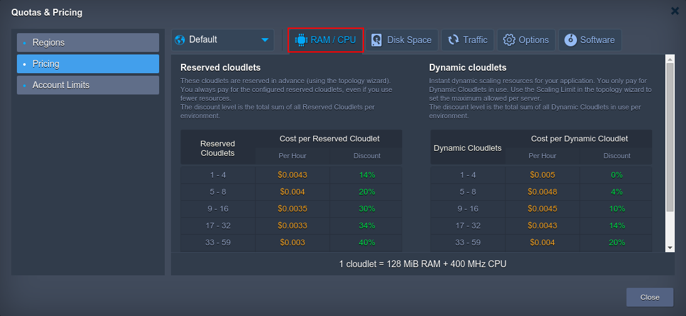
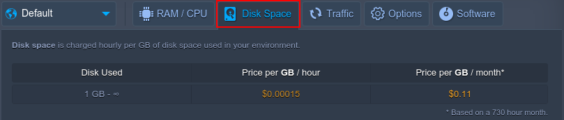
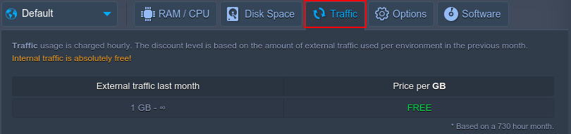
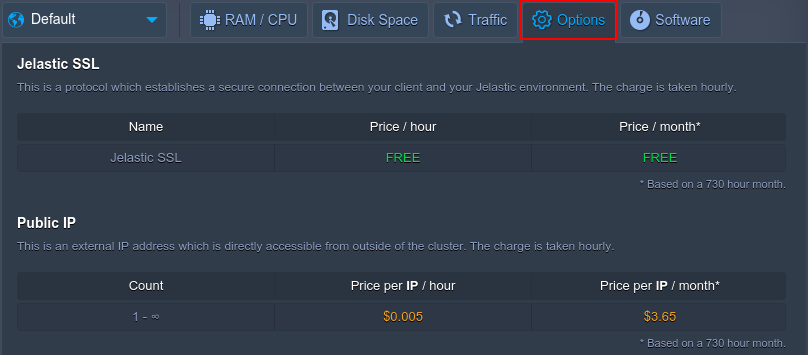

The platform can give you automatic discounts for your resource usage depending on the amount that you consume (so higher volume usage is automatically cheaper). The availability and the level of discount depends on your chosen hosting provider and the specific resource:

- [RAM/CPU (cloudlets);](/docs/Account&Pricing/Automatic%20Discounts#ramcpu)
- [disk space](/docs/Account&Pricing/Automatic%20Discounts#disk-space)
- [traffic](/docs/Account&Pricing/Automatic%20Discounts#traffic)
- [options (Public IP, SSL)](/docs/Account&Pricing/Automatic%20Discounts#options)

## RAM/CPU

The platform measures RAM and CPU in cloudlets. One cloudlet is roughly equivalent to 128 MiB RAM and 400MHz CPU.

Cloudlet consumption is considered across each individual environment (combining all servers within one environment, rather than per server within the environment). This makes it’s easy to get to the higher discount tiers and make some really big savings!

The platform offers two types of cloudlets: Reserved and Dynamic.

**Reserved cloudlets** are ‘consumed’ simply by configuring them within your environment (since you pay for Reserved cloudlets irrespective of your actual resource usage). So you can see the discount applied as you configure the environment using the topology wizard. The total of all Reserved cloudlets configured in your environment determine the discount tier applied.

**Dynamic cloudlet** consumption is calculated based on your usage each individual hour. The total of all Dynamic cloudlets consumed by your environment during one hour determines your discount tier for that hour.

If you use both types of cloudlets in your environment, you may have a different discount tier for each type.

You can see the exact discount tiers and corresponding pricing inside your platform dashboard.
Navigate to **Balance > Quotas & Pricing** menu item.

## Disk Space

Disk space is charged hourly per GB of disk space used in your environment.
Your chosen hosting provider may include some disk space for free, or may provide discount tiers depending on the amount of disk consumption.

You can see the exact discount tiers, corresponding pricing, and any included free amount inside your platform dashboard.
Navigate to **Balance > Quotas & Pricing** menu item.

## Traffic

Traffic usage is charged hourly per GB of **external** traffic used by your environment.

Your chosen hosting provider may include some free traffic usage, or may provide discount tiers depending on the amount of traffic consumption.

Since the amount of traffic can fluctuate so much, the discount tiers for traffic is set based on the total amount of (external) traffic used in the previous month.

**Internal traffic** (traffic between servers within your environment, or between multiple environments at the same hosting provider) **is absolutely free!**

You can see the exact discount tiers, corresponding pricing, and any included free amount inside your platform dashboard.

Navigate to **Balance > Quotas & Pricing** menu item.

## Options

### Built-In SSL

This is a protocol which establishes a secure connection between your client and your environment. The charge is taken hourly.

You can see the price (if any - it’s available free at some providers) set by your chosen hosting provider inside your platform dashboard.

Navigate to **Balance > Quotas & Pricing** menu item.

### Public IP

This is an external IP address which is directly accessible from outside of the cluster. The charge is taken hourly.

You can see the price set by your chosen hosting provider inside your platform dashboard. Navigate to **Balance > Quotas & Pricing** menu item.

