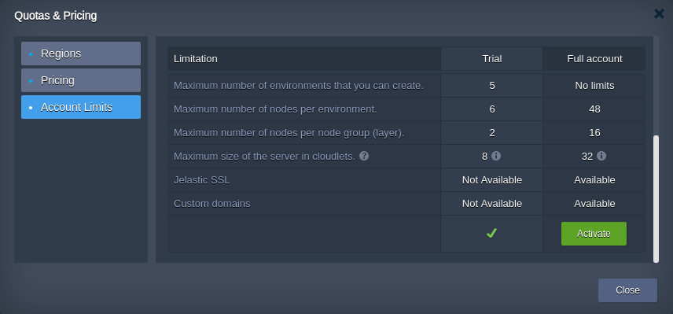

import obj from './QuotasSystem.json'

While working with the platform, you can notice some features being completely or partially restricted (e.g. [public IP](/docs/application-setting/external-access-to-applications/public-ip) option or number of [cloudlets](/docs/platform-overview/cloudlet) per container) by your particular service hosting provider. In most cases, such limitations are provided for trial accounts only, so [upgrading](/docs/account-and-pricing/upgrade-&-refill-account) will automatically unlock access to all of the platform functionality.

:::tip Note
If you still require some quotas enlargement after account conversion, please, contact your hosting service provider to get an assistance.
:::

The actual account permissions can be viewed via the **Quotas & Pricing > Account Limits** window at the platform dashboard.

    Quotas

{obj.data1.map((item, idx) => {
    return 

    {item}

})}

