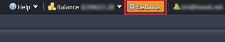
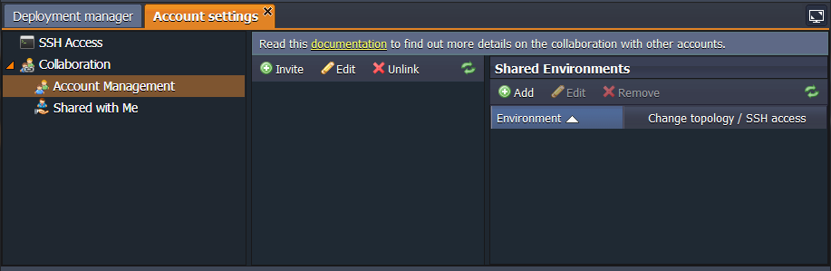
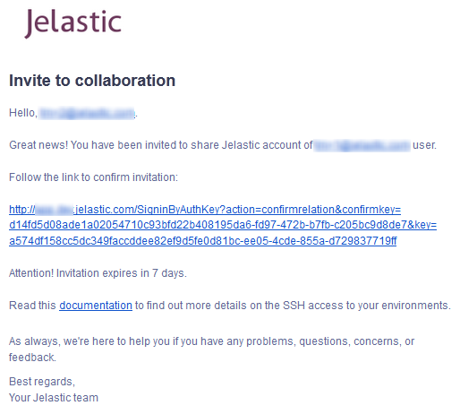

<!-- ## Create Collaboration (Deprecated) -->

*This information is relevant for the platforms prior the 7.0 release. See the up-to-date account collaboration feature description.*

In order to create your own collaboration, you need to have a billing PaaS account and invite additional customers/users to use your account. Follow the instruction below to perform this:

1. Select the **Settings** button in the right top corner of the platform dashboard.

2. You will see the **Account Settings** tab opened. Expand the **Collaboration** item to see two additional sections:

- ***Account Management***
- ***Shared with Me***
Navigate to ***Account Management***.

3. Using the buttons in the left subsection, you can invite users to join your collaboration, edit their rights or exclude them.

Select the **Invite** button.

4. In the opened window, enter the email of the required user.

Tick the Allow user to create new environments line if you would like to give such permissions.

Click the **Invite** button.

5. The specified user will receive an invitation email with a confirmation link which remains active over the following 7 days (the period can be changed via the admin panel).

After acceptance of the invitation by clicking the confirmation link, a user will be redirected to the platform dashboard without the necessity to enter any credentials.

If a user wasn’t registered at the platform before, the account will be automatically created and a user will be notified via email.

6. After confirmation, a user will appear in the list of collaboration’s members. Users are marked with two different icons:

- **green** - with permission to create environments on the primary account
- **blue** - without permission to create environments on the primary account

