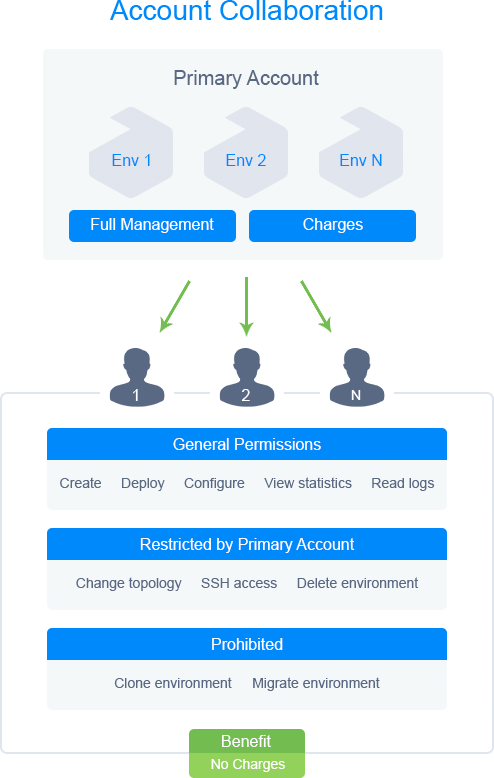

<!-- ## Account Collaboration (Deprecated) -->

This information is relevant for the platforms prior the 7.0 release. See the up-to-date [account collaboration](/account-and-pricing/accounts-collaboration/collaboration-overview) feature description.

Developing and releasing superior products in large companies always depends on efficient collaboration, i.e. properly organized interaction between all members of the team. In order to greatly facilitate the process of joint development, PaaS provides an account sharing feature.

The main idea, is to let organizations create one primary account, where all necessary environments are running, and to share certain or all activities with other accounts (e.g. members of the development team).

All accounts of an organization are interconnected in such a way, to enable collaboration. Any user (regardless if they are registered at the platform), can join (i.e. should be invited by a primary user) or leave an organization’s collaboration.

Within this concept, we define two types of accounts:

- primary
- user

The **primary** one is the main billing organization’s account. The primary account owner can manage the list of all other collaboration users, specify their rights for performing certain activities, decide on the access to the shared within collaboration environments, etc. All of the charges for using shared environments are applied to this account.

A collaboration **user** can work with shared environments of the primary billing account, being able to deploy applications, change configurations, read log files, view statistics and so on. The only exceptions are that this user cannot clone and migrate environments.

A user’s ability to change an environment’s topology, access this environment via SSH and delete it, is regulated by the primary account owner, when the particular environment is shared.

A user can also be allowed to create new environments on the primary collaboration account. In this case, there will not be any restrictions for a trial user while setting up the environment (e.g., number of cloudlets available). All of the charges for such environment usage will be applied to the primary account.

:::tip Note

After leaving the collaboration, the user will no longer have access to this environment.

:::
