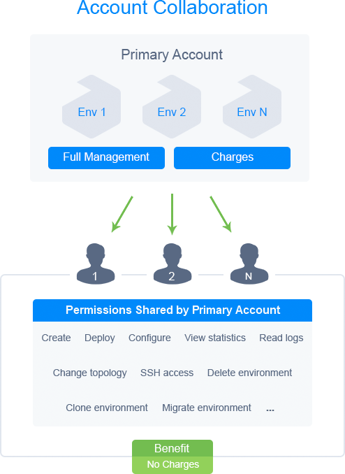

## Account Collaboration

Every large project is a result of the joint effort of multiple people. However, different team members working in a single account is not an efficient workflow that can cause numerous problems (including security issues). The platform provides a reliable **_account collaboration_** feature that greatly facilitates joint development and management, ensuring successful and efficient collaboration.

The core idea is pretty straightforward - one user (_primary account_) hosts all the necessary environments and can share required components with required permissions to others (_collaboration members_). The most distinct benefits of the process are efficient resource utilization and extreme management flexibility. There is no need to create environment duplicates for different members - the platform’s collaboration allows sharing required instances to as many users as needed. Complete control over the shared management permissions makes the feature suitable for most of the existing use cases.

The **primary account** has full access to all hosted environments regardless of whether they are shared or not (including ones created by collaboration members). It is responsible for managing collaboration and its members - inviting users, adjusting shared components, specifying [roles and permissions](/docs/Account&Pricing/Accounts%20Collaboration/Collaboration%20Roles%20Policies), etc. However, be aware that all charges for the shared environments (including actions performed by collaborators) are applied to this account.

**Collaboration members** are accounts that have accepted a collaboration invite from the primary account. The members are not charged for the shared environments and can work with them just as with regular ones. However, the list of allowed actions is defined and managed by the primary account (or other collaborators with the appropriate permission).

If provided with sufficient permissions, a member can create new environments on the primary collaboration account. In such a case, limitations ([quotas](/docs/Account&Pricing/Quotas%20System)) of the primary account will be considered, allowing to bypass any restrictions of the member’s account. Once again, all charges for the environment usage will be applied to the primary account.

:::danger Note

After leaving the collaboration, the member will no longer have access to any shared environments on the primary account, including ones created by them.

:::
