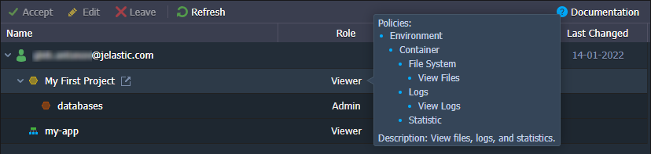

Once the [collaboration is established](/docs/Account&Pricing/Accounts%20Collaboration/Create%20Collaboration), its members can start working with shared environments. In this guide, we’ll go through all the peculiarities of the process.

1. The shared environments can be easily distinguished from the regular ones via the dedicated icon and owner tag.

2. You can click the owner name label in the **Tags** column to quickly filter shared environments by primary account.

3. At the **[Env Groups](/docs/environment-management/environment-groups/overview)** **> Shared with Me** tab, you can see the complete list of shared environments and groups.

:::danger Note

You cannot add shared environments to your personal groups.

:::

Also, the whole groups' tree can be seen when managing environment groups.

4. The management process for shared environments is the same as for regular ones. However, the primary account owner may restrict some of the options.

You can check the [role and list of allowed policies](/docs/Account&Pricing/Accounts%20Collaboration/Collaboration%20Roles%20Policies) for shared resources at the account **Settings > Shared with Me** section.

:::tip Tip

You can check roles for the specific shared environment by going to the Settings > Collaboration section.

By default, collaboration members can see only themselves and cannot manage rights. However, such a possibility can be shared by the environment owner through the role with the Collaboration policy.

:::

5. The **Tasks** manager keeps track of all the actions performed with the shared environments and provides a custom icon for operations initiated by other accounts. Hover over this icon to view the email of the corresponding collaboration member.

6. If provided with the ability to create environments, you’ll see the **_Environment Owner_** selection dialog after clicking the **New Environment** button at the top of the dashboard.

Here, you can select an account and group to create your environment.

:::tip Tip

If you have permission to install packages from the [Marketplace](/docs/deployment-tools/cloud-scripting-&-jps/marketplace), the **_Owner_** field will be added to the installation window.

:::

The limitations of the selected owner are automatically applied to the topology wizard or installation window (for [imported](/docs/environment-management/environment-export-and-import/environment-import) and Marketplace packages).

:::danger Notes

- By default, collaboration members cannot see the pricing information, and only resource data is provided in the topology wizard (as it is shown in the image above). However, the environment owner can share this possibility through the Cost Estimation / Billing History policy.
- Collaborators receive email notifications about actions (load alerts, auto-scaling, password reset, etc.) they initiated but not about actions taken by other collaborators or an account owner.

:::

When creating on behalf of a different account, the topology wizard shows the appropriate environment owner at the bottom-left corner.
