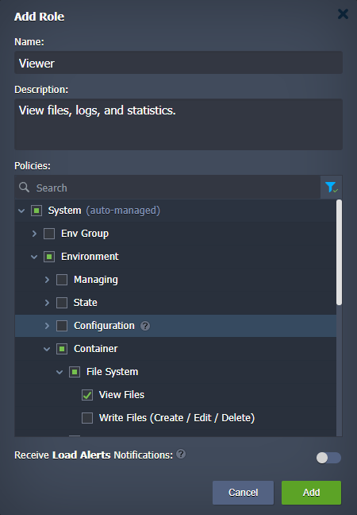

In order to create your own [collaboration](/docs/account-and-pricing/accounts-collaboration/collaboration-overview), you just need a billing PaaS account (**primary account**) that will invite additional customers/users (**collaboration members**). You can perform most collaboration-related operations via the dedicated section at the account settings panel.

Click the **Settings** button in the top-right corner of the dashboard.

Within the opened **User Settings** sections, you have the following two collaboration sub-sections:

- **_Shared by Me_** - collaboration options for the primary account, it has three tabs:
  - **Members** - manages a list of collaboration members (invite new users, suspend or remove existing ones, customize shared environments, groups, roles, etc.)
  - **Roles** - configures custom roles (list of allowed actions) from the available policies
  - **Policies** - lists the actions that can be added to a role
- **_Shared with Me_** - options for the collaboration members

Now, follow the instructions below to set up a collaboration:

- [sent collaboration invite](/docs/Account&Pricing/Accounts%20Collaboration/Create%20Collaboration#send-collaboration-invite) (as primary account)
- [accept collaboration invite](/docs/Account&Pricing/Accounts%20Collaboration/Create%20Collaboration#accept-collaboration-invite) (as collaboration member)

## Send Collaboration Invite

Go to the account **Shared by Me** section on the primary account (the one where environments are actually hosted).

1. If you haven’t before, create at least one **_Role_** at the appropriate tab.

Provide the following information within the **_Add Role_** dialog:

- **Name** - type any desired name for a role
- **Description** - provide custom description (optional)
- **Policies** - select actions allowed for a role; use search to quickly locate required actions and filter to review only selected ones
- **Receive Load Alerts Notifications** - enable to allow collaboration members with this role to receive load alert notifications about shared items

You can learn more about **[Roles & Policies](/docs/Account&Pricing/Accounts%20Collaboration/Collaboration%20Roles%20Policies)** at the dedicated guide.

2. On the **_Members_** tab, click the **Invite** button.

Fill in the fields of the opened **_Invite Member_** dialog:

- **Email** - type in the address of the user you want to invite
- **Display Name** - provide a custom name for the invited user (optional)
- **Shared Items** - select separate items and categories (environments and groups) that you want to share with the member

:::tip Tips

- you can assign several roles for a component - use **Ctrl** to select multiple options and **Alt** to replace all selected roles
- you can provide different roles for each (sub-)component
- hover over a role in the list to see a hint with all included policies
- if needed, you can **_Create New Role_** without closing the invite form
- you can manage [environment group](/docs/environment-management/environment-groups/overview) structure directly in the invite form - hover over the group and click the gear icon to select the required option (**Add**, **Edit**, **Remove**)
- to provide an ability to create environments at the account root (i.e. without any group), share the whole Environments category with a role that grants the appropriate permission
- if you need to [share a single environment](http://localhost:3000/docs/environment-management/share-environment), it can be done from the appropriate environment configs

::: 3. The invited member will appear in the list in the **_pending acceptance_** state.

Now, you wait for the member to [accept the invitation](/docs/Account&Pricing/Accounts%20Collaboration/Create%20Collaboration#accept-collaboration-invite). Any change to the invitation will be displayed at the **Members** tab. Also, you’ll get the appropriate email notification about the user’s decision.

4. If needed, you can select a collaboration member to perform the necessary adjustments:

- **Edit** - to change shared components and permissions at any time
  :::danger Note

If a collaboration member was logged in during the adjustments, they might need to refresh the dashboard to view new shared possibilities.

:::

- **Copy** - to share the same permissions with another user
- **Suspend / Activate** - to temporarily stop / restore sharing
- **Remove** - to terminate sharing and delete info about shared components and permissions

:::tip Tip

For convenience, terminated collaborations (including the case of members leaving on their own) are not removed entirely. The remaining record allows you to re-activate collaboration if necessary.

:::

## Accept Collaboration Invite

Wait for the primary account to [send a collaboration](/docs/Account&Pricing/Accounts%20Collaboration/Create%20Collaboration#send-collaboration-invite) invite for you.

1. Check your email inbox for the invite. It should look as follows:

If interested, click the **View Invitation** button.

:::danger Note

If not registered at the platform, the account for the current email address will be created automatically.

:::

2. After confirming via email, you will be redirected to the platform dashboard. Here, you’ll see a dialog window that provides options to accept or reject the invitation.

You can close the dialog or cancel the operation to process it later at the account **Settings > Shared with Me** section.

3. Once accepted, the member’s dashboard will get and display new shared items.

That’s it! All shared items are now available to the collaboration member (with defined permissions).

Check out the **[Collaboration User Experience](https://cloudmydc.com/)** guide to check the specifics of working in collaboration.
