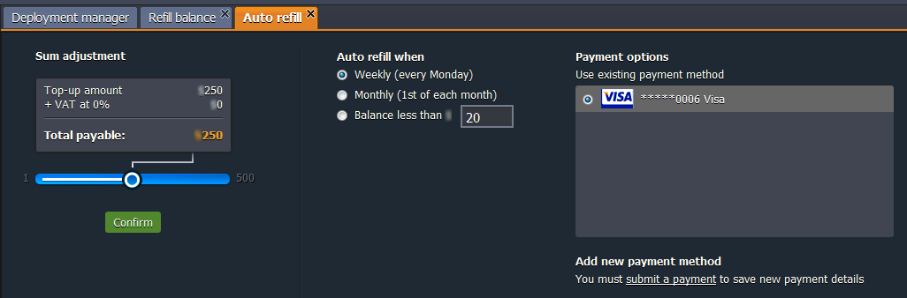
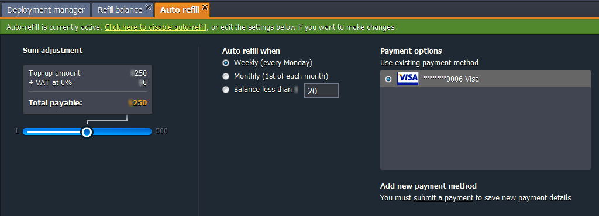
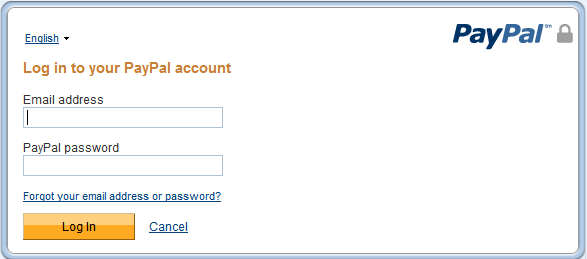
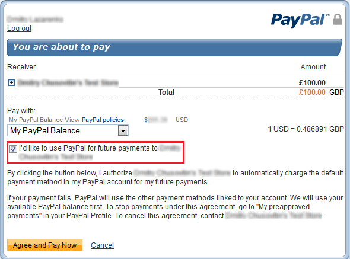

This step-by-step instruction shows you how to convert and refill your account if your hosting provider uses **OBA (Odin Business Automation)** system.

At the moment OBA system is used by **[Tsukaeru](https://cloudmydc.com/)**.

## Conversion

1. At the dashboard click the button **Upgrade trial account** in the drop-down menu.

2. Fill in the required fields in the opened window and confirm your agreement with **Terms of service**. Click **Next**.

Now you have already full account and got an email notification about this. Right after that you’ll be suggested perform refilling.

## Refilling

You can proceed to the refilling right after conversion or perform it by clicking **Balance > Refill balance.**

Select the payment method (**Diners, MasterCard, Visa, Check/cash,** or **Paypal**) and state the sum using the slider. **Submit Payment**.

1. <u>If you choose <b><i>Diners</i></b> as payment method.</u>

Diners is a special payment type for **OBA** users.

Fill in the required fields and register.

:::tip Note

After registration in Diners Club you won’t need to enter card details one more time while the next refilling (they are saved in Payment options). You just need to confirm refilling and that’s all.

:::

Also using **Diners** as payment method you can set auto-refill due to your demands. Click **Configure auto-refill** button in the drop-down menu.

In the opened tab specify the amount you want to put on your account. Then, choose the frequency of refilling:

- _weekly_ (every Monday)
- _monthly_ (1st of each month)
- when _balance less than_ the stated sum (up to your choice)

**Confirm** your choice.

If you want to switch **Auto refill** off click the link to disable it.

2. <u>If you choose <b>cash</b> as payment method.</u>

You can refill your account by paying due to the invoice in the bank.

When you choose **cash** as a payment method you get the invoice through the email. It can be used for the payment to be done through the bank.

3. <u>If you choose <b>card</b> as payment method.</u>

Enter your card details and click **register**.

:::tip Note

If you have already refilled account with this card earlier you won’t need to enter card details one more time (they are saved in Payment options). You just need to confirm refilling and that’s all.

:::

4. <u>If you choose <b>PayPal</b> as payment method.</u>

- **_with PayPal account_**

Click **Log In** button and state your email and password of your PayPal account to make the purchase.

After conversion you’ll get emails with information about the state of your account converting and refilling. Also such information will appear in the message at the dashboard.

:::tip Tip

If you would like to use autorefill option in the platform dashboard, you should tick the “I’d like to use PayPal for future payments to {hoster’s name}” line as it is shown below:

:::

- **_without PayPal account_**
  You can use PayPal payment method even if you don’t have the PayPal account. For that click the **Buy as a guest** button. In the opened window enter your billing information.

Fill in all the required fields and press **Continue** button. After that enter your debit/credit card details in the appeared window.

You’ll get emails with information about the state of your account converting and refilling. Also such information will appear in the message at the dashboard.

:::tip Note

Using this method of payment you won’t be able to use auto-refill option in the platform dashboard.

:::
