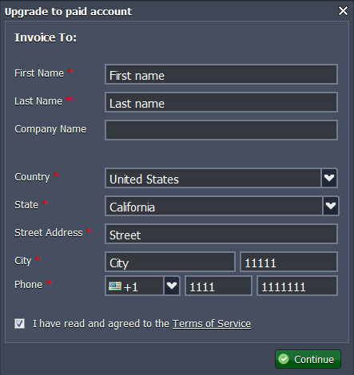
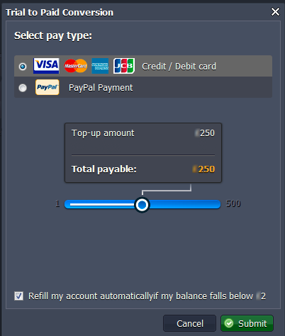

## Billing via WHMCS

This detailed manual describes how to upgrade and refill PaaS account via WHMCS billing system:

- [Upgrade](/docs/account-and-pricing/billing-systems/whmcs-billing-system#trial-account-upgrade-to-billing)
- [Refill](/docs/account-and-pricing/billing-systems/whmcs-billing-system#refilling-account-via-whmcs)

## Trial Account Upgrade to Billing

1. Click the **Upgrade trial account** button and choose the same-named option from the drop-down menu.

2. Within the opened form, fill in the required fields and accept the Terms of Service agreement.

:::tip Note

- <u>if you have the WHMCS account</u>, registered for the same email as the PaaS account, they will be connected automatically
- <u>if you do not have the WHMCS account</u>, the platform will automatically generate it for you (whilst you’ll receive the appropriate email with WHMCS admin panel access URL and your credentials)

:::

Click **Continue**.

3. Next, select the preferable payment method and specify the required payment sum with a slider.

trial to paid conversion

:::tip Notes

- consider that VAT (tax amount) is not displayed in the dashboard UI
- some hosting providers propose the alternative payment methods, given in addition to the default ones. In this case, you’ll be offered to contact the hosting provider in order to use some other ways of funding

:::

Click **Submit** and confirm your choice.

## Card Payment Method

Specify your card details and click **Continue**.

WHMCS payment

Next, within the opened **Purchase Authentication** window, type the password for authentication.

## PayPal Payment Method

- <u>with PayPal account</u>

Click the **Log In** button and enter your PayPal account credentials (email and password) to make a purchase.

Once your PaaS account is successfully converted to billing, you’ll receive the appropriate notifications on its upgrade and balance refilling via email. Also, similar messages will appear at the dashboard.

:::tip Note

If you would like to use the balance auto-refill option, don’t forget to tick the “I’d like to use PayPal for future payments to {hoster’s name}” line as it is shown below:

:::

- <u>without PayPal account</u>

If you don’t have a PayPal account yet, just click the **Buy as a guest** button. Specify your billing information in the opened window.

Click **Continue** and provide your debit/credit card details in the appeared window.

Once your PaaS account is successfully converted to billing, you’ll receive the appropriate notifications on its upgrade and balance refilling via email. Also, similar messages will appear at the dashboard.

:::tip Note

Use of the auto-refill option is unavailable when recharging balance as a guest in PayPal (i.e. the appropriate option won’t be enabled even if being ticked).

:::

## Refilling Account via WHMCS

1. In order to replenish your account, select the **Balance > Refill balance** option at the top of dashboard.

State the required sum using the appropriate slider, choose the prefered payment method and click on **Submit Payment**.

:::tip Note

The VAT (tax amount) will be shown only when proceeding the payment in the order.

:::

## Card Payment Method

Specify your card details and click **Submit Payment**.

:::tip Note

In case you’ve already refilled your account with this card, you won’t need to enter card details again - just confirm the refilling.

:::

## PayPal Payment Method

Log in to your PayPal account and complete the purchase.

After the replenishment completion, you’ll receive an email with information about your account refilling. Also, the appropriate message will appear at the dashboard.

2. Additionally, you are able to configure the **auto-refill option**, if needed. For that choose the Configure auto-refill item in the **Balance** drop-down menu.

Within the opened tab state the sum you would like to put on your account and choose the refilling frequency:

- _weekly_ (every Monday)
- _monthly_ (1st of each month)
- when _balance less_ than the stated sum (up to your choice)

**Confirm** your choice.

:::tip Note

As WHMCS doesn’t truly supports auto-recharge feature, the platform automatically creates order (threshold or monthly trigger based) for a particular recharge card. So the payment can be made in two ways:

- _automatically_ - if you have a positive WHMCS balance that is greater or equals to order amount
- _manually_ - the confirmation email is automatically sent to you before completing each order

:::

3. If you want to switch off the **Auto refill** option, click the appropriate link to disable it.

4. After clicking the **Payment methods** option from the **Balance** drop-down menu, you can select your default payment method which will be used automatically while refilling.

5. Click **View invoices** to open WHMCS admin panel with your Billing history which includes all financial documents issued for your Account (i.e. Invoices, Orders, Payments, and Adjustments).

6. Click **Billing history** to view the data about consumed resources on your account and the appropriate charges by the platform.
