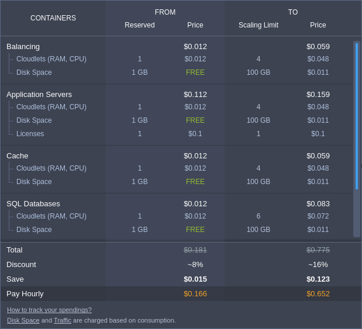
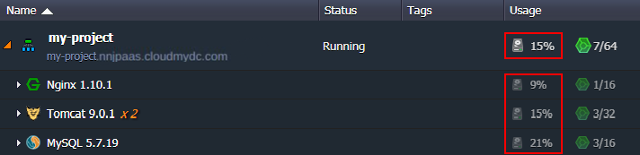
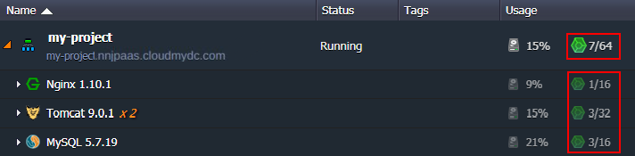
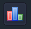
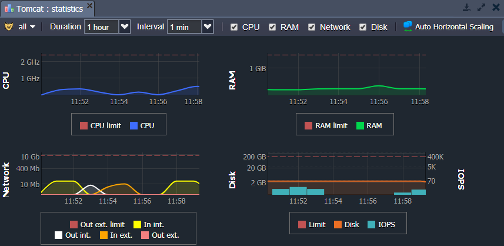
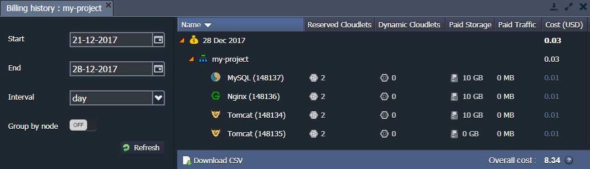
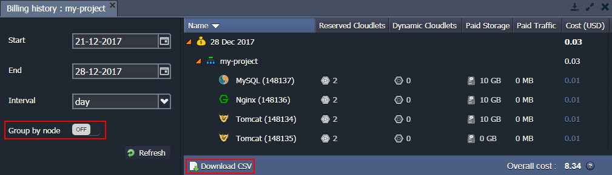

Keeping an eye on the amount of resources your application consumes allows you to plan your budget and control an expenditure of funds. Below, we will describe how it is implemented in the platform:

- [Estimated Environment Cost](/docs/account-and-pricing/resource-charging/monitoring-consumed-resources#estimated-environment-cost)
- [Current Resource Usage](/docs/account-and-pricing/resource-charging/monitoring-consumed-resources#current-resource-usage)
- [Statistic of Consumption](/docs/account-and-pricing/resource-charging/monitoring-consumed-resources#statistics-of-consumption)
- [Billing History](/docs/account-and-pricing/resource-charging/monitoring-consumed-resources#billing-history)

## Estimated Environment Cost

While creating or changing the environment, you operate with a dedicated wizard, which is divided into three main sections. The left part allows to set up the required topology. The second (central) one - to choose the number of nodes, allocate resources (**Reserved cloudlets** and **Scaling limit**) and enable options the **Disk Limit**, the **High Availability** and the usage of **Public IP**. Within the right panel, you can check an **Estimated Cost** of your environment in the from minimum to maximum format, show price per hour, day or month.

:::tip Note

You can learn more about how the platform pricing works in the linked document.

:::

Hover over the **Price** slider in the wizard to get a detailed information about the cost of the used resources and options within your environment.

Here, you can see three columns:

- **Containers** - list of all nodes in the environment
- **From** - a reserved amount of allocated resources (i.e. environment minimal price)
- **To** - a resource limit (i.e. maximal price)

The displayed containers are grouped by layers to simplify perception and the total cost is shown at the bottom of the frame, providing an additional information on the received **Discount** and **Saved** money.

## Current Resource Usage

In your dashboard, you can see a list of all of your environments. The right-hand column displays current resource **Usage**. You can see the amount of disk storage and cloudlets currently being used by the whole environment or, if you expand the environment context using the arrow  at the left, you can see the individual resource usage by each server within the environment.

1. The first number (Storage icon ) in the Usage column is the amount of **disk space** currently consumed.

2. The second number (cloudlet icon ) in the Usage column is the number of **cloudlets** currently being used (first cloudlet number) out of the cloudlet Scaling Limit (second cloudlet number) you have configured.

The cloudlet icon changes color to warn when you are currently near () the configured Scaling Limit, or at ( ) the configured Scaling Limit.

## Statistics of Consumption

You can also see the amount of consumed Disk, RAM (Memory), CPU and Network Bandwidth according to each container by clicking on the [Statistics](/docs/application-setting/built-in-monitoring/statistics)  button of the desired node.

Based on the received statistics, you can change limits of the automatic [vertical](/docs/application-setting/scaling-and-clustering/automatic-vertical-scaling) and [horizontal](/docs/application-setting/scaling-and-clustering/automatic-horizontal-scaling) scaling for your environment. For example, you can choose the number of reserved cloudlets in accordance with the load on the graphs.

## Billing History

An important tool for budget analysis is billing history tracking, which you can be found in the corresponding section at the platform dashboard and, consequently, be downloaded to your local machine.

1. Use the **Billing history**  button for your environment or navigate to **Balance > Billing history** item in the upper menu to review the charges applied for consumed resources. In the left panel, you can specify the desired start/end dates, and the time period interval to view the billing data for.
   The displayed data is grouped by environments, use the  icon on the right panel to expand the particular one and see the list of its nodes and their resource usage. Herewith, all the nodes are sorted in the alphabetical order and below a list of the additional paid options (if any) is shown, e.g. [public IP](/docs/application-setting/external-access-to-applications/public-ip) or [SSL](/docs/application-setting/ssl/custom-ssl).

You can see the following information regarding every environment node:

- _Reserved Cloudlets_
- _Dynamic Cloudlets_
- _Paid Storage_
- _Paid Traffic_
- _Cost_

:::tip Note

Some hosters can provide a certain amount of free resources (cloudlets, disk space, IP addresses, SSL certificates). In this case, you will only pay for those resources, which are used over the free amount.

:::

The total charges (overall cost) between the selected dates are calculated for you at the very bottom of the list.

2. By default, the billing history is shown separately for each node. If needed you can enable **Group by node** switcher to group instances with the same layer.

In order to analyze your costs locally, you can download billing history as a **csv** file with the appropriate **Download CSV** button.

As you can see, the platform provides complete information about the cost of services and the use of resources, which helps you easily plan your budget.
