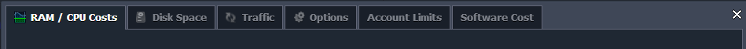
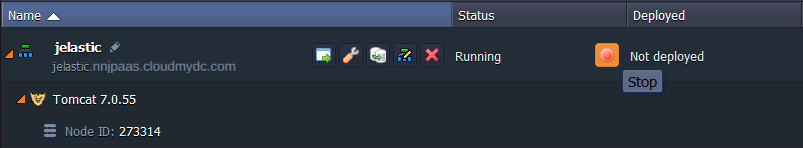

- [What is charged?](/account-and-pricing/resource-charging/pricing-faq#what-is-charged)
- [Where can consumed resources be seen?](/account-and-pricing/resource-charging/pricing-faq#where-the-consumed-resources-can-be-seen)
- [How much do resources cost?](/account-and-pricing/resource-charging/pricing-faq#how-much-do-resources-cost)
- [How to decrease the consumption?](/account-and-pricing/resource-charging/pricing-faq#how-to-decrease-the-consumption)

## What is Charged?

Resource consumption for each environment is charged to the account owner on an hourly basis. There are 3 types of charges:

- **Primary** - fees for the main platform resources (i.e. RAM & CPU), provided within cloudlets
- **Provider-dependent** - the ones that can be either payable or not, according to the chosen hosting provider settings
- **Optional extras** - charges for usage of some additional platform features
  Detailed information on each of these types of charges can be found in the [Charged Resources](/account-and-pricing/resource-charging/charged-resources) document.

## Where the Consumed Resources Can be Seen?

The detailed information on the amount of consumed resources can be seen in the different places at your dashboard, for example:

- pricing widget at the **environment wizard’s** right pane shows the approximate monthly spends, based on the stated amount of reserved cloudlets
- the current resources consumption of every environment is displayed in the **Usage** column of your environments list. It includes the amount of occupied disc space (in MB) and currently used/overall amount of cloudlets
- the total usage **Statistics** on all resources types (i.e. RAM, CPU, Storage and Network Bandwidth) can be seen via the appropriate section for the desired node/set of the same-type nodes
- finally, the **Billing History** section provides any information on all the payable resources, consumed during the stated period, and their costs.

The details on each of these options can be seen in the [Monitor Consumed Resources](/account-and-pricing/resource-charging/monitoring-consumed-resources) document.

## How Much do Resources Cost?

With the platform, you only pay for consumed resources. The resource pricing is set by your chosen hosting provider. You can find exact cost for each resource unit by going to CloudMyDC's [Pricing page](https://cloudmydc.com/pricing).

The prices can also be seen inside your platform dashboard.

Navigate to **Balance > Quotas & Pricing** menu item. Here you’ll see a set of tabs displaying pricing information for each kind of resource available in the platform.

Choose the one you are interested in to see the pricing and discount scale offered by your hosting provider. You can find more information about pricing and discount systems in the [Pricing System](/account-and-pricing/pricing-model-overview) and [Automatic Discounts](/account-and-pricing/automatic-discounts) documents.

Note that the various software stacks are provided free of charge in the platform. You only pay for the resources consumed but not for the software itself.

## How to Decrease the Consumption?

To decrease your spends you can stop your environment when it is not needed. For example, if you happen to be using your environment as a test or dev one and you don’t use it on nights and weekends - you don’t have to pay for the resources that you don’t use.

In such a way **RAM (Memory), CPU** and **traffic** are not going to be charged.

You are going to pay only for **disk space** that you use and for **public IP** and **SSL** if you purchased any.

Follow the links to get acquainted with useful tips on consuming platform resources in a smart way:

- [Save Your Cloud Money!](https://cloudmydc.com/)
- [How to Manage the Application Lifecycle in PaaS](/application-setting/application-lifecycle-management)
