## Custom Error Page Settings via NGINX Balancer

When an error occurs within a particular environment (e.g. when trying to access non-existing page), a default error page for the server is opened. For example:

<div style={{
    display:'flex',
    justifyContent: 'center',
    margin: '0 0 1rem 0'
}}>

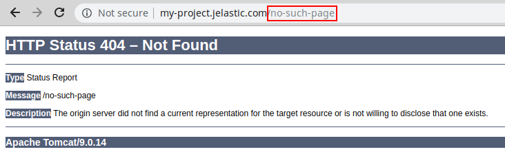

</div>

You can substitute this error page with a custom one to provide end-users with more specific instructions and leave email to contact you. Below, we’ll show how to configure a custom error page using the NGINX load balancer added to your environment:

1. Go to your platform dashboard, find the NGINX load balancer in your environment and click the **Config** button next to it.

<div style={{
    display:'flex',
    justifyContent: 'center',
    margin: '0 0 1rem 0'
}}>

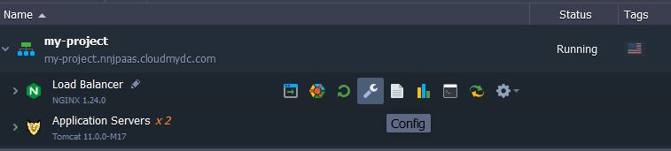

</div>

2. In the opened configuration manager tab navigate to the **/etc/nginx/conf.d** folder and create or upload your custom error page.

<div style={{
    display:'flex',
    justifyContent: 'center',
    margin: '0 0 1rem 0'
}}>

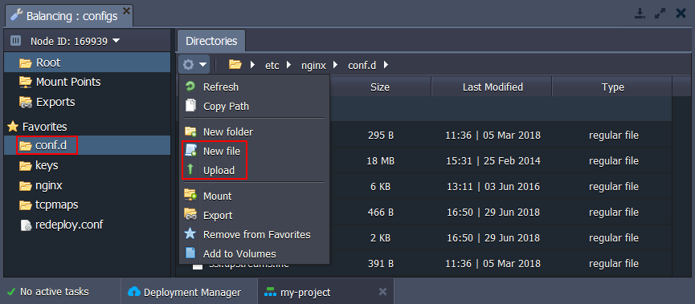

</div>

3. For this tutorial we’ll use the following **_error.html_** file:

<div style={{
    display:'flex',
    justifyContent: 'center',
    margin: '0 0 1rem 0'
}}>

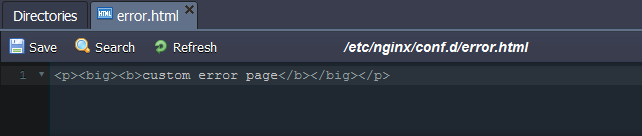

</div>

4. Then navigate to the **/etc/nginx** directory and copy content of the **_nginx-jelastic.conf_** file and paste it into the **_nginx.conf_**, replacing the include /etc/nginx/nginx-jelastic.conf; line (circled in the image below).

<div style={{
    display:'flex',
    justifyContent: 'center',
    margin: '0 0 1rem 0'
}}>

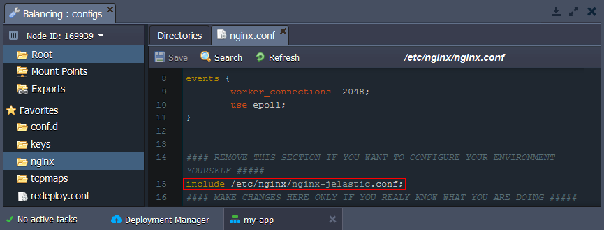

</div>

Now, you are able to specify all the required configurations.

5. Find the **_server_** section of the pasted configs and substitute the default error_page settings with the following strings:

```bash
error_page 403 404 500 502 503 504 /error.html;
proxy_intercept_errors on;
```

<div style={{
    display:'flex',
    justifyContent: 'center',
    margin: '0 0 1rem 0'
}}>

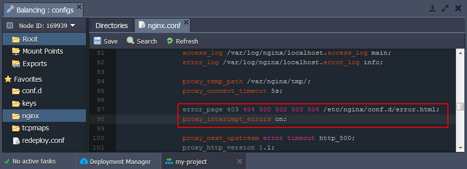

</div>

6. Next, scroll a little bit lower and adjust the error page parameters within **location** subsections:

```bash
location /error.html {
    root   /etc/nginx/conf.d;
    internal;
}

location / {
    if ($cookie_SRVGROUP ~ group|common) {
        proxy_pass http://$cookie_SRVGROUP;
        error_page 403 404 500 502 503 504 = /error.html;
    }
    if ($cookie_SRVGROUP !~ group|common) {
        add_header Set-Cookie "SRVGROUP=$group; path=/";
    }
    proxy_pass http://default_upstream;
    add_header Set-Cookie "SRVGROUP=$group; path=/";
}

location @rescue {
    proxy_pass http://$cookie_SRVGROUP;
    error_page   500 502 503 504 = error.html;
}

location @recycle {
    proxy_pass http://default_upstream;
    add_header Set-Cookie "SRVGROUP=$group; path=/";
}
```

<div style={{
    display:'flex',
    justifyContent: 'center',
    margin: '0 0 1rem 0'
}}>

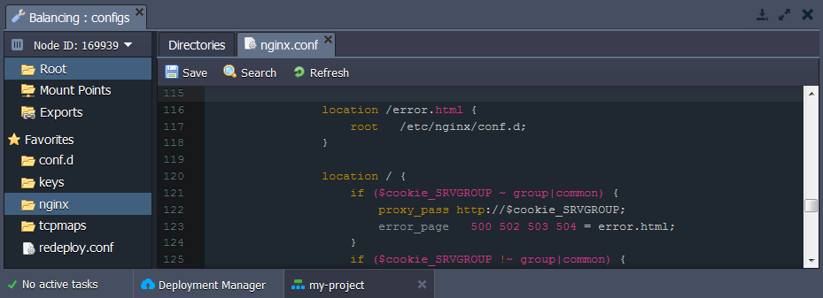

</div>

7. In case of using [SSL](http://localhost:3000/docs/application-setting/ssl/secure-sockets-layer) for your website (i.e. for connections over HTTPS), some additional configurations are required (otherwise go to the 9th step of this guide). Add the following lines to the **servers** section of the **_/etc/nginx/conf.d/ssl.conf_** file:

```bash
proxy_intercept_errors on;
location /error.html {
                    root   /etc/nginx/conf.d;
 }
```

<div style={{
    display:'flex',
    justifyContent: 'center',
    margin: '0 0 1rem 0'
}}>

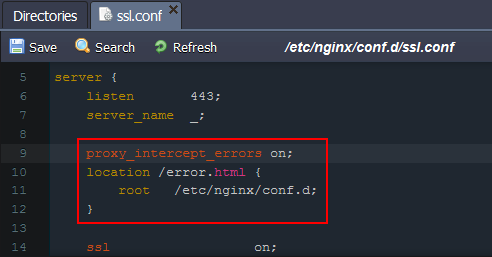

</div>

8. Also, you need to adjust the **_/etc/nginx/conf.d/ssl.upstreams.inc_** file. Find the next condition and change it as follows:

```bash
if ($cookie_SRVGROUP ~ group|common) {
                   proxy_pass http://$cookie_SRVGROUP;
                   error_page 403 404 /error.html;
                   error_page   500 502 503 504 = @resque;
}
```

<div style={{
    display:'flex',
    justifyContent: 'center',
    margin: '0 0 1rem 0'
}}>

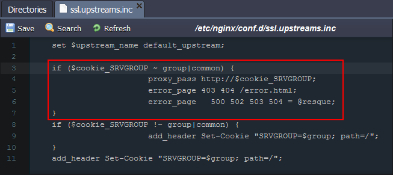

</div>

9. Don’t forget to **Restart** NGINX server to apply all changes.

<div style={{
    display:'flex',
    justifyContent: 'center',
    margin: '0 0 1rem 0'
}}>

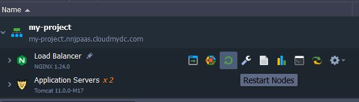

</div>

10. That’s it! Try to access any non-existing page within your domain.

<div style={{
    display:'flex',
    justifyContent: 'center',
    margin: '0 0 1rem 0'
}}>

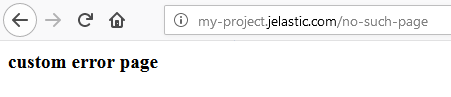

</div>

:::danger Note

If the server with pre-configured custom error pages or the whole environment is not reachable, a platform-wide default error page will be displayed, e.g.:

<div style={{
    display:'flex',
    justifyContent: 'center',
    margin: '0 0 1rem 0'
}}>

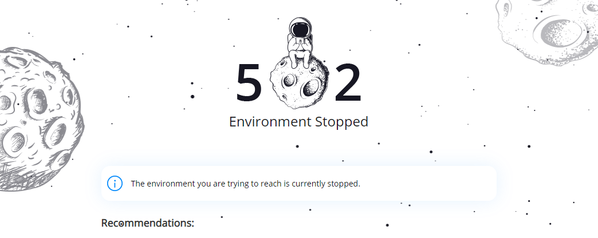

</div>

You cannot modify such notifications for your environments.

:::
