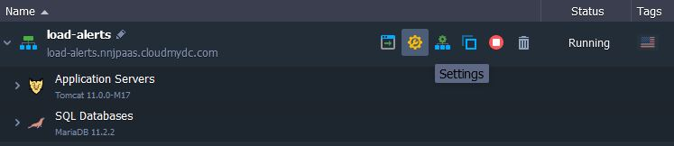

## Load Alerts

While creating an environment, you state the cloudlet limits for each node. In such a way, the resources are limited and the spends are regulated. When the traffic grows an application requests more resources for normal work. And, if the limits created by you are too low, this can lead to failure in app performance.

To monitor your application’s load and the amount of resources it requires, you can configure a set of automatic notification triggers. They are executed if the usage of a particular resource type is above/below the stated value (%) during the appropriate time period. As a result, you’ll get an email notification about your application’s load change.

:::danger Note

Starting with PaaS 4.6 version, each of the newly created containers is delivered with a set of preconfigured load triggers, so you’ll receive the appropriate notifications by default. However, any of them can be easily tuned or disabled, as well as the new ones can be added like it’s described below.

:::

- [Create Alert](/docs/application-setting/built-in-monitoring/load-alerts#create-alert)
- [Triggers Execution History](/docs/application-setting/built-in-monitoring/load-alerts#triggers-execution-history)

## Create Alert

In order to configure an alert, follow the next instruction:

1. Click the **Settings** button for the desired environment:

2. In the opened tab, navigate to the **Monitoring > Load Alerts** section:

Here, if such is stated within your hosting service provider’s settings, you can find a bunch of default triggers, which are automatically added during environment creation. These ones, if exist, are to notify you when the _RAM, CPU, disk, inodes_ or _network traffic_ usage at any node is coming close to current resource limits (according to the predefined by hoster levels of consumption for notification).

3. Using the buttons in the tool panel, you can either **Add** a new alert or **Edit**, **Remove**, **Enable/Disable** the already existing ones (including the default triggers set). Also, alerts list can be **Refreshed** using the corresponding button.

Let’s consider a case of setting up your own trigger - for that, click on the **Add** button, circled in the image above.

4. In the opened **Add alert** frame, define the following values:

- **_Name_** - name of the notification trigger
- **_Nodes_** - type of the environment’s node (you can apply trigger to any node within the chosen environment)
- **_Whenever_** - type of resources that will be monitored by trigger: _Cloudlets (Memory, CPU), Memory, CPU, Network (out ext. + in ext.), Network (out ext.), Storage_ (disk space amount), _Disk I/O, Disk IOPS_ and _Inodes_
- **_Is_** - condition for trigger invocation/execution, due to which the resource consumption should be _above_ or _below_ (the “>” or “<” values correspondingly - use the first combo-box) of the stated percentage or _Mbps_ for the _Network monitoring_
- **_For at least_** - time period before trigger execution, during which it should remains invoked
- **_Notification frequency_** - delay for the repetitive message to be sent

After you’ve stated all the preferable configurations, click **Add** button.

5. As soon as alert is configured and activated, it will appear within list with the name you’ve specified in the previous step.

6. As a result, every time the resource usage comes above/below the stated percentage (depending on the condition stated) during the specified time period, the system will send you an email notification with the current level of consumption, some recommendations on this issue and direct link for the node’s scaling limit adjustment:

:::tip Note

That if an environment is [shared](/docs/environment-management/share-environment) with other users, they will also receive the same preconfigured load notifications via their emails.

:::

In this way, you can set up a number of different triggers for any existing node in your environment.

## Triggers Execution History

You can view the history of triggers' executions for the nodes of a particular environment within its settings.

1. Navigate to the **Monitoring > Events History** section. The **_Load Alerts_** notification **Type** will be chosen automatically (whilst the second option in the appropriate list is devoted to [auto horizontal scaling](/docs/application-setting/scaling-and-clustering/automatic-horizontal-scaling) history).

2. Using the **Period** drop-down list, define the time interval you’d like to view the alerts for. The available values are: _day, week, month_ and _custom_ (where the last one allows to specify the required dates manually).

3. As a result, you’ll see the list of alerts, that were activated during the stated period. It includes information on:

- **Date** and time when a trigger has been invoked
- **Name** of the activated alert
- **Nodes** type the alert has been configured for
- **Condition** of alert activation
- **Result** of the alert (success or _failure_, i.e. whether notification has been sent or not)

4. Click on a particular load alert to see its **Details** to the right. This pane contains some additional information:

- **Loading Value** - resource usage level for the time of alert activation, with the amount of consumed cloudlets in brackets
- **Action** - operation, that has been performed after alert activation (_Send Notification_ in this case)

In such a way, you can configure a set of alerts and to be sure that the platform will inform you about your application load changes.

:::tip

In case you have any questions left on configuring alert notifications or just need more detailed information on this functionality, feel free to appeal for our technical experts' assistance at [Stackoverflow](https://stackoverflow.com/questions/tagged/jelastic).

:::
