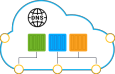
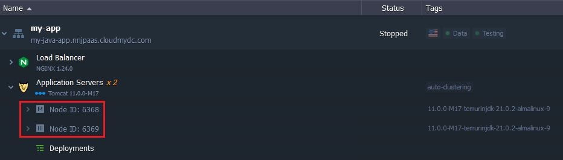
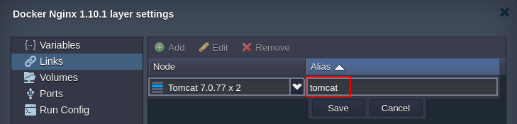

import obj from './ContainerDNSHostnames.json'

<!-- ## DNS Hostnames for Direct Connection to Containers -->

Being able to easily connect to Cloud services is a criteria of great importance for all of the developers. In the platform, each newly created node is assigned a number of automatically generated hostnames, pointed to the appropriate server internal/[external](/application-setting/external-access-to-applications/public-ip) IP address.

Depending on a type of the created node, the set of hostnames for it could differ. Thus, below we’ll consider the possible ways to refer to a particular node, hosted at the platform, either from inside (i.e. when managing it via [SSH Gate](/deployment-tools/ssh/ssh-overview)) or outside of the Cloud
<!-- 
- [Hostnames for Specific Containers](/application-setting/domain-name-management/container-dns-hostnames#hostnames-for-specific-containers)
- [Supplementary Hostnames for Particular Node Types](/application-setting/domain-name-management/container-dns-hostnames#supplementary-hostnames-for-particular-node-types)
- [Hostnames for Specific Layers](/application-setting/domain-name-management/container-dns-hostnames#hostnames-for-specific-layers)
- [Short Hostnames for Containers within One Environment](/application-setting/domain-name-management/container-dns-hostnames#short-hostnames-for-containers-within-one-environment)
- [Hostnames for Linked Containers](/application-setting/domain-name-management/container-dns-hostnames#hostnames-for-linked-containers) -->

## Hostnames for Specific Containers

Each container at the platform can be accessed by its internal IP address with an URL of one of the following formats:

- **_node${nodeId}-${envName}.${platformDomain}_**
- **_node${nodeId}.${envName}.${platformDomain}_**

Herewith, the placeholders should be replaced with the next values:

- **_${nodeId}_** - an automatically generated unique digit identifier, assigned to every container within a Platform

- **_${envName}_** - environment name (not an [alias](/environment-management/environment-aliases)), specified during its creation
- **_${platformDomain}_** - domain name of a PaaS installation [hosting service provider](/quickstart/hosters-list-&-info)

Both variants can be used for refering to the nodes from inside or outside of the platform (i.e. allowing to establish both internal and external connections).

## Supplementary Hostnames for Particular Node Types

Some of the platform certified stacks are provisioned with additional hostname prefixes (i.e. where the appropriate stack name is used instead of the node string) to make their management more convenient.

:::tip Note

Such supplementary prefixes are valid only within domains with a hyphen as a separator.

:::

    

        

            

                Node Type
            

            

               Stack
            

            

                Additional Hostname
            
 
        

         

            

                Custom Docker Сontainers
            

            

               <i>{obj.data1[0]}</i>
            

        
 
        {obj.data2.map((item, idx) => {
            return 

            

                {idx === 5 && 'Database'}
            

            

               {item.Stack}
            

            

               {item.AdditionalHostname}
            

        
 
        })}
         

            

                VPS
            

            

               <i>{obj.data1[1]}</i>
            

        
 
    
 

All alternative domain strings, shown in the table above, can be utilized similarly to the [hostnames for specific containers](/application-setting/domain-name-management/container-dns-hostnames#hostnames-for-specific-layers).

## Hostnames for Specific Layers

For the new environments, you can get all internal IP addresses of containers within one node layer using the following hostname:

- **_${nodeGroup}.${envName}.${platformDomain}_**

Here, **_${nodeGroup}_** placeholder is a name of a particular layer the required container belongs to. By default, layers are named in accordance with the appropriate nodeGroup specific role.

:::tip Note

Node groups added via the extra layers in the topology wizard are named in the same way, but with the appropriate **_${N}_** index. Herewith, the default layers in topology wizard (e.g. _bl, cp, sqldb,_ etc.) are considered as the first index, so the enumeration in extra layers starts with the second one, e.g. _cp2, cp3, cp4_, … (except of the _extra, extra2, extra3_, …). For example:

:::

For example, this command can be used to get an application servers list for any environment within the platform:

:::tip Tip

In order to get a list of containers for the current environment, just a [short hostname](/application-setting/domain-name-management/container-dns-hostnames#short-hostnames-for-containers-within-one-environment) can be used.

:::

Herewith, every time a new container is created (removed) in a system, the appropriate record is automatically added to (removed from) DNS for the layer hostname.

## Short Hostnames for Containers within One Environment

All the newly created Docker containers and dockerized platform-managed stacks are provisioned with the specific DNS rules, which allow usage of the additional simplified hostnames:

- **_node${nodeId}_** - alias to refer to a container in confines of a single environment
- **_${nodeGroup}_** - alias to refer to a layer in confines of a single environment

Utilizing such short hostnames in server configuration files, application source code and [SSH](/deployment-tools/ssh/ssh-overview) console (within often used commands like _ping, host, dig_, etc.) makes operating with Dockerized stacks via Platform internal network much more convenient. Additionally, such approach enables painless [environment migration](/environment-management/environment-regions/migration-between-regions) to another [hardware region](/environment-management/environment-regions/choosing-a-region) through eliminating the necessity to adjust your application code due to the changed server location.

## Hostnames for Linked Containers

Upon [linking](/container/container-configuration/links) two Docker-based environment layers, a set of dedicated DNS records are automatically added to the global platform database. This allows to refer to the nodes within a _target_ layer from the _source_ ones (but not vice versa) when working in confines of these two layers using the following hostname aliases:

- **${linkAlias}** - to refer to a random node within a target layer; an exact node to respond is chosen by means of the Round-Robin algorithm - this ensures even load distribution
- **_${linkAlias}_${N}\_** - to access a particular container within a target layer

Here, the appropriate placeholders are to be substituted with:

- **_${linkAlias}_** - link name you’ve specified during its setting (e.g. tomcat in the image below)

- **_${N}_** - nominal index number (in a _1…N_ range) of a particular container within the target linking layer (e.g. _tomcat_1, tomcat_2_), etc; herewith, master container is always considered the 1st instance, whilst the rest of layer nodes are assigned numbers according to their nodeID values, being sorted in ascending order (starting with the _\_2_ index, then _\_3, \_4_, etc.)

For example, if there are three containers on a layer - with the _123, 124_ (master) and _125_ IDs. According to the above-described implementation, the aliases will be assigned as follows:

- **_alias_1_** - link to the 124 container as a master node
- **_alias_2_** - will point to the 123 instance since it has the lowest ID among the remaining containers
- **_alias_3_** - for referring to the 125 container as the one with the next lowest nodeID

:::tip Tip

By appending an environment domain to the alias **_${linkAlias}.${envName}.${platformDomain}_**, the corresponding linked layer name can be resolved and accessed externally, i.e. from anywhere over the Internet. And by **_${linkAlias}_${N}\_** corresponding container of a linked layer can be resolved internally only, within the linked layers network.

:::

Now, you know all the specifics and shortcuts that can be used to refer to your nodes, which will help to quickly and efficiently organize connections between your application instances.
