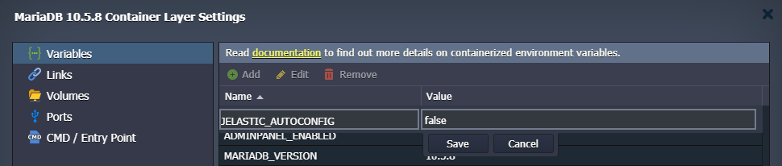
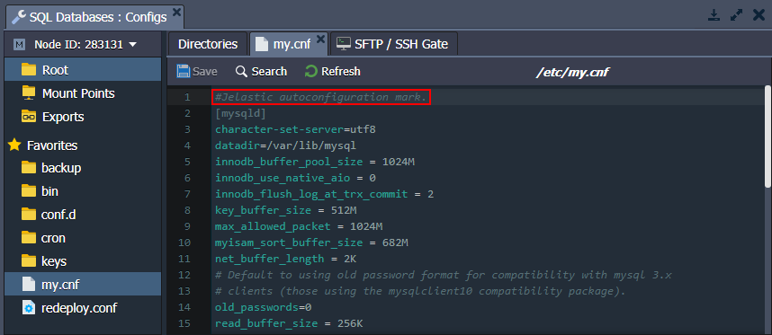

## Database Auto-Configuration

The platform [**Smart Auto-Configuration**](http://localhost:3000/docs/application-setting/smart-auto-configuration/auto-configuration-overview) automatically adjusts the **_MySQL_**, **_MariaDB_**, and **_Percona_** databases in accordance with the resource limit allocated to the containers. Namely, the changes affect the **_/etc/my.cnf_** configuration file and the following settings in particular:

- _key_buffer_size_
- _table_open_cache_
- _myisam_sort_buffer_size_
- _innodb_buffer_pool_size_

Starting with the **5.7** and **8.0** versions of the **MySQL/Percona** and **MariaDB 10.x**, two additional parameters are configured by the platform:

- _innodb_buffer_pool_instances - deprecated in MariaDB since the 10.6.x (always 1 pool instance)_
- _innodb_buffer_pool_chunk_size_

If you want to manually change any of the settings from the list above, you need to set the **_JELASTIC_AUTOCONFIG_** [environment variable](http://localhost:3000/docs/container/container-configuration/variables) to _“false”, “disable”, or “0”_. Otherwise, your custom changes will be overwritten.

:::tip Tip

Alternatively, you can override any of the settings in the **_/etc/my.cnf_** file (including ones managed by the platform’s _Smart Auto-Configuration_) by stating them in the **_/etc/mysql/conf.d/custom.cnf_** file.

:::

## Legacy Implementation

If you want to manually change the auto-configured settings on the old containers, you need to remove the _“#Jelastic autoconfiguration mark.”_ line at the start of the **_/etc/my.cnf_** file.

