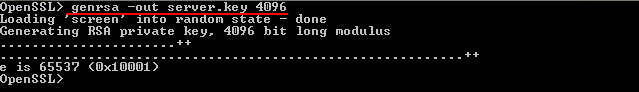
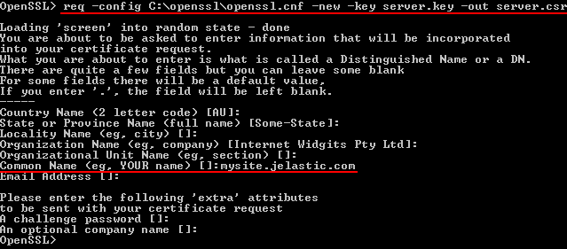
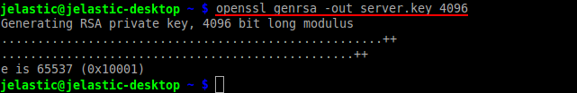
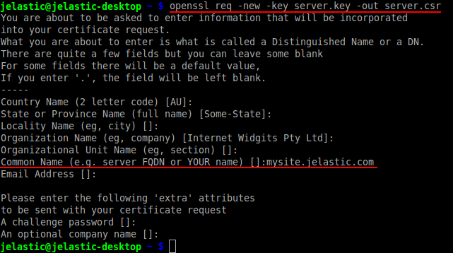
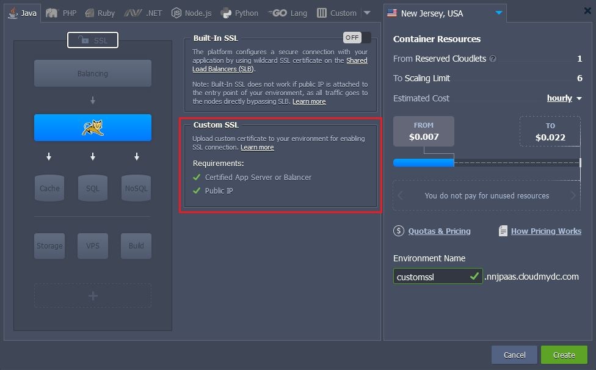
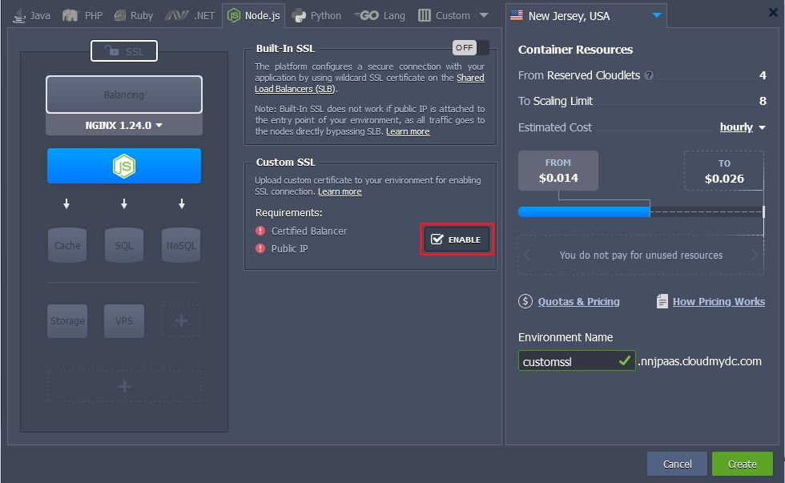
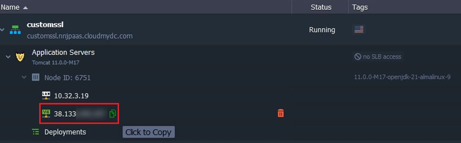
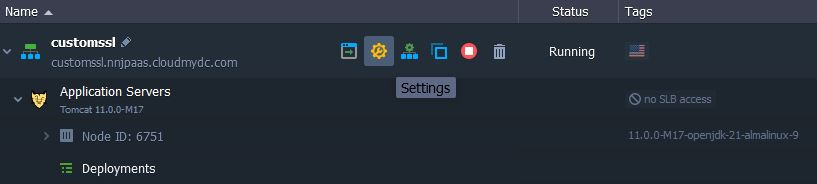
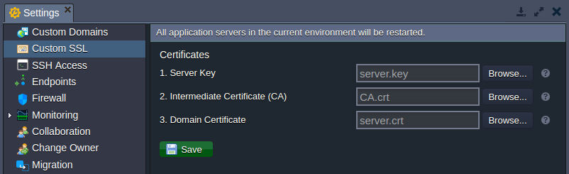
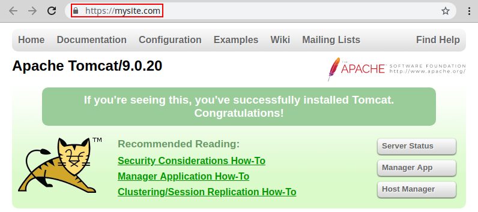

## Custom SSL Certificates

**SSL certificates** support gives a significant level of security for your domain names. With the platform, hosting of applications that need SSL becomes fairly easy.

In addition to the [Built-In SSL](http://localhost:3000/docs/application-setting/ssl/built-in-ssl) and Let’s Encrypt SSL, the platform provides the ability to upload and use **custom SSL certificates** for your environments. The platform supports the following certificate types:

- [self-signed](/docs/application-setting/ssl/self-signed-custom-ssl)
- Wildcard
- Multi-Domain
- Extended validation single domain
- Extended validation multi-domain
- Low assurance/domain-validated certificate

In this instruction, we’ll show you how to get a single-domain Custom SSL certificate enabled at your environment.

## Generate a Custom SSL Certificate

In order to add the Custom SSL certificate to your environment, you need to have:

- pre-purchased custom domain name
- server key
- intermediate certificate or certificates chain (CA)
- domain certificate

Therefore, follow the next instruction:

1. Buy a **Domain Name** (e.g. _mysite.com_) using any domain registrar.

2. Generate your _server key_ for the purchased domain name and create a **Certificate Request** on its basis with the help of any preferred tool.

We’ll use **OpenSSL** as an example. Depending on the operating system you are using, perform the following steps:

- [for Windows](http://localhost:3000/docs/application-setting/ssl/custom-ssl#for-windows)
- [for Linux/MacOS/FreeBSD](http://localhost:3000/docs/application-setting/ssl/custom-ssl#for-linuxmacosfreebsd)

## For Windows

[Download](https://code.google.com/archive/p/openssl-for-windows/downloads) the latest OpenSSL tool version. Extract the received archive and run the tool by double-clicking the **_openssl.exe_** file in the **bin** folder. Subsequently, the files created with OpenSSL will appear in the same **bin** directory by default.

- First, you need to generate an SSH private server key with the following command:

```bash
genrsa -out {filename} {length}
```

where

**_{filename} _**- name of the output key file with **.key** extension (_e.g. server.key_)

**_{length} _**- private key length in bits (should be at least 2048 to be considered secure, e.g. _4096_)

:::danger note

DO NOT protect your key with a passphrase; otherwise, you’ll get an error during its addition to the platform dashboard.

:::

<div style={{
    display:'flex',
    justifyContent: 'center',
    margin: '0 0 1rem 0'
}}>



</div>

- Then you should generate a certificate request based on the prepared key. Create it as follows:

```bash
req -config {config_path} -new -key {keyname} -out {filename}
```

where

**_{config_path}_** - path to the _openssl.cnf_ configuration file, located in the directory with extracted OpenSSL files (specified according to the C:_\path\to\openssl.cnf format_)

**_{keyname} _**- your server key name (the one you’ve generated in the previous step, server.key in our case)

**_{filename} _**- desired name of the output request file with **.csr** extension (e.g. _server.csr_)

You’ll see a set of questions appear. Answer them to complete the certificate information with your data.

:::danger note

The **Common Name** parameter value has to be equal to your purchased domain name; otherwise, your certificate won’t be validated.

:::

<div style={{
    display:'flex',
    justifyContent: 'center',
    margin: '0 0 1rem 0'
}}>



</div>

## For Linux/MacOS/FreeBSD

In case you don’t have the OpenSSL tool installed yet, get it with the appropriate command (according to your OS package manager) executed within your terminal. E.g. for Ubuntu/Debian Linux distribution use the following one:

```bash
sudo apt-get install openssl
```

When the installation process is completed, proceed to generation of the required files. All newly created with OpenSSL files will appear in the **home** directory of your local machine user by default.

- First, you need to generate an SSH private server key. For that run the following command:

```bash
openssl genrsa -out {filename} {length}
```

where

**_{filename}_** - name of the output key file with **.key** extension (e.g. _server.key_)

**_{length}_** - private key length in bits (should be at least 2048 to be considered secure, e.g. _4096_)

:::danger note

DO NOT protect your key with a passphrase; otherwise, you’ll get an error during its addition to the platform dashboard.

:::

<div style={{
    display:'flex',
    justifyContent: 'center',
    margin: '0 0 1rem 0'
}}>



</div>

- Then you should generate a certificate request based on the prepared key. Create it as follows:

```bash
openssl req -new -key {keyname} -out {filename}
```

where

**_{keyname} _**- your server key name (the one you’ve generated in the previous step, _server.key_ in our case)

**_{filename}_** - desired name of the output request file with **.csr **extension (e.g. _server.csr_).

You’ll see a set of questions appear. Answer them to complete the certificate information with your data.

:::danger note

The **Common Name** parameter value has to be equal to your purchased domain name; otherwise, your certificate won’t be validated.

:::

<div style={{
    display:'flex',
    justifyContent: 'center',
    margin: '0 0 1rem 0'
}}>



</div>

3. Send the **Certificate Request** you’ve received to your preferred **Certificate Authority (CA)** company for signing.

:::tip

You can [sign certificates yourself](/docs/application-setting/ssl/self-signed-custom-ssl), follow the link to see the detailed instruction.

:::

4. The chosen **CA** checks the identity of the domain owner and (if everything is ok) sends the **Intermediate certificate** and **Domain certificate** back to you.

Once you’ve received all the required files, you can proceed to configuring your environment.

## Adjust Environment Topology

In order to be secured with a Custom SSL certificate, your environment should have **custom domain** and Public IP address attached to your application server.

:::danger note

Environments based on the **.NET**, **Go**, **Node.js** servers or [**custom Docker containers**](http://localhost:3000/docs/container/container-types) should include the certified [**load balancer**](/docs/Load%20Balancers/Load%20Balancing) to support custom SSL. In these cases, the external IP address should be attached to the balancer instead of an application server as it becomes the entry point of your environment.

:::

1. Log into the platform dashboard and create a **New Environment** (or click the **Change Environment Topology** button for an existing one).

2. In the opened **Environment Topology** dialog, click on the **_SSL_** section switcher above the server blocks and check if all the _Custom SSL_ requirements are fulfilled (i.e. if all the options in the requirements list are marked with a green tick).

<div style={{
    display:'flex',
    justifyContent: 'center',
    margin: '0 0 1rem 0'
}}>



</div>

If they are not, the platform can help you to **Enable** these requirements for your environment in one click. Select the appropriate button next to the list of requirements and your environment topology will be instantly tuned according to them.

<div style={{
    display:'flex',
    justifyContent: 'center',
    margin: '0 0 1rem 0'
}}>



</div>

To complete the adjustment, click **Create** for a new environment or click on **Apply** in case you’ve edited the existing one.

## Domain Name and A Record Settings

Now you need to set an **A Record** in order to point your custom domain name to the public IP address of your application.

1. Expand the entrypoint node for your environment (load balancer or application server) to see the list of IPs. Click **Copy to Clipboard** next to your public IP address.

<div style={{
    display:'flex',
    justifyContent: 'center',
    margin: '0 0 1rem 0'
}}>



</div>

2. Then, navigate to **DNS Manager** of the chosen domain registrar system (the one you’ve used for your custom domain name purchase) and set an A Record within it.

Additional information and a detailed example can be found in the appropriate [Custom Domain Name](/docs/application-setting/domain-name-management/custom-domain-name) document.

## Upload Certificate to the Environment

The last step that you need to perform is to upload the certificate files to your environment.

1. Click **Settings** for the configured environment.

<div style={{
    display:'flex',
    justifyContent: 'center',
    margin: '0 0 1rem 0'
}}>



</div>

2. In the opened tab, choose the **Custom SSL** option within the left-hand list. Upload **Server Key**, **Intermediate Certificate (CA)** and **Domain Certificate** into the appropriate fields and click **Save**.

<div style={{
    display:'flex',
    justifyContent: 'center',
    margin: '0 0 1rem 0'
}}>



</div>

When the servers in your environment are automatically restarted, let’s ensure everything works properly. For that, enter the bound custom domain name (or the attached external IP address) into your browser’s address bar with **_https://_** connection protocol specified instead of the default _http://_ one. Your application should be opened without any problems.

<div style={{
    display:'flex',
    justifyContent: 'center',
    margin: '0 0 1rem 0'
}}>



</div>

That’s all! Now you can be confident all the received/sent by your application data is secured and encrypted.
