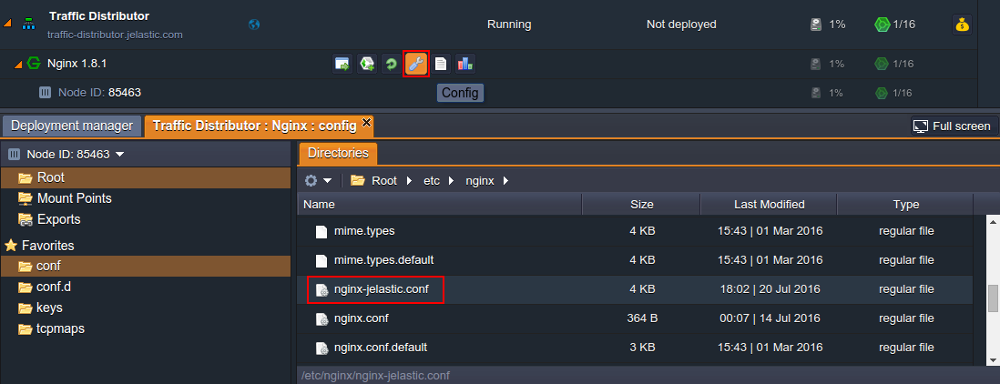
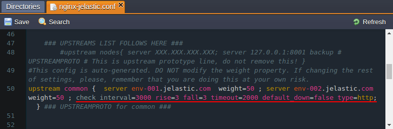
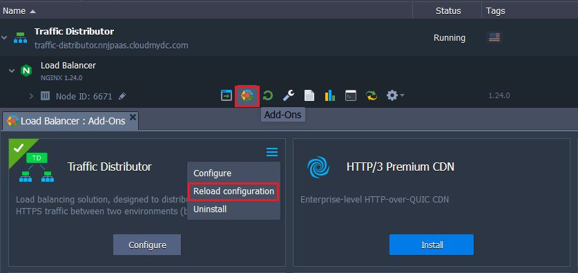

## Failover Protection with TD

[Traffic Distributor](http://localhost:3000/docs/application-setting/traffic-distributor/traffic-distributor-overview) allows to easily achieve advanced failover protection with the help of the in-build health check module, which automatically regularly tests backends for availability and excludes unavailable ones from routing. This functionality is enabled by default, however, you can adjust this module behaviour if required. Follow the steps below for that.

1. Navigate to the NGINX **Config** panel with the same-named button and navigate to the _/etc/nginx/nginx-jelastic.conf_ file within **Root**:

<div style={{
    display:'flex',
    justifyContent: 'center',
    margin: '0 0 1rem 0'
}}>



</div>

Doubleclick to open it in a new tab for editing.

2. Scroll down to the approximately _50th_ line, where the add-on’s configuration is declared, and find the required **_check_** module inside the **_upstream common_** section. It operates with the following parameters (where the ones in square brackets are optional):

```bash
check interval={interval} fall={fail_count} rise={rise_count} [timeout={timeout}] [default_down={true/false}] [port={port}] [type={type}]
```

<div style={{
    display:'flex',
    justifyContent: 'center',
    margin: '0 0 1rem 0'
}}>



</div>

where

- {**_interval}_** - delay between two consecutive check requests; is set in milliseconds
- **_{fail_count}_** - amount of checkup failures, after which the server will be marked as unavailable
- **_{rise_count}_** - amount of successful checkups, after which the server is marked as up and working
- **_{timeout}_** - timeout (in milliseconds) the health check module is waiting for reply from backend before the check request is considered as failed
- **_{true/false}_** - sets the initial state (_down_ or _up_ correspondingly) of both backends (i.e. until the corresponding amount of checkups is passed); states in _true_ by default
- **_{port}_** - port number to be used while connecting to a backend to perform health check; by default is set to 0, which means that the default server’s port (according to the set protocol) will be used
- **_{type}_** - protocol type to be used for health check (i.e. to diagnose if backend is up):
  - **tcp** - a simple _TCP_ socket connection
  - **ssl_hello** - sends _Client Hello_ SSL packet, which should be responded with a _Server Hello_ message
  - **http** - sends _HTTP_ request packet to receive and parse the response
  - **mysql** - connects to the _MySQL_ server and receives the greeting response
  - **ajp** - sends _AJP Cping_ packet to receive and parse the _Cpong_ response
  - **fastcgi** - sends a _FastCGI_ request to receive and parse the response

According to the settings in the image above, both backends will be checked for the normal HTTP response (i.e. 200 status code, which means that the request was fulfilled) every 3 seconds. If check up is failed for 3 times in a row, the corresponding backend will be marked as “down” and excluded from the route, so that all the requests will go to the second environment. And when the fallen server is live again, it will be automatically re-added (namely, after 3 successful requests in a row) to the list of backends.

3. After you’ve saved the made changes in NGINX balancer configurations, they can be applied without restarting the whole server (and, in such a way, avoid project downtime) through performing the graceful reload via the **_Reload configuration_** option in add-on’s menu.

<div style={{
    display:'flex',
    justifyContent: 'center',
    margin: '0 0 1rem 0'
}}>



</div>

Confirm your decision via appeared pop-up and in a few seconds your new failover protection settings will take effect.
