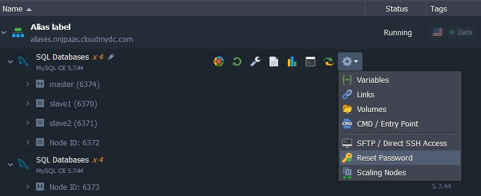

Since custom containers don’t have the embedded GUI for their management, the most common way to take the full control over such an instance is connecting to it under the SSH protocol and perform any desired operations inside using the corresponding terminal commands.

:::tip Note

With the PaaS, the majority of the required configurations can be performed directly through the dashboard without the necessity to use SSH, thanks to the following tools:

- [Container Configurations](/container/container-configuration/configuration-tools) - allows to customize the main container settings (like variables, volumes, linking, run options, opened ports, etc.)
- [Configuration Manager](/container/container-configuration/configuration-tools#configuration-file-manager) - provides the full root access to the container’s file system, allowing to operate with all of the comprised files
  In addition, you can leverage the platform-dedicated [CLI client](/deployment-tools/api-&-cli/platform-cli/platform-cli-overview), which provides the advanced remote management for all types of environments and nodes and allows to automate your app’s lifecycle via scripts.

:::

SSH connection to a container can be established in two ways:

- through the SSH Gateway as for any other environment. The flow will be the following:

  - [generate](/deployment-tools/ssh/generate-ssh-key) an SSH keypair
  - [add your public SSH key](/deployment-tools/ssh/add-ssh-key) to the dashboard
  - [access your account](/deployment-tools/ssh/ssh-access/overview) via SSH protocol

- or, if you don’t want to use SSH keys, you need to attach the [public IP](/application-setting/external-access-to-applications/public-ip) address to the required node and perform the next steps:

  - open your **terminal** emulator
  - enter the **_ssh [username]@[hostname]_** string, where the **username** is your login, and hostname is the Public IP address (you receive these credentials via email everytime a new container is created or added to the environment)
  - specify the requested **password** (can be found in the email also)

Once you’ve entered your container, you can perform any required configurations, thanks to the full root permissions granted.

:::tip Note

If you’ve faced any problems during establishing the connection, check the firewall rules for your container and ensure it has the openssh server running.

:::

## Reset Password

In case you’ve forgotten your container’s credentials or lost/deleted the appropriate email, you can restore them at any time - simply choose the **Reset password** option within the expandable **Additional** list (the gear icon) for the necessary node (or set of them):

As a result, you’ll receive a new password via email and can use it for operating your container(s).
