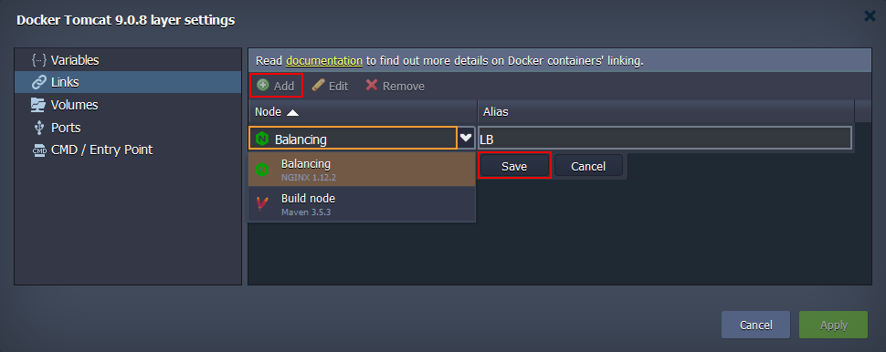
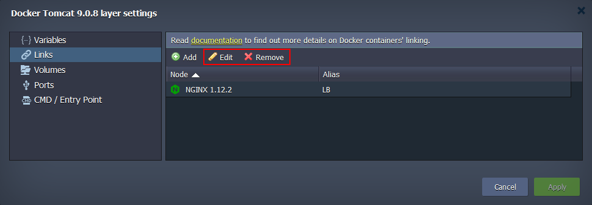

Links
The **Links** section is intended to establish connection between the containers placed at different layers of a single environment.

After such connection is set, a container will be able to work with [environment variables](/docs/Container/Container%20Configuration/Variables) of the linked image (herewith, the imported properties can be recognized by a specified prefix). Below, we’ll provide a step-by-step example of containers linking.

1. Click the **Add** button and fill in the appeared fields:

- **Node** - select the required layer of the current environment using the drop-down list
- **Alias** - type a connection alias (LB in our case). Subsequently, it will be used as a prefix for the variables imported to the current container(s) from the layer chosen in previous field

:::tip Tip

Upon linking containers, the platform also adds the corresponding DNS record (with the name identical to the used alias) to the platform DB. In such a way, you can refer to a particular container from inside of these two environment layers not just over its IP address or NodeID, but also specifying the assigned alias with counter, i.e. {alias_name}**\_N**.

For example, after linking with DB alias, you can ping specific containers at the appropriate layer as “db_1”, “db_2”, etc while working with platform internal network via [SSH Gateway](/docs/Deployment%20Tools/SSH/SSH%20Overview). Herewith, if using common layer alias (i.e. without counter, “db” in our case), the system will use Round-Robin algorithm to choose any container within the defined node group.

:::

2. After that click **Save** to confirm linking settings. You can link as many different node groups to a single layer as you require.

:::tip Note

- all the stated connections will take effect only after selecting the **Apply** buttons for this frame and, if needed, for the whole topology wizard
- **be aware** that the linked nodes <u>will be restarted</u> for the new settings to be applied (causing a short downtime of the involved containers)

:::

3. You always can **Edit** or **Remove** the unnecessary link with the corresponding buttons at the top pane of the Docker layer settings frame.

When updates are applied, you can check the results by switching to the [Variables](/docs/Container/Container%20Configuration/Variables) section (where the newly imported parameters will be listed).
