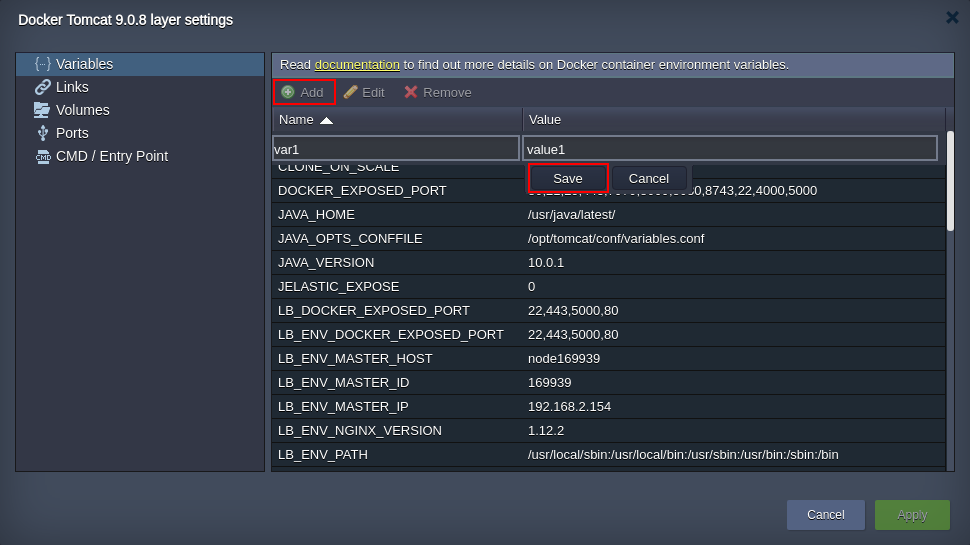
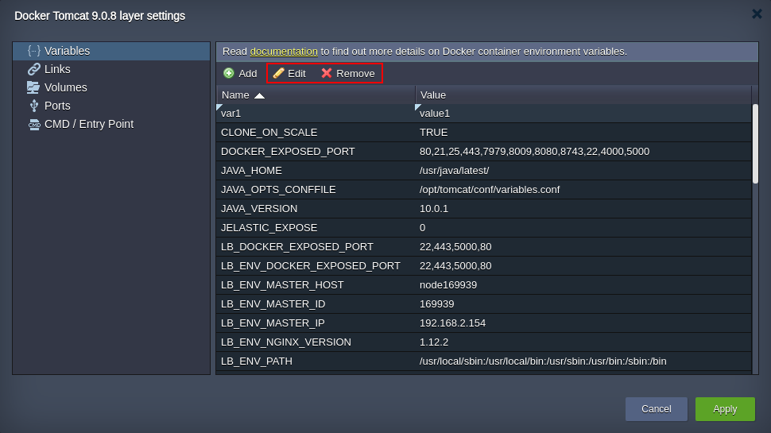

At the **Variables** tab, you can view and manage a list of the [environment variables](/docs/environment-management/environment-variables/environment-variables) for the current layer.

In case of [CLI client](/docs/container/container-configuration/links), variables from other nodes within the environment will be also displayed in the same tab with a special prefix. In addition, they can be edited on a fly, automatically applying changes to all source and target containers.

1. To state a [custom variable](/docs/environment-management/environment-variables/custom-environment-variables), click the **Add** button and fill in the appeared cells with the required variable Name and Value.

:::danger Note

Variable names should only contain Latin letters, numbers, and underscore “\_” characters.
add variable layer settings

:::

Don’t forget to **Save** your variable.

2. Beside adding, you can also **Edit** and **Remove** the already existing records (except some default ones) with the help of the same-named buttons.

:::tip Tip

Here are a few hints for speeding up the configuration process:

- double clicking on a variable will immediately switch you to its editing
- in case you need to remove several records, you can select them using the **Shift** or **Ctrl** buttons

:::

edit remove variable layer settings

3. Click on **Apply** to save all the changes made in the Docker layer settings frame and, if required, one more time at the wizard window to apply them.
