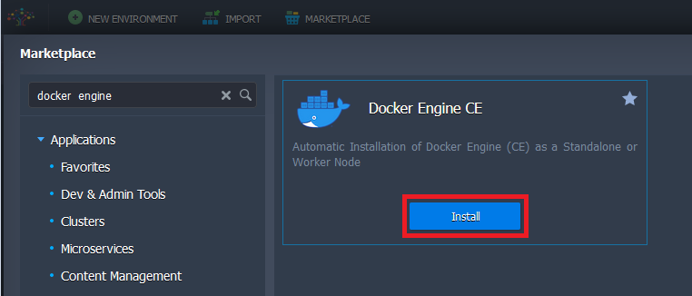
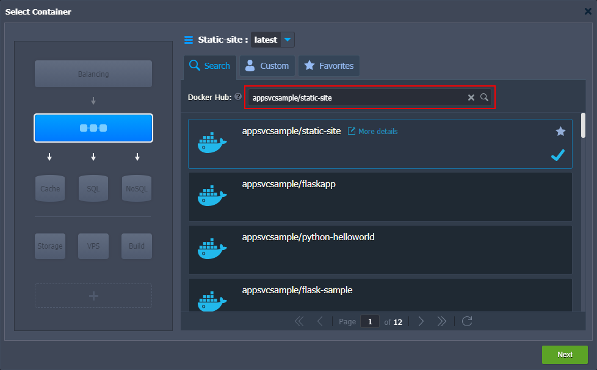
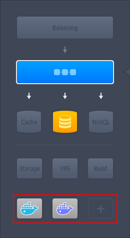
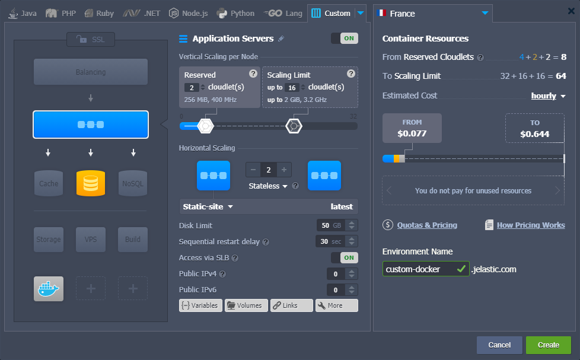
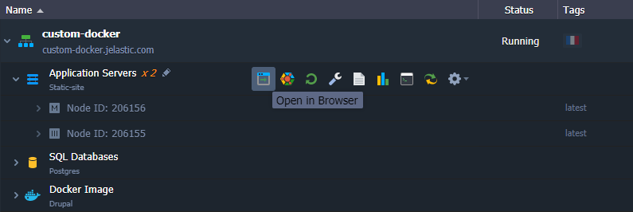
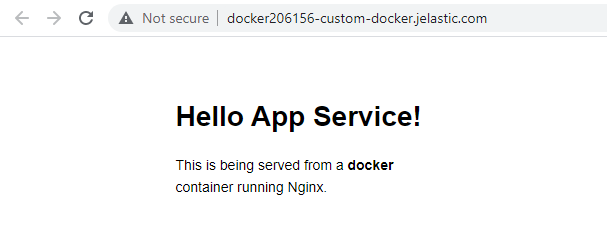
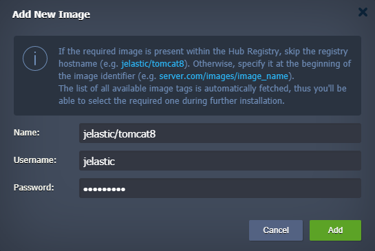
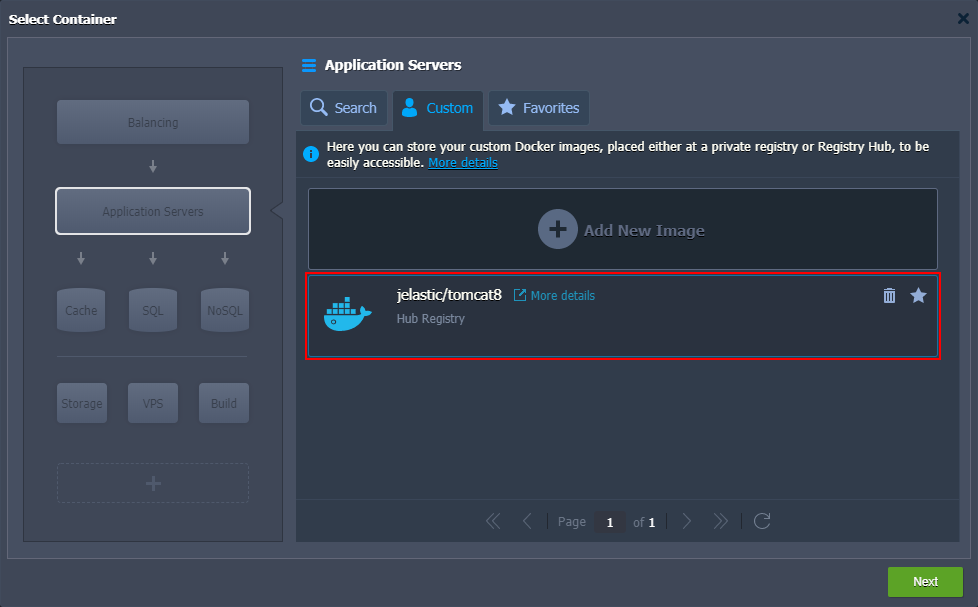
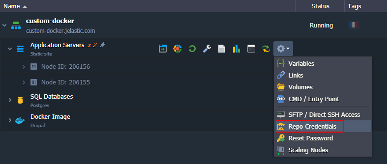
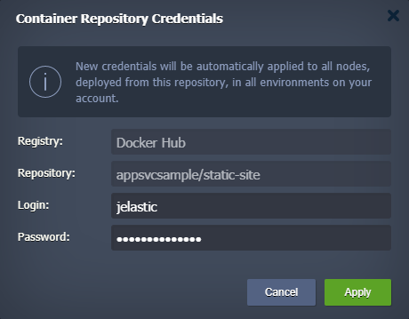

The platform can automatically create **custom containers** based on any standard Docker image that uses [supported OS and architecture](/docs/Container/Container%20Image%20Requirements) and is stored at Docker Hub or any other public/private registry. Such containers get all the benefits of the platform (automatic vertical and horizontal scaling, logs, statistics and alerts monitoring, embedded configuration file manager, etc.) while maintaining the original software of the image intact. Be aware that the operability of the application itself cannot be guaranteed as it is managed by respective third-party image maintainers and not the platform.

:::tip Tip

The platform provides support of the most popular [software stacks](/docs/quickstart/software-stack-versions) with ensured template operability and regular updates to the latest version (**[certified containers](/docs/Container/Container%20Deployment/Certified%20Containers%20Deployment)**).

:::

Within this guide, you’ll find out how to get started with custom Docker containers - how to create and manage all types of applications and services that are available within the [Docker Hub](/docs/Container/Container%20Deployment/Custom%20Containers%20Deployment) or your [custom private registry](/docs/Container/Container%20Deployment/Custom%20Containers%20Deployment#containers-from-customprivate-registry).

## Custom Containers from Docker Hub

1. Open the environment [topology wizard](/docs/environment-management/setting-up-environment) by clicking the **New Environment** button at the top-left corner of the dashboard.

Switch to the **Custom** tab at the top of the wizard. Inside, you’ll find several blocks with different layer names to the left, where each of them provides the ability to create a custom container based on the selected Docker image. Use these sections to divide and structurize the topology according to your needs.

Switch to the required layer and proceed with the **Select Image** button.

2. In the opened **Select Container** frame, you’ll see a few tabs:

- _Quick Start_, which provides a set of the most popular/recommended templates for the current layer (this tab may be absent depending on your hosting service provider settings)
- _Search_, which allows you to find the desired template at the central Docker Hub registry
- _Custom_, where you can add your own template from the [custom/private registries](/docs/Container/Container%20Deployment/Custom%20Containers%20Deployment#containers-from-customprivate-registry)
- _Favorite_, where you can store the images for quick access (i.e. which you presume to use in the future)

As an example, let’s Search the official Docker Hub registry - navigate to the same-named tab, type the full or part of the required name to the input field (e.g. appsvcsample/static-site) and hit **Enter**.

The platform will load relevant results in a moment, so just click on the required template to add it to the chosen layer. You can select the necessary **tag** with the drop-down list at the top of the frame. The field supports searching to help manage images with multiple tags.

:::tip Tip

Hovering over a particular image will expand the plank with a few auxiliary functions. Click on the **_More details_** string to open the corresponding repository page at Docker Hub in a separate browser tab.

You can mark an image as **Favorite** by clicking on the star icon at the top-right corner. After that, the platform will add this image to the corresponding tab for quick access. To remove the saved image from the list, click the star-shaped button again.

:::

Different Docker images cannot be added to the same layer. To add more images, use different layers. The **Extra** blocks allow expanding topology as far as you need.

Click the **Next** button after you’ve finished composing the topology.

3. Once you are back at the wizard with all the required custom containers added, you can start configuring and managing them just as any [regular node](/docs/EnvironmentManagement/Setting%20Up%20Environment#configuring-nodes-resources-and-specifics):

Сlick on the **Create** button at the bottom of the wizard to initiate the environment creation.

4. That’s all! In a few minutes, your environment with custom containers will be created and appear on the dashboard.

You can **Open in Browser** each container with the corresponding button next to it or the whole environment via the assigned domain (shown below the environment name). In the latter case, the application server or balancer layer’s template will be opened.

:::tip Notes

- Not all custom containers have the web interface running out-of-the-box. Thus you can get the 502 application down error while accessing such a node via the browser. However, that doesn’t mean this image is incorrect or corrupted. If you’d like to ensure the necessary service is working, check the running processes inside a container [using the SSH](/docs/Container/Custom%20Container%20SSH%20Access) connection.
- In case an application is deployed to a container without the [public IP](/docs/application-setting/external-access-to-applications/public-ip) and is not listening to the [port](/docs/Container/Container%20Configuration/Ports) 80 on its backend, you’ll be shown the dedicated 502 - Service is down error page while trying to open it. In such a case, you need to ensure your container has an HTTP service running and set for handling the incoming requests through the port mentioned above.

:::

In our example, you can see a Docker application sample upon opening the image in the browser.

You can make additional configurations to this container directly in the dashboard. For example, you can operate via the embedded [file manager](/docs/container/container-configuration/configuration-tools) or **[Web SSH](/docs/deployment-tools/ssh/ssh-access/web-ssh)** client. In both cases, you are granted the full root permissions for accomplishing your desired adjustments.

## Containers from Custom/Private Registry

In addition to the numerous public templates available to be found within the official Docker Hub registry, the platform gives you the ability to deploy your own private image from any custom registry. This template will be remembered by the platform (stored within the dedicated **Custom** section), allowing you to manage it the same way as any public image. If your repository is protected, you’ll need to specify the appropriate access credentials (just once during the addition). At the same time, all the subsequent authentication required for [container scaling](/docs/ApplicationSetting/Scaling%20And%20Clustering/Horizontal%20Scaling) or [redeployment](/docs/category/container-deployment) will be performed automatically.

Such an image addition can be done via the Custom section in the topology wizard.

1. Start with switching to the **Custom** tab and clicking the **Add New Image** button:

.png>)

2. In the opened frame, insert the **Name** of your repository into the corresponding field. You can omit the registry host at the beginning of an image name when working with Docker Hub.

:::tip Tip

You don’t need to specify a tag during custom image addition, as you’ll be able to choose the required one during the creation/customization of the appropriate container. Furthermore, a list of available image tags is automatically updated upon its selection for installation, so you don’t need to re-add your Docker template to the Custom section just because your application code has been updated.

:::

In case your repository is private, you’ll need to additionally specify the proper credentials via the **Username** and **Password** fields (otherwise, leave them empty). Click **Add** to proceed.

3. In a few seconds, your new template will be added to the list of custom images so that it can be easily deployed on the platform.

If some custom template is not needed anymore, you can remove it from the list by clicking on the **bin** icon at the top-right corner of the appropriate plank. Custom images can be added as Favorites in the same way as regular ones (i.e. using the **star** icon).

4. In case you need to update access credentials to any of your existing custom containers, hover over the appropriate layer in the dashboard, expand the Additionally list, and click the **Repo Credentials** option.

5. Within the opened **Container Repository Credentials** frame, you can specify a new **Login** and **Password** for your image.

**Apply** changes with the same-named button.

That’s all! Now, you are acquainted with the custom containers addition from non-default repositories to the platform.

:::tip Tip

If you face any issues while operating with your custom Docker images at the platform, feel free to appeal to our technical experts for assistance at [Stackoverflow](https://stackoverflow.com/questions/tagged/jelastic).

:::
