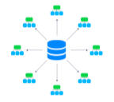

<!-- ## External NFS Server Configuration -->

<div style={{
    display: 'grid',
    gridTemplateColumns: '0.15fr 1fr',
    gap: '10px'
}}>
<div style={{
    width: '100%',
    height: '100%',
    display: 'flex',
    alignItems: 'center',
}}>



</div>

<div>

The platform allows [sharing data](https://cloudmydc.com/) between servers (where the files are physically located) and clients (gain access to the remote data as if it was kept locally). The configurations required to set up a share varied based on the following condition:

_both instances are inside of the same PaaS account_ - either [export data](https://cloudmydc.com/)[ from storage or mount data](https://cloudmydc.com/) on the clients (the platform automatically handles the second operation)

</div>

</div>

_one instance is outside of the platform_ - export data from external storage (described in this guide) <u>and</u> [mount external data](https://cloudmydc.com/) on the clients

Below, we’ll consider the configurations required to export data from the platform [Shared Storage Container](https://cloudmydc.com/) to the external instance. The described flow is suitable for any NFS-based storage server.

1. First of all, to share data over the Internet, it’s required to attach a [public IP](https://cloudmydc.com/) address to your server:

<div style={{
    display:'flex',
    justifyContent: 'center',
    margin: '0 0 1rem 0'
}}>


</div>

2. Next, you need to declare the list of directories you’d like to share within the corresponding **_etc/exports_** file. In the platform, it can be easily accessed with the **Configuration** button in the **_[Exports](https://cloudmydc.com/)_** section of the built-in _Configuration File Manager._

Here, the following format should be used:

```bash
{directory} {server}([option],[option],..)
```

<div style={{
    display:'flex',
    justifyContent: 'center',
    margin: '0 0 1rem 0'
}}>


</div>

where:

- `{directory}` - path to the folder (relative to the Root folder) that should be exported
- `{NFS_client}` - [custom domain](https://cloudmydc.com/) name or public IP address of the client node (i.e where the exported files should be mounted)

:::tip Note

In case your instance does not have an external address attached, you can alternatively use the IP of the appropriate host. It could be obtained by connecting to the container via SSH and executing the following command:

```bash
curl ifconfig.co
```

<div style={{
    display:'flex',
    justifyContent: 'center',
    margin: '0 0 1rem 0'
}}>


</div>

<u>Be aware</u> that such flow is highly insecure and should not be used for production purposes, as it will make your shared data available for any container on the same host.

:::

- **_[option]_** - some [additional parameters](https://cloudmydc.com/) to describe the access permissions, where the main ones are:

- _async_ - allows NFS clients to receive a response from the storage as soon as a request on adding content is processed. At the moment, the data is already in the cache but not actually written to storage yet. Compared to the opposite sync option, it gives a performance boost but leaves a slight risk of data loss (if stopped/crashed while still holding unwritten data in cache)
- _ro (or rw)_ - defines read-only (read & write) permissions to make the client node available to view (view and edit) the shared data
- _no_root_squash_ - gives root user on a client’s server the same level of access as a root user on a storage container
- _no_subtree_check_ - sets accessibility for the whole directory (better performance but restricts providing individual rules for files inside)

:::tip Tip

For additional security, you can [configure](https://cloudmydc.com/) the corresponding **_etc/hosts.allow_** and **_etc/hosts.deny_** files to manage a list of hosts that NFS server can work with.

:::

3. <u>When working with the <a href="/">Shared Storage Auto-Cluster</a> based on the GlusterFS</u>, take into consideration that only <b>/data</b> folder is replicated between instances, so the exported directory should be located inside.

Also, an additional **fsid** option should be obligatory added to the export configuration string. For example, the value of this parameter can be randomly generated with the next command:

```bash
cat /proc/sys/kernel/random/uuid
```

<div style={{
    display:'flex',
    justifyContent: 'center',
    margin: '0 0 1rem 0'
}}>


</div>

As a result, the export string would be similar to the following one:

<div style={{
    display:'flex',
    justifyContent: 'center',
    margin: '0 0 1rem 0'
}}>


</div>

Don’t forget to **Save** the changes you’ve made.

4. In order to apply new export settings, the corresponding **_exportfs_** command should be used (e.g. via [Web SSH](https://cloudmydc.com/)):

```bash
exportfs -ra
```

<div style={{
    display:'flex',
    justifyContent: 'center',
    margin: '0 0 1rem 0'
}}>


</div>

5. Next, you need to open the NFS server ports (111, 2049, and 20048) for the NFS client IP address (the one used in the second step). Navigate to the storage environment **Settings > [Firewall](https://cloudmydc.com/)** section to add required rules via intuitive UI:

<div style={{
    display:'flex',
    justifyContent: 'center',
    margin: '0 0 1rem 0'
}}>


</div>

:::tip Tip

This can be done through the console as well:

```bash
iptables -I INPUT -p tcp -m multiport --dports 111,2049,20048 -s {NFS_client} -j ACCEPT
iptables -I INPUT -p udp -m multiport --dports 111,2049,20048 -s {NFS_client} -j ACCEPT
```

<div style={{
    display:'flex',
    justifyContent: 'center',
    margin: '0 0 1rem 0'
}}>


</div>

:::

6. When granting the RW rights, ensure that the same users have equal access permissions to the shared folder on both NFS client and server. For example, different [stacks](https://cloudmydc.com/) can use different users by default (e.g. root and jelastic).

So, if needed, execute the following command on your storage server to adjust the rights:

```bash
chown {uid}:{gid} {path}
```

Here:

- `{uid}` - user name or ID, which can be found in the **_/etc/passwd_** file of your platform container
- `{gid}` - group name or identifier, that is shown within the **_/etc/group_** file of your node
- `{path}` - path to the directory you’d like to change the permissions for

<div style={{
    display:'flex',
    justifyContent: 'center',
    margin: '0 0 1rem 0'
}}>


</div>

That’s all! Your data storage server is ready, so you can return to the client instance and start [mounting](https://cloudmydc.com/).
