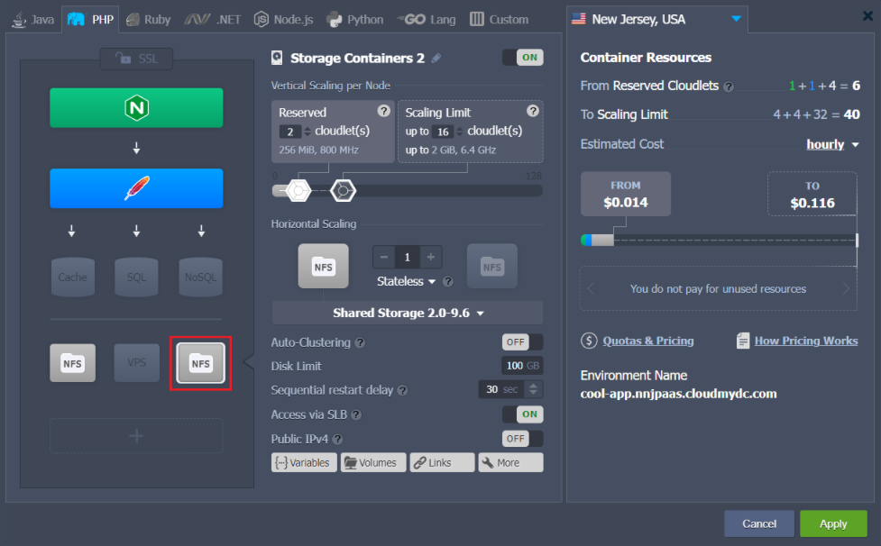
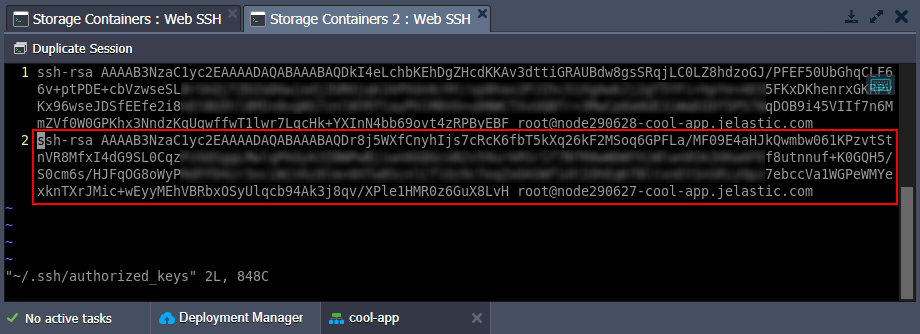
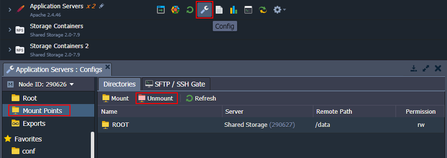
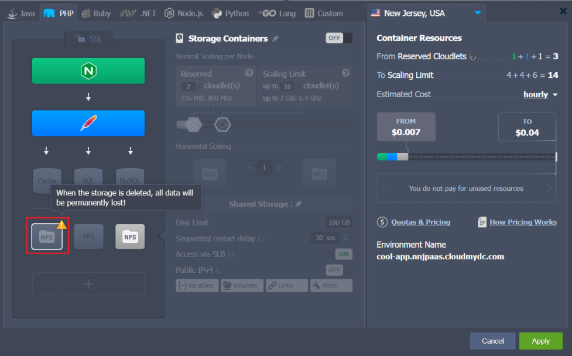
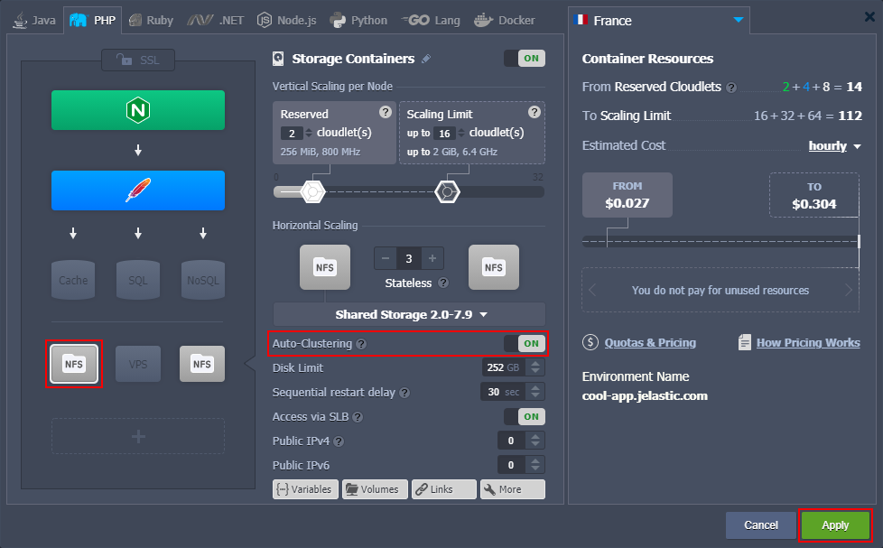
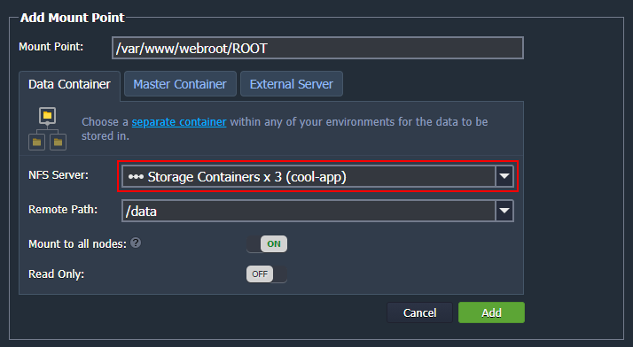
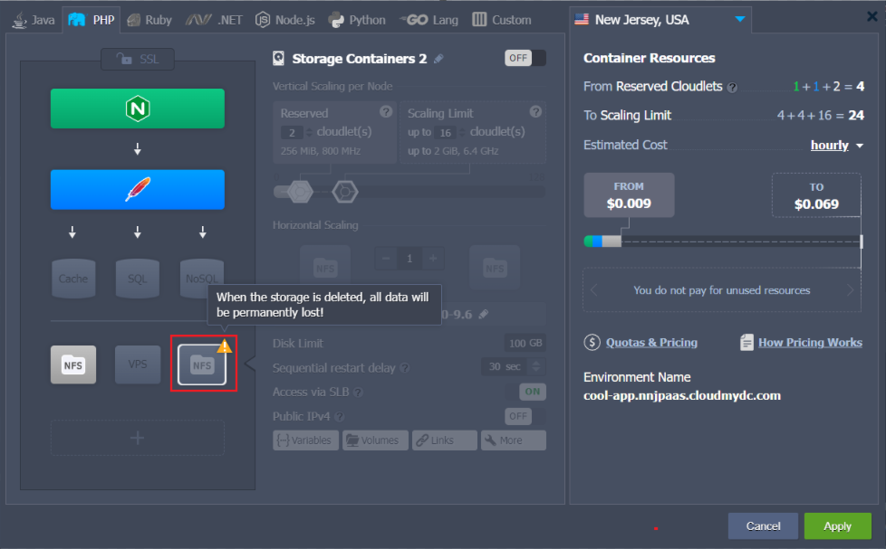

<!-- ## Migrating Standalone Storage to GlusterFS Cluster -->

Currently, automatic conversion of the existing standalone storage into the GlusterFS cluster is not supported. You’ll need to recreate the storage from scratch. We recommend creating a temporary Storage node in the extra layer, copy data, and remount any existing shares. Then, recreate the initial Storage node as a GlusterFS cluster and restore data and mount shares back. The instruction below will guide you through the process step-by-step.

1. Locate the required environment in your platform dashboard and click the **Change Environment Topology** button.

<div style={{
    display:'flex',
    justifyContent: 'center',
    margin: '0 0 1rem 0'
}}>


</div>

2. Within the opened wizard, add a new **Shared Storage** node in the Extra layer. Click **Apply** to proceed.

<div style={{
    display:'flex',
    justifyContent: 'center',
    margin: '0 0 1rem 0'
}}>



</div>

3. Connect to your initial (source) Storage node via [SSH](https://cloudmydc.com/), e.g. using the built-in **Web SSH** client. Run the following command to [generate](https://cloudmydc.com/) a keypair that will be used to interconnect two storages:

```bash
ssh-keygen -f ~/.ssh/storage
```

<div style={{
    display:'flex',
    justifyContent: 'center',
    margin: '0 0 1rem 0'
}}>


</div>

You can view the generated public key with the command below:

```bash
cat  ~/.ssh/storage.pub
```

<div style={{
    display:'flex',
    justifyContent: 'center',
    margin: '0 0 1rem 0'
}}>


</div>

Use the **Ctrl+Shift+С** or **Сmd+C** shortcut in the Web SSH panel to copy the key.

4. Switch to your new Shared Storage node and connect to it via [SSH](https://cloudmydc.com/) as well. Insert public key from the previous step to the **_~/.ssh/authorized_keys_** file using any preferred editor, for example:

```bash
vim ~/.ssh/authorized_keys
```

<div style={{
    display:'flex',
    justifyContent: 'center',
    margin: '0 0 1rem 0'
}}>



</div>

5. Return to the source storage and copy required data to a new node via the **_rsync_** utility:

```bash
cd /data; rsync -az . {NEW_STORAGE_IP}:/data/ -e "ssh -i $HOME/.ssh/storage"
```

Here, the `{NEW_STORAGE_IP}` placeholder should be substituted with the internal IP address of your new storage that can be viewed in the dashboard.

<div style={{
    display:'flex',
    justifyContent: 'center',
    margin: '0 0 1rem 0'
}}>


</div>

Confirm connection by typing _“yes”_ when prompted. The operation may require some time that depends on the amount of copied data.

6. [Remount](https://cloudmydc.com/) application data from the initial to temporary storage.

- click the **Config** button next to our application server and **Unmount** the current Shared Storage.

<div style={{
    display:'flex',
    justifyContent: 'center',
    margin: '0 0 1rem 0'
}}>



</div>

next, create a new **Mount** to your temporary storage server

<div style={{
    display:'flex',
    justifyContent: 'center',
    margin: '0 0 1rem 0'
}}>


</div>

7. Standalone Shared Storage can be replaced with a GlusterFS storage cluster in two steps:

- open the **Change Environment Topology** wizard, remove the appropriate storage node altogether, and **Apply** changes

<div style={{
    display:'flex',
    justifyContent: 'center',
    margin: '0 0 1rem 0'
}}>



</div>

access topology wizard once more and add Shared Storage node with the **Auto-Clustering** option enabled

<div style={{
    display:'flex',
    justifyContent: 'center',
    margin: '0 0 1rem 0'
}}>



</div>

8. Return data from the temporary storage server in the Extra layer to a new Shared Storage cluster with GlusterFS support.

<u>Repeat the 3-7 steps</u>, using the temporary storage as source and master node of the GlusterFS cluster as target.

<div style={{
    display:'flex',
    justifyContent: 'center',
    margin: '0 0 1rem 0'
}}>



</div>

9. Remove the temporary storage from the _Extra_ layer.

<div style={{
    display:'flex',
    justifyContent: 'center',
    margin: '0 0 1rem 0'
}}>



</div>

That’s all! Now, you have a GlusterFS cluster instead of the standalone storage node.
