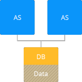

<!-- ## Storing Data in Compound Container -->
The platform provides a possibility to treat any node at account as a data storage server, i.e. assign it an additional storage role beside the main native one. Using such a kind of compound containers suits best for handling simple projects.

In this way, you can leverage the shared storage functionality without the redundant complication of your environment topology due to a separate node inclusion. And complementary utilization of a server, which presence is necessary due to its role but which is not very loaded, generally, helps to save money compared to the dedicated Shared Storage Container use.

Also keep in mind, that local files can be retrieved by an application much more faster in contrast to when they are accessed via network. So, for example, if you have two nodes with one of them distributing some static content and another one - just pushing it out upon the request, the best solution will be to set up a storage on the first container to ensure faster distribution and prevention the network from being bottleneck.