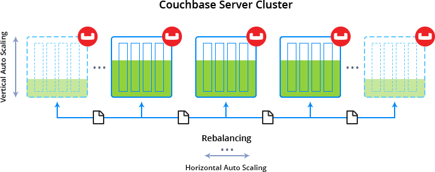
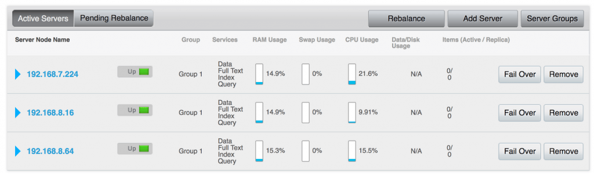
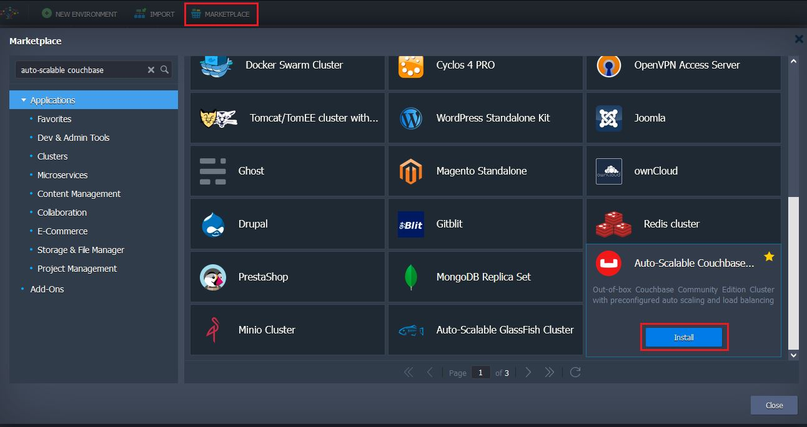
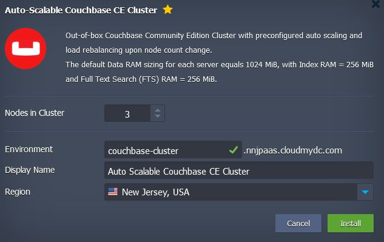
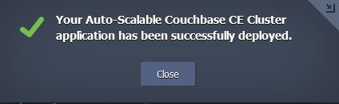
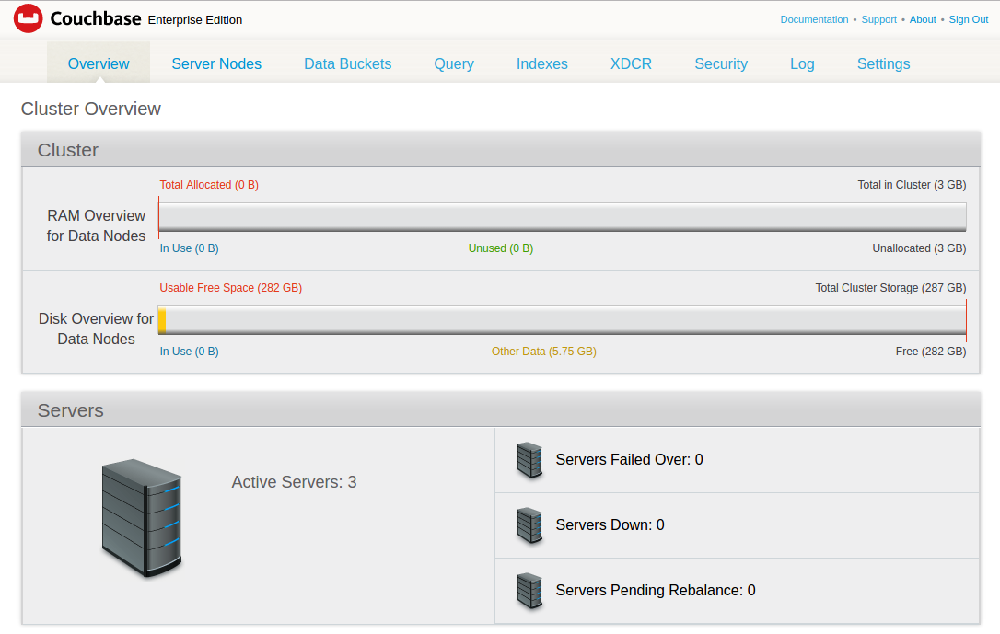

## Auto-Scalable Couchbase Cluster in Containers: One-Click Deploy to the Cloud

Building and running complex applications, able to handle unstructured data and serve lots of concurrent globally-distributed users, is what enterprises need to be agile and robust. When facing the emerging data-management requirements, many companies give preference to NoSQL data storing technology as the one that provides a substantial level of scale, speed, and data variability.

Among the available NoSQL solutions, [Couchbase](https://www.couchbase.com/?_gl=1%2A1ya143w%2A_gcl_au%2AMTkyNTQ2Mjk4Ny4xNjk0OTczMzMx) is designed to provide low-latency data management for large-scale applications. With its simple administration, fast performance and advanced engine for executing SQL-like queries, Couchbase is able to satisfy the majority of requirements a database should comply with.

Thus, to allow our customers benefit from all the advantages this data storing system provides, today we’ll consider a one-click solution the Jelastic team has developed for you to easily deploy an auto-scalable Couchbase cluster within Docker containers inside the Cloud. Further, we’ll take a look at the appropriate package specifics and consider a detailed guide on its installation and connectivity configurations.

## Auto-Scalable Couchbase Cluster Package Specifics

The [Couchbase Cluster](https://github.com/jelastic-jps/couchbase?utm_source=blog-couchbase&_gl=1*1ya143w*_gcl_au*MTkyNTQ2Mjk4Ny4xNjk0OTczMzMx) package by Jelastic is built upon the official _[couchbase](https://hub.docker.com/_/couchbase/?_gl=1*1ya143w*\_gcl_au\*MTkyNTQ2Mjk4Ny4xNjk0OTczMzMx)_ Docker image as a base. During its deployment, you can set the desired number of cluster nodes (up to 10 instances) to be created. All cluster members (both the initially created ones and subsequently added nodes) will be automatically interconnected to represent a single highly available data storing system. In this way, you get a ready-to-use logical grouping of container instances rather than a set of standalone nodes that require additional configurations’ appliance for even data distribution.

Within the package, each Couchbase container is assigned 16 dynamic cloudlets as a space of resources for [vertical scaling](/docs/application-setting/scaling-and-clustering/automatic-vertical-scaling#automatic-vertical-scaling), with maximum capacities in 2 GiB of RAM and 6.4 GHz of CPU (if necessary, this limit can be subsequently adjusted by following the above-linked guide). And with automatically provisioned [Jelastic SSL](/docs/application-setting/ssl/built-in-ssl#built-in-ssl-certificates) certificate, you get the out-of-box ability to access your Couchbase cluster via secured HTTPS connection.

As for the memory allocation parameters, they are set as following for each node in a cluster by default:

- **Data RAM** size, required to handle CRUD data operations (create/read/update/delete), is limited to 1024 MiB
- **Index RAM**, which maintains secondary indexes and performs index scan for N1QL queries, could consume up to 256 MiB
- **Full Text Search (FTS) RAM**, which is utilized for creating, managing and querying full text indexes on JSON documents, is assigned a maximum of 256 MiB

## Auto-Scaling and Rebalancing Configurations

The Couchbase cluster is to be expanded/shrunk with **automatic horizontal scaling** (i.e. by changing containers count) based on the following resources consumption conditions:

- +1 node (up to 10 instances per layer) if either RAM or CPU usage exceeds 70% of the allocated capacity for at least 5 minutes
- -1 node (but not less than a number of containers you’ve stated initially, i.e. during package installation) whenever RAM or CPU usage drops under 40% of a set limit and remains in this range for at least 5 minutes
  The appropriate modifications are automatically applied to add/remove Couchbase nodes, whilst you receive the corresponding email notification upon each executed scaling operation. If necessary, these default auto-scaling trigger settings could be subsequently changed by following the [Automatic Horizontal Scaling](/docs/application-setting/scaling-and-clustering/automatic-horizontal-scaling#automatic-horizontal-scaling) guide.

Each time a cluster is scaled in or out, the process of **rebalancing** takes place. It represents an automated operation of data redistribution across available nodes in a cluster. During this operation, a cluster remains fully workable and continues to serve and handle client requests.

In such a way, the auto-scalable clustered Couchbase solution by Jelastic is capable of operating in a nonstop fashion, ensuring high availability of your services with a minimum involvement from your side.

Now, let’s proceed further to examine how to easily get such Couchbase cluster up and running with Jelastic Cloud hosting.

## Couchbase Cluster in the Cloud: One-Click Deploy

With the considered prepackaged solution for one-click installation, the process of Couchbase cluster deployment is fully automated and doesn’t require any manual configurations - just several steps to accomplish.

1. Log in to the Jelastic Cloud with your credentials and click **Marketplace** at the top pane.

Within the **Apps** section, use the search box to find the Auto Scalable Couchbase Cluster package and select **Install**. 2. In the opened frame, set a number of Nodes in Cluster to be created (considering that this value will be set as a minimal cluster size and can’t be decreased due to auto-scaling). Then type an Environment name, and, optionally, alternative Display Name ([alias](/docs/environment-management/environment-aliases)) for it.

Also, select a preferable hardware _[Region](/docs/environment-management/environment-regions/choosing-a-region#environment-regions)_ (if several ones are available) and click **Install**. 3. Once cluster deployment is completed, you’ll be provided with credentials for its administrating in the appeared pop-up and, at the same time, via dedicated email notification.

Click the **Web Console** link and specify this data to access the appropriate Couchbase management panel via HTTPS.

At the opened start page, you’ll see a general Cluster Overview, composed of the following sections:

- _Cluster_ - intended to provide data on cluster RAM and disc space usage upon its filling up with data
- _Servers_ - displays general information on servers count within a cluster and their status
  For a detailed guidance on working with Couchbase Web Console, refer to the [official documentation](https://docs.couchbase.com/server/current/introduction/intro.html?_gl=1*1t80js0*_gcl_au*MTkyNTQ2Mjk4Ny4xNjk0OTczMzMx).

Now, when the cluster is up and running, it can serve your application as a highly available and elastic data storage - the details on setting up a proper interaction between them will be considered in one of the forthcoming articles. Thus, keep track on Jelastic blog updates whilst exploring the efficiency of the above described clustered Couchbase DB solution by your own with a free 2-week trial period at one of our partner's Cloud Platforms.

:::tip Tip
Have any questions on scalable Couchbase cluster deployment to Jelastic in one click? Feel free to submit them within the comments below or get in touch with our technical experts at [Stackoverflow](https://stackoverflow.com/questions/tagged/jelastic?_gl=1*1t80js0*_gcl_au*MTkyNTQ2Mjk4Ny4xNjk0OTczMzMx).

:::
