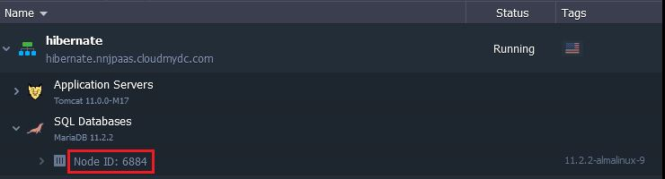

import obj from './DatabaseConnectionviaHibernate.json'

<!-- ## Connection to DB using Hibernate -->

To connect to DB using Hibernate users have to make the next steps:

- Create an environment at the platform
- Add a database node to this environment
- Modify some configuration files in a web-app
- Execute queries

Let’s do it step by step:

1. Create environment with a database server (MySQL in our case):

<div style={{
    display:'flex',
    justifyContent: 'center',
    margin: '0 0 1rem 0'
}}>


</div>

2. Create a new user in a database:
   How to create a new user - [click here](/database/mysql-mariadb-percona/connection-to-applications/java-connection#java-connection-to-mariadbmysqlpercona).

```bash
Database name : jelasticDb
Username : jelastic
Password : jelastic
```

For this example we’ve created table books with fields book_name and book_author inside the jelasticDb database.

3. Modify the following configuration files of your web-application:
   **_hibernate.cfg.xml_**

```bash
<hibernate-configuration>
  <session-factory>
    <property name="hibernate.dialect">org.hibernate.dialect.MySQLDialect</property>
    <property name="hibernate.connection.driver_class">com.mysql.jdbc.Driver</property>
    <property name="hibernate.connection.url">jdbc:mysql://mysql{node_id}.{your_env_name}.{hoster_domain}:3306/jelasticDb</property>
    <property name="hibernate.connection.username">jelastic</property>
    <property name="hibernate.connection.password">jelastic</property>
    <property name="hibernate.current_session_context_class">thread</property>
    <mapping resource="com/Testdata.hbm.xml"/>
  </session-factory>
</hibernate-configuration>
```

:::tip Note

Don’t miss to put the correct values to the hibernate.connection.url string instead of the text inside curly brackets.

{obj.data1}

where **_{node_id}_** - ID of the container with MySQL server you want to receive the access to. It can be seen at the dashboard:

<div style={{
    display:'flex',
    justifyContent: 'center',
    margin: '0 0 1rem 0'
}}>



</div>

:::

**_hibernate.revenge.xml_**

```bash
<hibernate-reverse-engineering>
  <schema-selection match-catalog="jelasticDb"/>
  <table-filter match-name="books"/>
</hibernate-reverse-engineering>
```

For the next step we’ve used reverse engineering mechanism and got 2 files in our web-project:

- Books.java
- Books.hbm.xml

Also you need to create the **_HibernateUtil.java_** file but do not need to change it.

4. Create a simple Java method, which will add a new row to the books table in our database:

```bash
public void addBook(){
        Session s = HibernateUtil.getSessionFactory().getCurrentSession();
        s.beginTransaction();
            Books book = new Books("romeo and juliet","william shakespeare ");
            s.save(book);
        s.getTransaction().commit();
}
```

that you have to put the connector for database (**.jar** library) to your project or to the appropriate web-server’s folder in the environment.
