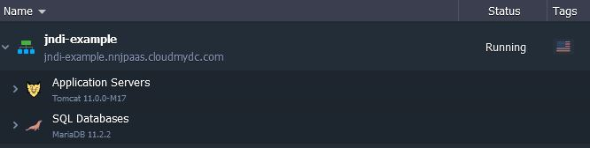

## Connection to DB using JNDI

To connect to DB using JNDI you have to perform the following steps:

- Log onto PaaS dashboard
- Create an environment
- Add database node into your environment
- Modify some configuration files in a web-app
- Create a connection in a java-class

Let’s do it step-by-step:

1. Create environment with database (MySQL in our case):

<div style={{
    display:'flex',
    justifyContent: 'center',
    margin: '0 0 1rem 0'
}}>



</div>

2. Create a new user in a database:
   How to create new user - [click here](/docs/Database/MySQL-MariaDB-Percona/Connection%20to%20Applications/Java%20Connection#java-connection-to-mariadbmysqlpercona)

```bash
Database name : jelasticDb
User_name : jelastic
Password : jelastic
```

3. Modify configuration files in your web-application:
   context.xml:

```bash
<Context antiJARLocking="true" path="/JNDI">
    <Resource name="jdbc/jelasticDb" auth="Container" type="javax.sql.DataSource"
               maxActive="100" maxIdle="30" maxWait="10000"
               username="jelastic" password="jelastic" driverClassName="com.mysql.jdbc.Driver"
               url="jdbc:mysql://mysql-jndi-example.{hoster_domain}/jelasticDb"/>
</Context>
```

web.xml:

```bash
<resource-ref>
 <description>MySQL Datasource example</description>
 <res-ref-name>jdbc/jelasticDb</res-ref-name>
 <res-type>javax.sql.DataSource</res-type>
 <res-auth>Container</res-auth>
</resource-ref>
```

4. Create connection in java-class

```bash
public class MyConnection {

    private DataSource dataSource;

    public MyConnection() {
        try {

            InitialContext context = new InitialContext();
            dataSource = (DataSource) context.lookup("java:comp/env/jdbc/jelasticDb");

        } catch (NamingException ex) {
            Logger.getLogger(MyConnection.class.getName()).log(Level.SEVERE, null, ex);
        }
    }

    public Connection getConnection() {
        Connection conn = null;
        try {
            conn = dataSource.getConnection();
        } catch (SQLException ex) {
            Logger.getLogger(MyConnection.class.getName()).log(Level.SEVERE, null, ex);
        }
        return conn;
    }
}
```
