<!-- ## Import and Export Dump Files to MongoDB -->

You can import and export dump files to MongoDB in two ways:

- [using any **MongoDB client**](/database/mongodb/dump-import-export#mongodb-client-database-master)
- [using **RockMongo** administration GUI tool](/database/mongodb/dump-import-export#rockmongo-admin-panel)

:::tip Note

If you would like to use MongoDB client, you need to have **[public IP](https://cloudmydc.com/)** feature enabled in your MongoDB node.

:::

## MongoDB Client (Database Master)

### Dump Import to MongoDB

1. After remote connection to **MongoDB** click on **Import** in the desktop client (we use Database Master 4 as an example) and select the type of file you want to import.

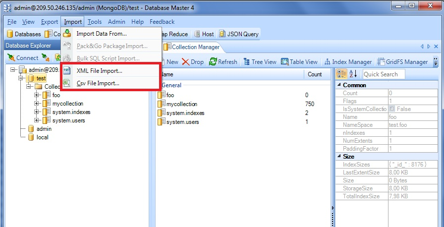

2. Browse **XML/Csv** file, you want to import. Then browse a log file.

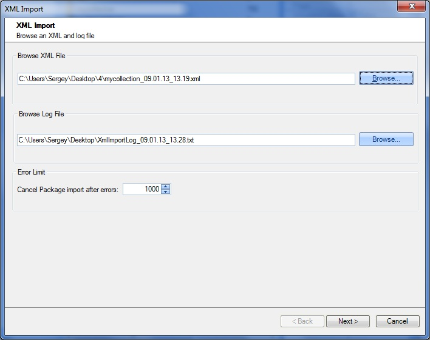

3. Merge source tables to the target tables.

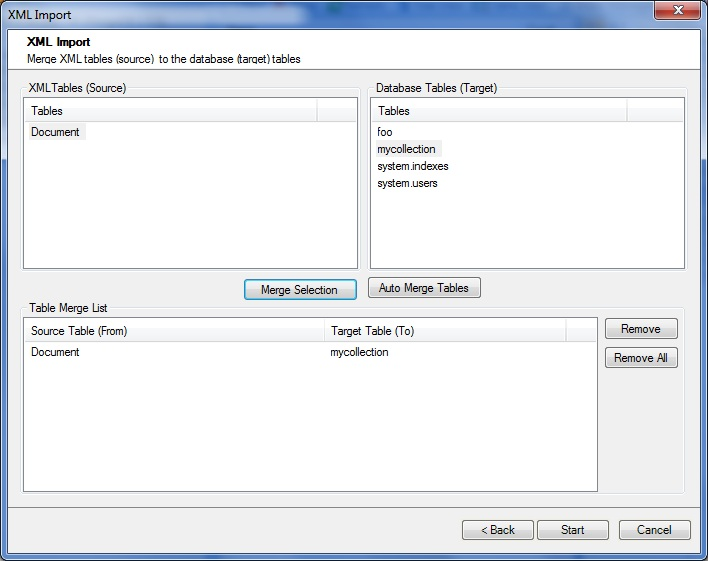

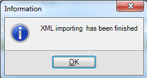

4. Now you can go back to the platform’s dashboard, open MongoDB in a web browser and find imported dumps in the **test** directory.

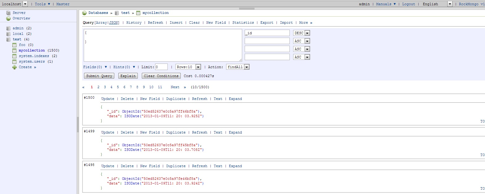

## Dump Export from MongoDB

1. Click **Export > Data Export**.

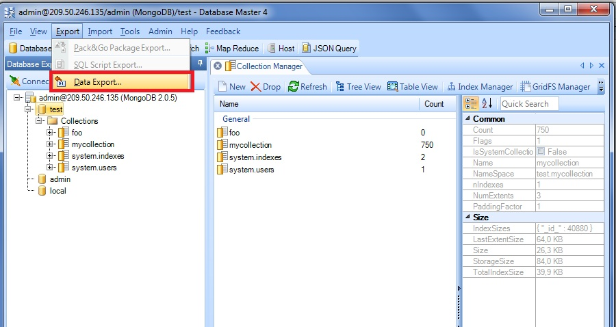

2. Browse a target folder and select tables to export.

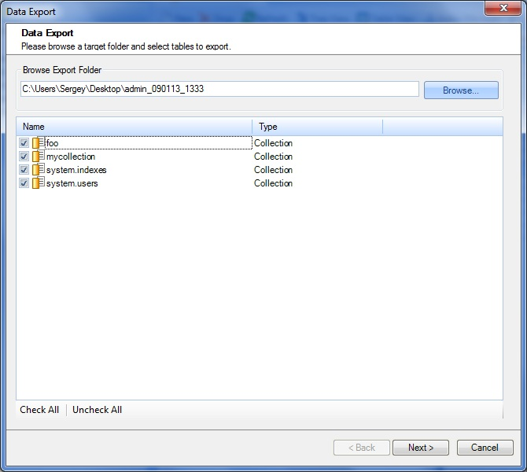

3. Select data export options and click **Finish**.

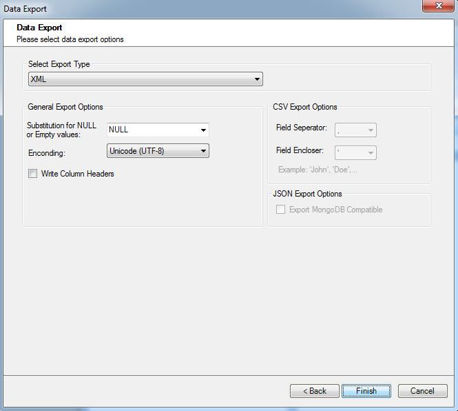

4. Data export is successfully finished. You can check your target folder to ensure that everything is ok.

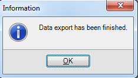

## RockMongo Admin Panel

1. Click **Open in Browser** button for MongoDB node in your enviroment:

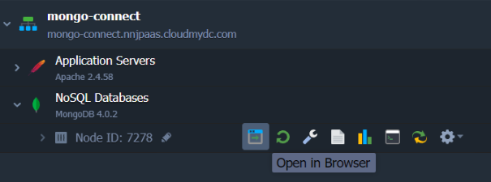

2. In the opened window you’ll be requested to log in with your credentials, which you’ve received within email after creating MongoDB node.

3. To **Export** or **Import** dump files use the corresponding buttons:

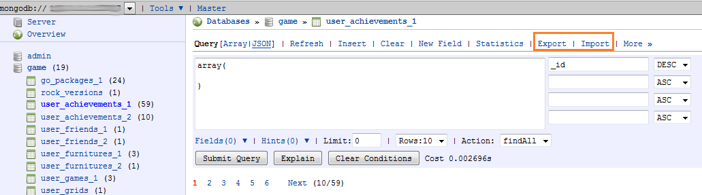

Hope this instruction will be useful for you.
