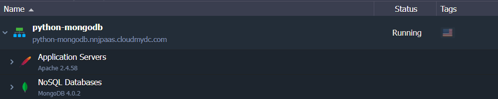
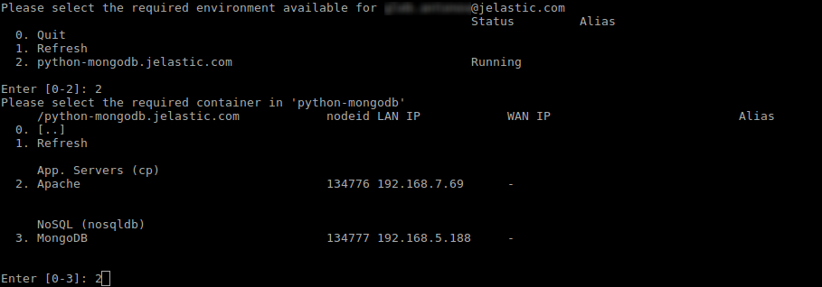
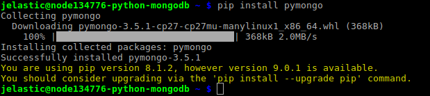
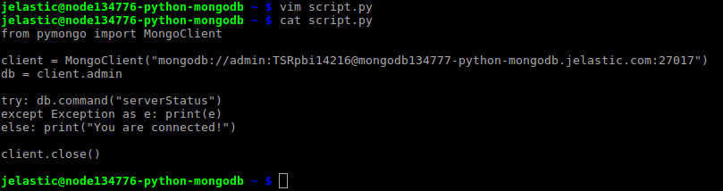
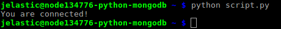

<!-- ## Python Application Connection to MongoDB -->

**MongoDB** is one of the most popular NoSQL databases, which allows developers to easily work with the stored data. This tutorial provides an example of connection to the MongoDB server from your **Python** application.

1. In our case we have an environment with _Python_ and _MongoDB_ containers inside (you can [create](/environment-management/setting-up-environment) such one at any time), but this instruction is suitable for the remote servers as well.

<div style={{
    display:'flex',
    justifyContent: 'center',
    margin: '0 0 1rem 0'
}}>



</div>

2. Connect your compute node via [SSH Gate](/deployment-tools/ssh/ssh-overview#ssh-gate-overview).

<div style={{
    display:'flex',
    justifyContent: 'center',
    margin: '0 0 1rem 0'
}}>



</div>

3. Install a [MongoDB driver for Python](https://github.com/mongodb/mongo-python-driver) using the command below:

```bash
pip install pymongo
```

<div style={{
    display:'flex',
    justifyContent: 'center',
    margin: '0 0 1rem 0'
}}>



</div>

4. Set up a simple script to check your DB server connection. For that use any preferable text editor and create a file with the **_.py_** extension (e.g. **_vim script.py_**).

```bash
from pymongo import MongoClient
client = MongoClient("mongodb://{user}:{password}@{host}:{port}")
db = client.{database}
try: db.command("serverStatus")
except Exception as e: print(e)
else: print("You are connected!")
client.close()
```

Just adjust the [connection string](https://www.mongodb.com/docs/manual/reference/connection-string/) with a relevant date, which can be gained from email for your MongoDB node:

- `{user}` - username to log into database with
- `{password}` - password for the appropriate user
- `{host}` - link to your MongoDB container
- `{port}` - port to be used for connection (use the default one - 27017)
- `{database}` - database to be accessed (e.g. the default admin one)

<div style={{
    display:'flex',
    justifyContent: 'center',
    margin: '0 0 1rem 0'
}}>



</div>

This script will connect to the specified database server and will try to get its status. If any error occurs in the process, its description will be printed; otherwise, just a “You are connected!” string will be displayed.

5. So, execute code in the file by running the appropriate command:

```bash
python script.py
```

<div style={{
    display:'flex',
    justifyContent: 'center',
    margin: '0 0 1rem 0'
}}>



</div>

The “You are connected!” string ensures, that application was able to connect the DB server successfully, so you can start managing database node by [extending code](http://api.mongodb.com/python/current/api/pymongo/) with other operations.
