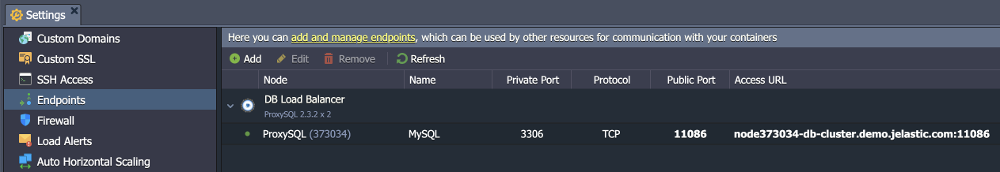
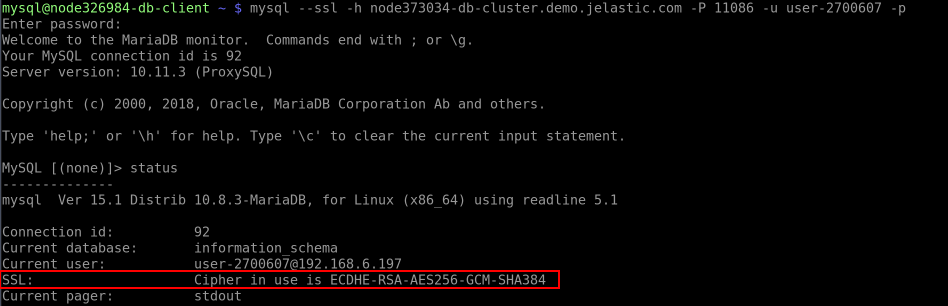

## SSL/TLS Encryption in Transit for MySQL/MariaDB/Percona

MySQL/MariaDB/Percona database solutions are provided with a built-in add-on that implements “**encryption in transit**”. The functionality ensures data protection with SSL/TLS encrypted connection while it moves between servers. After the add-on installation, all the related operations are handled automatically - data encryption before transmission, endpoints authentication, content decryption, and verification upon arrival.

## Add-On Installation

The add-on can be installed on top of the **MySQL/MariaDB/Percona** and **ProxySQL** (for database clusters) nodes only.

1. In the platform dashboard, go to the **Add-Ons** section of the appropriate database layer, and click **Install** for the SSL/TLS Encrypted Connection solution.

:::tip Tip

The add-on is also available from the [Marketplace](/docs/deployment-tools/cloud-scripting-&-jps/marketplace#marketplace) and can be imported from the appropriate GitHub repository.

:::

<div style={{
    display:'flex',
    justifyContent: 'center',
    margin: '0 0 1rem 0'
}}>


</div>

2. Within the opened installation window, select the target **Environment** and **Node Group(s)** where the add-on will be installed.

<div style={{
    display:'flex',
    justifyContent: 'center',
    margin: '0 0 1rem 0'
}}>


</div>

:::danger Note

Both **MySQL/MariaDB/Percona** and **ProxySQL** (if added) layers should be selected for the clustered solution.

:::

Click **Install** to continue.

3. In a minute, your database will be reconfigured to work over an encrypted connection.

<div style={{
    display:'flex',
    justifyContent: 'center',
    margin: '0 0 1rem 0'
}}>


</div>

## Add-On Specifics

Below you can learn about certificates generation processes and specifics:

- Certificates are generated with the **_/usr/local/sbin/selfcertgen_** utility.
- Certificates are self-signed and issued for the hostname of the particular node. It means that each node has a set of own certificates, and you must use the ones corresponding to the accessed node for authentication.
- Certificates are stored within the **_/var/lib/jelastic/keys/SSL-TLS_** folder (accessible via the **_keys_** shortcut in the file manager). Two subfolders are present:
  - **_server_** – server certificates are used to provide the TLS encryption of connection to the PostgreSQL database
  - **_client_** – downloadable client certificates can be used to authenticate client connection to the database server

<div style={{
    display:'flex',
    justifyContent: 'center',
    margin: '0 0 1rem 0'
}}>


</div>

## MySQL/MariaDB/Percona configurations:

All the add-on configurations are provided via a separate **_/etc/mysql/conf.d/ssl-config.cnf_** configuration file:

```bash
[mysqld]
ssl_cert=/var/lib/jelastic/keys/SSL-TLS/server/server.crt
ssl_key=/var/lib/jelastic/keys/SSL-TLS/server/server.key
ssl-cipher=ECDHE-RSA-AES256-GCM-SHA384:DHE-RSA-AES256-SHA
#require_secure_transport=ON
```

<div style={{
    display:'flex',
    justifyContent: 'center',
    margin: '0 0 1rem 0'
}}>


</div>

- The config provides paths to server SSL files and lists supported ciphers. Also, it includes an option (commented by default) to make server demand usage of the secure connection. If uncommented, it will be impossible for client to connect this server using the plain non-encrypted connection.

**ProxySQL configurations:**

- SSL on the ProxySQL nodes is enabled by setting the following variables on all the servers:
  - **\*[mysql-have_ssl](https://proxysql.com/documentation/global-variables/mysql-variables/#mysql-have_ssl)** (true)\* - enables SSL for frontend connections
  - **\*use_ssl** (1)\* - sets the corresponding column in mysql_servers, which will tell ProxySQL that our backend nodes use SSL
- Changes are done with the following SQL query:

```bash
UPDATE global_variables SET variable_value='true' WHERE variable_name='mysql-have_ssl';
LOAD MYSQL VARIABLES TO RUNTIME; SAVE MYSQL VARIABLES TO DISK;
UPDATE mysql_servers SET use_ssl=1 WHERE port=3306;
LOAD MYSQL VARIABLES TO RUNTIME; LOAD MYSQL SERVERS TO RUNTIME; SAVE MYSQL SERVERS TO DISK;
```

## Add-On Configuration

After the installation, the add-on can be found under the **Add-Ons** tab for the appropriate layer(s). Here, you can generate SSL certificates anew by clicking the **Re-issue certificates** button (e.g. if you think they are compromised or accidentally removed).

<div style={{
    display:'flex',
    justifyContent: 'center',
    margin: '0 0 1rem 0'
}}>


</div>

To remove the add-on from the layer (including custom configs and generated SSL certificates), expand the menu in the top-right corner of the panel and click **Uninstall**.

## Secure Connection to MySQL/MariaDB/Percona

1. The “**encryption in transit**” (**_server-side encryption_**) functionality works immediately after the add-on’s installation. You can check it by connecting to the database using the credentials from the email. For remote connection, you can add [endpoint](/docs/ApplicationSetting/External%20Access%20To%20Applications/Endpoints#endpoints-a-direct-connection-to-the-cloud) or [public IP](/docs/ApplicationSetting/External%20Access%20To%20Applications/Public%20IP#public-ip):

<div style={{
    display:'flex',
    justifyContent: 'center',
    margin: '0 0 1rem 0'
}}>



</div>

Use the following command to connect to the database:

```bash
mysql --ssl-mode=required -h {host} -P {port} -u {user} -p
```

:::danger Note

If you are working with the MariaDB client, replace the “--ssl-mode=required” option with the “**_--ssl_**” one.

:::

Here:

- **_{user}_** - database username for the connection
- **_{host}_** - database entry point (endpoint, in our case)
- **_{port}_** - port for the connection (from the endpoint, in our case)
  Once connected, run the **_status_** command and check for the SSL line in the output.

<div style={{
    display:'flex',
    justifyContent: 'center',
    margin: '0 0 1rem 0'
}}>



</div>

2. While connected to the server, you can configure the use of client certificates for authentication to get **_server- and client-side encryption_**. Execute the command below to make SSL auth obligatory for the specified user. For example, we’ll provide “**_user-2700607_**” (replace the **_{user}_** placeholder) from the email received after the environment creation:

```bash
FLUSH PRIVILEGES;ALTER USER '{user}'@'%' REQUIRE X509;ALTER USER '{user}'@'localhost' REQUIRE X509;FLUSH PRIVILEGES;
```

<div style={{
    display:'flex',
    justifyContent: 'center',
    margin: '0 0 1rem 0'
}}>


</div>

:::danger Note

Common name (CN) is not checked, any certificate signed with this certificate authority (CA) will be considered as appropriate. If you want to check the CN of client certificates (i.e. whether the certificate is issued for the specific user), execute the command below:

```bash
FLUSH PRIVILEGES;ALTER USER '{user}'@'%' REQUIRE SUBJECT 'CN={user}';ALTER USER '{user}'@'localhost' REQUIRE SUBJECT 'CN={user}';FLUSH PRIVILEGES;
```

Also, if you want to use just certificates for login, you can remove password requirement with the ALTER USER command as well.

:::

Now, provide client server (computer/container/VM) with the appropriate SSL certificate files, which can be downloaded from the **_/var/lib/jelastic/keys/SSL-TLS/client_** directory of the required target node. Once done, you can connect with the following command:

```bash
mysql –h {host} -P {port} -u {user} -p --ssl-mode=required --ssl-ca={path/to/root.crt} --ssl-cert={path/to/client.crt} --ssl-key={path/to/client.key}
```

<div style={{
    display:'flex',
    justifyContent: 'center',
    margin: '0 0 1rem 0'
}}>


</div>

:::tip Tip

To avoid specifying certificates as arguments, you can add such options to the **_my.cnf_** file on the client server:

```bash
[client]
ssl-ca = {path/to/root.crt}
ssl-cert = {path/to/client.crt}
ssl-key = {path/to/client.key}
```
