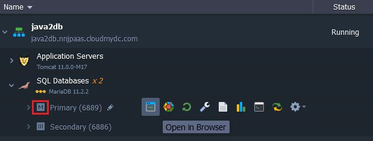

<!-- ## Java Connection to MariaDB/MySQL/Percona -->

**MariaDB**, **MySQL**, and **Percona** are highly popular open source databases, used by developers all over the world. In this instruction we’ll show you how to connect your Java application to these databases, standalone server and clustered solution.

1. Log into your PaaS account and [create an environment](/environment-management/setting-up-environment) with the **MariaDB** (or **MySQL**) database server (available within the **_SQL_** wizard section):

- for standalone database server

<div style={{
    display:'flex',
    justifyContent: 'center',
    margin: '0 0 1rem 0'
}}>


</div>

- for Auto-Clustering solution

<div style={{
    display:'flex',
    justifyContent: 'center',
    margin: '0 0 1rem 0'
}}>


</div>

We’ve also added **Tomcat** node to provide an example of database connection from application server.

2. Check your email inbox - it should contain a message with administration details for the created MariaDB (or MySQL) server.

In case of database cluster, the **_Entry Point for Connecting_** is referred to a ProxySQL load balancer.

3. Switch back to the dashboard and click the **Open in Browser** button for your MariaDB/MySQL node.

<div style={{
    display:'flex',
    justifyContent: 'center',
    margin: '0 0 1rem 0'
}}>


</div>

If you have clustered solution, press on **Open in Browser** next to the master database node (marked as **M**).

<div style={{
    display:'flex',
    justifyContent: 'center',
    margin: '0 0 1rem 0'
}}>



</div>

Log into the opened admin panel using credentials from the above-mentioned emails.

4. Use an existing database (e.g. **_test_**) or **Create** a new one.

<div style={{
    display:'flex',
    justifyContent: 'center',
    margin: '0 0 1rem 0'
}}>


</div>

5. Return to dashboard and click the **Config** button next to the application server (Tomcat, in our case) to access [configuration file manager](/application-setting/configuration-file-manager#configuration-file-manager).

<div style={{
    display:'flex',
    justifyContent: 'center',
    margin: '0 0 1rem 0'
}}>


</div>

6. Navigate to the **/opt/tomcat/temp** folder, create a new **_mydb.cfg_** file.

For standalone database connection, add the following data in the **_mydb.cfg_** file:

```
host=jdbc:mysql://{host}/{db_name}
username={user}
password={password}
driver=com.mysql.jdbc.Driver
```

All the required info can be found within the MariaDB/MySQL node email:

- `{host}` - link to your DB node without protocol part
- `{db_name}` - name of the database (test in our case)
- `{user}` and `{password}` - database admin credentials (for production usage, it’s recommended to create a dedicated account with the appropriate permissions)

<div style={{
    display:'flex',
    justifyContent: 'center',
    margin: '0 0 1rem 0'
}}>


</div>

For connection to the cluster, ProxySQL load balancer is used as the entry point, and each type of databases has its own connector. So add the following data to the **_mydb.cfg_** file:

For MariaDB:

```
host=jdbc:mariadb://{hostname}/{db_name}?usePipelineAuth=false
username={user}
password={password}
driver=org.mariadb.jdbc.Driver
```

- `{hostname}` - link to your DB cluster load balancer (i.e. ProxySQL layer)
- `{db_name}` - name of the database. We chose test in the first step
- `usePipelineAuth` - if activated different queries are executed using pipeline (all queries are sent, only then all results are read), permitting faster connection creation. This value should be set to **_false_**, as such implementation doesn’t work with the ProxySQL in front of the cluster
- `{user}` and `{password}` - database credentials received in the email

<div style={{
    display:'flex',
    justifyContent: 'center',
    margin: '0 0 1rem 0'
}}>


</div>

For MySQL:

```
host=jdbc:mysql://{host}/{db_name}
username={user}
password={password}
driver=com.mysql.jdbc.Driver
```

- `{hostname}` - link to your DB cluster load balancer (i.e. ProxySQL layer)
- `{db_name}` - name of the database (test in our case)
- `{user}` and `{password}` - database admin credentials (for production usage, it’s recommended to create a dedicated account with the appropriate permissions)
  In such a way, all connection settings are saved in a single file, which, subsequently, will be read by the application.

7. For deployment and further connection, we are going to use the following sample application:

```bash
package connection;

import java.io.IOException;
import java.sql.Connection;
import java.sql.DriverManager;
import java.sql.SQLException;
import java.sql.Statement;
import java.text.SimpleDateFormat;
import java.util.Date;
import java.util.Properties;
import java.util.logging.Level;
import java.util.logging.Logger;

public class DbManager {

    public String date = new SimpleDateFormat("dd-MM-yyyy-HH-mm").format(new Date());
    private final String createTable = "CREATE TABLE `" + date + "` (id INT, data VARCHAR(100));";
    private static final int LoginTimeout = 10;

    public DbManager() {
    }

    public Connection createConnection() throws IOException, ClassNotFoundException, SQLException {
        Properties prop = new Properties();
        System.out.println("\n\n=======================\nJDBC Connector Test " + date);
        System.out.println("User home directory: " + System.getProperty("user.home"));
        String host;
        String username;
        String password;
        String driver;
        try {
            prop.load(new java.io.FileInputStream(System.getProperty("user.home") + "/mydb.cfg"));

            host = prop.getProperty("host").toString();
            username = prop.getProperty("username").toString();
            password = prop.getProperty("password").toString();
            driver = prop.getProperty("driver").toString();
        } catch (IOException e) {
            System.out.println("Unable to find mydb.cfg in " + System.getProperty("user.home") + "\n Please make sure that configuration file created in this folder.");

            host = "Unknown HOST";
            username = "Unknown USER";
            password = "Unknown PASSWORD";
            driver = "Unknown DRIVER";
        }

        System.out.println("host: " + host + "\nusername: " + username + "\npassword: " + password + "\ndriver: " + driver);

        Class.forName(driver);
        System.out.println("--------------------------");
        System.out.println("DRIVER: " + driver);
        System.out.println("Set Login Timeout: " + LoginTimeout);
        DriverManager.setLoginTimeout(LoginTimeout);
        Connection connection = DriverManager.getConnection(host, username, password);
        System.out.println("CONNECTION: " + connection);

        return connection;
    }

    public String runSqlStatement() {
        String result = "";
        try {
            Statement statement = createConnection().createStatement();
            System.out.println("SQL query: " + createTable);
            statement.execute(createTable);
        } catch (IOException | ClassNotFoundException ex) {
            Logger.getLogger(DbManager.class.getName()).log(Level.SEVERE, null, ex);
            System.out.println("Exception occurred: " + ex);
            result = ex.getMessage();
        } catch (SQLException ex) {
            ex.printStackTrace();
            result = ex.getMessage();
        }
        return result;
    }
}
```

8. [Deploy](/deployment/deployment-guide) our example application to your Tomcat server using the following link:

_[https://download.jelastic.com/public.php?service=files&t=b2c6e4e01d487dfd5af953ba31dac848&download](/deployment/deployment-guide)_

<div style={{
    display:'flex',
    justifyContent: 'center',
    margin: '0 0 1rem 0'
}}>


</div>

<div style={{
    display:'flex',
    justifyContent: 'center',
    margin: '0 0 1rem 0'
}}>


</div>

:::tip Note

- Our example application already contains the jdbc-connectors for [MariaDB](https://mariadb.org/download/?t=mariadb&p=mariadb&r=11.3.0&os=windows&cpu=x86_64&pkg=msi&m=ossplanet)/[MySQL](https://dev.mysql.com/downloads/connector/j/) database access. However, to connect your own project, you need to manually upload them to the `webapps/{app_context}/WEB-INF/lib` folder on your application server.
- Don’t forget to restart your application server to apply **_mydb.cfg_** changes, by pressing **Restart Node** button.

<div style={{
    display:'flex',
    justifyContent: 'center',
    margin: '0 0 1rem 0'
}}>


</div>

:::

9. Once deployment is finished, click **Open in Browser** in popup window or next to your application server.

<div style={{
    display:'flex',
    justifyContent: 'center',
    margin: '0 0 1rem 0'
}}>


</div>

10. In the opened browser tab, click on the **Create test table in your database** button.

<div style={{
    display:'flex',
    justifyContent: 'center',
    margin: '0 0 1rem 0'
}}>


</div>

11. Now, in order to ensure everything works fine, return to the **_phpMyAdmin_** panel and navigate to the **_test_** database.

<div style={{
    display:'flex',
    justifyContent: 'center',
    margin: '0 0 1rem 0'
}}>


</div>

You’ll see that the newly created table appeared with the name `{date-time of creation}`, that means the DB has been successfully accessed and modified from your Java application. It’s that easy!

## Useful to Know

The platform also lets you extend your MariaDB/MySQL servers functionality by following the appropriate instructions in our documentation:

- set up the preferred database replication type with embedded Auto-Clustering feature in order to get the increased DB performance and data loss protection
- adjust [Backups Scheduling](/database/database-hosting/manual-database-backups#manual-database-backups) for ensuring safety of the information inside your DBs in the case of unexpected server failure
- see the [Remote Access](/database/mysql-mariadb-percona/remote-access#remote-access-to-mysqlmariadbpercona) instruction and learn how to access your database remotely via the preferred desktop MySQL client
- use the [Dump Files Import/Export](/database/mysql-mariadb-percona/dump-import-export) guide to find out how to manually backup and restore your data from the previously created dumps
- see the [Database connection strings](/database/database-hosting/database-connection-strings#database-connection-strings) to get more info how to configure connection to different db types

## Video Tutorial on MySQL Connection to Java Application

You can use the video tutorial version to see how to create a new environment, configure a MySQL database server, connect to it from your application, and finally, deploy the application to the platform.

[](https://youtube.com/watch?v=x6hbTg4BKAk)
