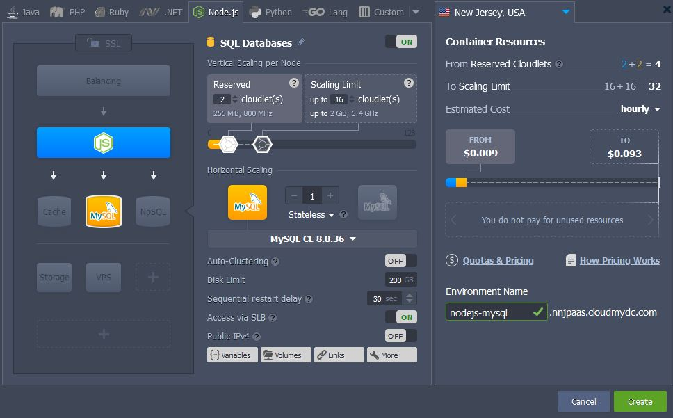
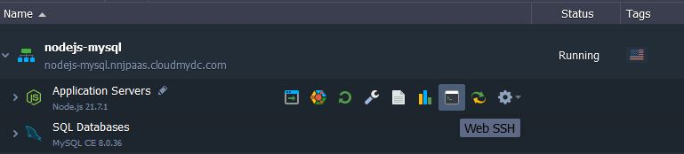
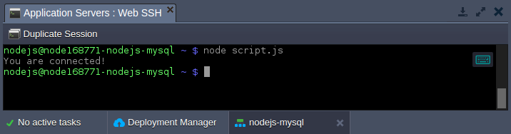

<!-- ## Node.js Application Connection to MySQL/MariaDB/Percona -->

**MySQL**, **MariaDB**, and **Percona** are among of the most popular open source SQL databases, used by world’s largest organizations. In this guide we’ll overview a simple example of **Node.js** application connection to MySQL or MariaDB server.

1. Log into your PaaS account and [create an environment](/environment-management/setting-up-environment) with MySQL (or MariaDB) database server, we’ll also add a NodeJS compute node for this tutorial.

<div style={{
    display:'flex',
    justifyContent: 'center',
    margin: '0 0 1rem 0'
}}>



</div>

2. Access your NodeJS server via SSH, e.g. with embedded [Web SSH](/deployment-tools/ssh/ssh-access/web-ssh) client.

<div style={{
    display:'flex',
    justifyContent: 'center',
    margin: '0 0 1rem 0'
}}>



</div>

3. Once connected, get an official [MySQL driver for Node.js](https://www.npmjs.com/package/mysql) (compatible with MariaDB) by executing the following command:

```bash
npm install mysql
```

:::tip Note

MySQL driver for NodeJS 10 is currently in testing, so if the deprecation warnings are shown while operating this server version, you may need to install the testing version:

```bash
npm install mysqljs/mysql
```

:::

<div style={{
    display:'flex',
    justifyContent: 'center',
    margin: '0 0 1rem 0'
}}>


</div>

Installation will be finished in a moment.

4. Prepare a simple Node.js script to verify connection. Create a file with the **_.js_** extension, using any text editor of your choice (e.g. **_vim script.js_**).

```bash
var mysql = require('mysql');
var con = mysql.createConnection({
  host: "{host}",
  user: "{user}",
  password: "{password}",
  database: "{database}"
});

con.connect(function(err) {
  if (err) throw err;
  console.log("You are connected!");
});
con.end();
```

The placeholders in the code above should be adjusted using the appropriate connection information (is provided within email for your MySQL / MariaDB container):

- `{user}` - username to log into database with
- `{password}` - password for the appropriate user
- `{host}` - link to your MySQL / MariaDB container
- `{database}` - database to be accessed (e.g. the default one - mysql)

<div style={{
    display:'flex',
    justifyContent: 'center',
    margin: '0 0 1rem 0'
}}>


</div>

Using this script, you can check connection to the database from your application server and, if it fails, get an error description.

5. Run code with the appropriate command:

```bash
node script.js
```

<div style={{
    display:'flex',
    justifyContent: 'center',
    margin: '0 0 1rem 0'
}}>



</div>

For successful connection a “You are connected!” phrase will be displayed in terminal, otherwise error description will be provided. Now, when you are sure your database container is accessible, [expand the code](https://www.npmjs.com/package/mysql) to execute some real actions on your DB server.
